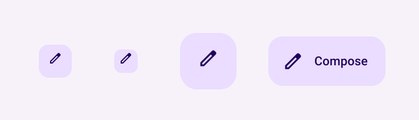
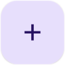
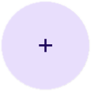

- [フローティングアクションボタン](#フローティングアクションボタン)
  - [API サーフェス](#api-サーフェス)
  - [フローティングアクションボタン](#フローティングアクションボタン-1)
  - [小さいボタン](#小さいボタン)
  - [大きいボタン](#大きいボタン)
  - [拡張ボタン](#拡張ボタン)
  - [参考情報](#参考情報)


# フローティングアクションボタン

フローティング アクション ボタン (FAB) は、ユーザーがアプリケーションで主要なアクションを実行できるようにする、強調表示ボタンです。ユーザーが実行する可能性が最も高い単一のアクションを表示します。通常は画面の右下に固定されています。

FAB を使用する可能性がある次の 3 つのユース ケースを検討してください。

- **新しいアイテムの作成**: メモ作成アプリでは、FAB を使用して新しいメモをすばやく作成できます。

- **新しい連絡先の追加**: チャット アプリでは、FAB を使用して、ユーザーが会話に誰かを追加できるインターフェースを開くことができます。

- **中央の位置**: マップ インターフェースでは、FAB を使用して、ユーザーの現在の位置をマップの中央に表示できます。

マテリアル デザインには、次の 4 種類の FAB があります。

- **FAB**: 通常サイズのフローティング アクション ボタン。
- **小さい FAB**: 小さいフローティング アクション ボタン。
- **大きい FAB**: 大きいフローティング アクション ボタン。
- **拡張 FAB**: アイコン以外のものも含まれるフローティング アクション ボタン。




## API サーフェス

フローティング アクションの作成に使用できるコンポーザブルはいくつかありますが、 ボタンはマテリアル デザインと一致しており、パラメータに大きな違いはありません。主なパラメータは次のとおりです。

- onClick: ユーザーがボタンを押すと呼び出される関数。
- containerColor: ボタンの背景色。
- contentColor: アイコンの色。


## フローティングアクションボタン

一般的なフローティング アクション ボタンを作成するには、基本的な [FloatingActionButton](https://developer.android.com/reference/kotlin/androidx/compose/material3/package-summary?hl=ja&_gl=1*x27yam*_up*MQ..*_ga*NTY3MDY5MDA1LjE3MjQ2NTg1MjY.*_ga_6HH9YJMN9M*MTcyNTAyODI3OS40LjAuMTcyNTAyODI3OS4wLjAuMA..#FloatingActionButton(kotlin.Function0,androidx.compose.ui.Modifier,androidx.compose.ui.graphics.Shape,androidx.compose.ui.graphics.Color,androidx.compose.ui.graphics.Color,androidx.compose.material3.FloatingActionButtonElevation,androidx.compose.foundation.interaction.MutableInteractionSource,kotlin.Function0)) コンポーザブルを使用します。次の例は、 FAB の基本的な実装です。

```kotlin
@Composable
fun Example(onClick: () -> Unit) {
    FloatingActionButton(
        onClick = { onClick() },
    ) {
        Icon(Icons.Filled.Add, "Floating action button.")
    }
}
```

これを実装すると次のようになります。




## 小さいボタン

小さいフローティング アクション ボタンを作成するには、 [SmallFloatingActionButton](https://developer.android.com/reference/kotlin/androidx/compose/material3/package-summary?hl=ja&_gl=1*x27yam*_up*MQ..*_ga*NTY3MDY5MDA1LjE3MjQ2NTg1MjY.*_ga_6HH9YJMN9M*MTcyNTAyODI3OS40LjAuMTcyNTAyODI3OS4wLjAuMA..#SmallFloatingActionButton(kotlin.Function0,androidx.compose.ui.Modifier,androidx.compose.ui.graphics.Shape,androidx.compose.ui.graphics.Color,androidx.compose.ui.graphics.Color,androidx.compose.material3.FloatingActionButtonElevation,androidx.compose.foundation.interaction.MutableInteractionSource,kotlin.Function0)) コンポーザブルを使用します。次の例は、カスタムカラーを設定します。

```kotlin
@Composable
fun SmallExample(onClick: () -> Unit) {
    SmallFloatingActionButton(
        onClick = { onClick() },
        containerColor = MaterialTheme.colorScheme.secondaryContainer,
        contentColor = MaterialTheme.colorScheme.secondary
    ) {
        Icon(Icons.Filled.Add, "Small floating action button.")
    }
}
```

これを実装すると次のようになります。


## 大きいボタン

大きなフローティング アクション ボタンを作成するには、 [LargeFloatingActionButton](https://developer.android.com/reference/kotlin/androidx/compose/material3/package-summary?hl=ja&_gl=1*zi2ys5*_up*MQ..*_ga*NTY3MDY5MDA1LjE3MjQ2NTg1MjY.*_ga_6HH9YJMN9M*MTcyNTAyODI3OS40LjAuMTcyNTAyODI3OS4wLjAuMA..#LargeFloatingActionButton(kotlin.Function0,androidx.compose.ui.Modifier,androidx.compose.ui.graphics.Shape,androidx.compose.ui.graphics.Color,androidx.compose.ui.graphics.Color,androidx.compose.material3.FloatingActionButtonElevation,androidx.compose.foundation.interaction.MutableInteractionSource,kotlin.Function0)) コンポーザブルを使用します。このコンポーザブルは、ボタンが大きくなるという点を除けば、他の例と大きな違いはありません。

以下は、大きな FAB の簡単な実装です。

注: この例では、シェイプ パラメータの値として CircleShape を渡すため、角丸の四角形ではなく、正円のボタンになります。Shape の任意のインスタンスを渡すことも、MaterialTheme.shape.large の値を設定してアプリ全体で調整することもできます。

```kotlin
@Composable
fun LargeExample(onClick: () -> Unit) {
    LargeFloatingActionButton(
        onClick = { onClick() },
        shape = CircleShape,
    ) {
        Icon(Icons.Filled.Add, "Large floating action button")
    }
}
```

これを実装すると次のようになります。




## 拡張ボタン

[ExtendedFloatingActionButton](https://developer.android.com/reference/kotlin/androidx/compose/material3/package-summary?hl=ja&_gl=1*sh2tvs*_up*MQ..*_ga*NTY3MDY5MDA1LjE3MjQ2NTg1MjY.*_ga_6HH9YJMN9M*MTcyNTAyODI3OS40LjAuMTcyNTAyODI3OS4wLjAuMA..#ExtendedFloatingActionButton(kotlin.Function0,kotlin.Function0,kotlin.Function0,androidx.compose.ui.Modifier,kotlin.Boolean,androidx.compose.ui.graphics.Shape,androidx.compose.ui.graphics.Color,androidx.compose.ui.graphics.Color,androidx.compose.material3.FloatingActionButtonElevation,androidx.compose.foundation.interaction.MutableInteractionSource)) コンポーザブルを使用すると、より複雑なフローティング アクション ボタンを作成できます。FloatingActionButton との主な違いは、専用の icon および text パラメータがあることです。これらを使用すると、コンテンツに合わせて適切に拡大縮小される、より複雑なコンテンツを持つボタンを作成できます。

```kotlin
@Composable
fun ExtendedExample(onClick: () -> Unit) {
    ExtendedFloatingActionButton(
        onClick = { onClick() },
        icon = { Icon(Icons.Filled.Edit, "Extended floating action button.") },
        text = { Text(text = "Extended FAB") },
    )
}
```

これを実装すると次のようになります。


## 参考情報

- [一般的なボタン](https://developer.android.com/develop/ui/compose/components/button?hl=ja&_gl=1*ndu3xu*_up*MQ..*_ga*NTY3MDY5MDA1LjE3MjQ2NTg1MjY.*_ga_6HH9YJMN9M*MTcyNTAyODI3OS40LjAuMTcyNTAyODI3OS4wLjAuMA..)
- [マテリアル UI のドキュメント](https://m3.material.io/components/floating-action-button/overview)


