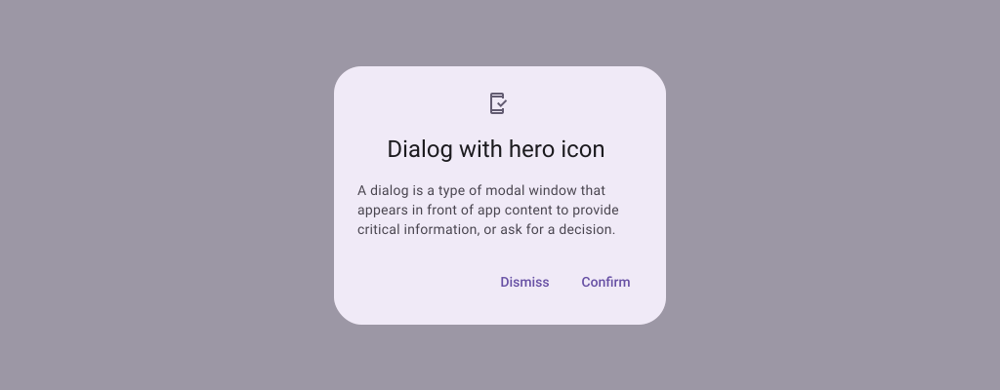
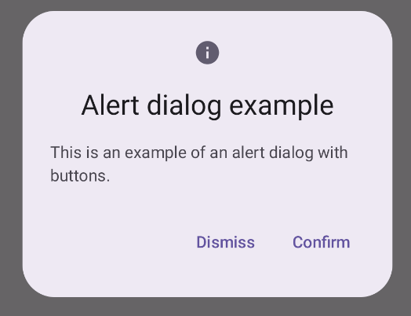
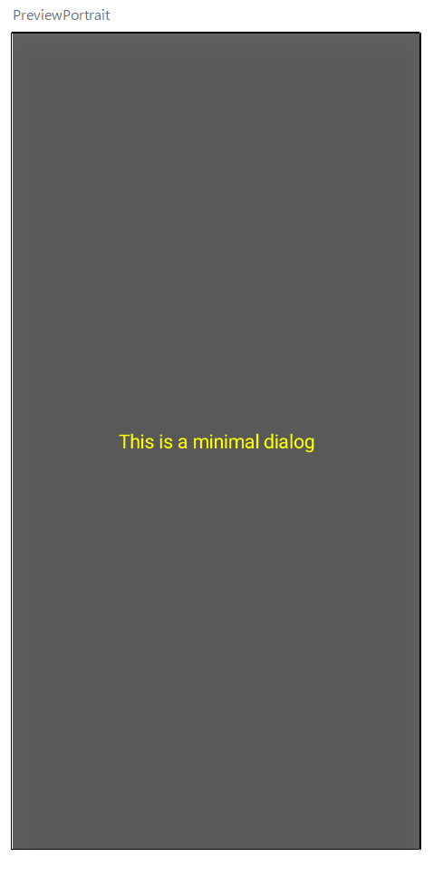
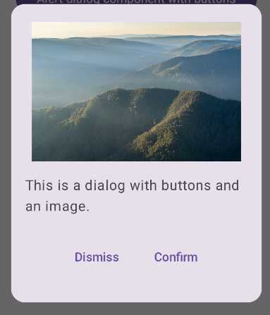

- [ダイアログ](#ダイアログ)
  - [AlertDialog コンポーザブル](#alertdialog-コンポーザブル)
  - [Dialog コンポーザブル](#dialog-コンポーザブル)
    - [基本的な例](#基本的な例)
    - [高度な例](#高度な例)
  - [DialogProperties](#dialogproperties)
  - [参考情報](#参考情報)


# ダイアログ

ダイアログ コンポーネントは、メインのアプリ コンテンツの上のレイヤーでポップアップ メッセージを表示したり、ユーザー入力を要求したりします。これにより、ユーザーの注意を引くための中断的な UI エクスペリエンスが作成されます。

ダイアログの使用例は次のとおりです。

- ファイルを削除するときなど、ユーザー アクションを確認する。
- ToDo リスト アプリなどでユーザー入力を要求する。
- プロファイル設定で国を選択するなど、ユーザー選択のオプション リストを表示する。




## AlertDialog コンポーザブル

[AlertDialog](https://developer.android.com/reference/kotlin/androidx/compose/material3/package-summary?hl=ja&_gl=1*ykkgjy*_up*MQ..*_ga*NTY3MDY5MDA1LjE3MjQ2NTg1MjY.*_ga_6HH9YJMN9M*MTcyNTI0Njg0NC41LjAuMTcyNTI0Njg0NC4wLjAuMA..#AlertDialog(kotlin.Function0,kotlin.Function0,androidx.compose.ui.Modifier,kotlin.Function0,kotlin.Function0,kotlin.Function0,kotlin.Function0,androidx.compose.ui.graphics.Shape,androidx.compose.ui.graphics.Color,androidx.compose.ui.graphics.Color,androidx.compose.ui.graphics.Color,androidx.compose.ui.graphics.Color,androidx.compose.ui.unit.Dp,androidx.compose.ui.window.DialogProperties)) コンポーザブルは、 マテリアル デザインをテーマにしたダイアログです。AlertDialog には次のパラメータがあります。 ダイアログの特定の要素を処理しますその一例は次のとおりです。

- **title**: ダイアログの上部に表示されるテキスト。
- **text**: ダイアログ内で中央に表示されるテキスト。これは、 Text コンポーザブルである必要はありません。任意のコンポーザブルを渡すことが可能です。
- **icon**: ダイアログの上部に表示されるグラフィック。
- **onDismissRequest**: ユーザーがダイアログを閉じると呼び出される関数。 画面の外側をタップするといった操作です。
- **dismissButton**: 閉じるボタンとして機能するコンポーザブル。
- **confirmButton**: 確認ボタンとして機能するコンポーザブル。

次の例では、アラート ダイアログに 2 つのボタンを実装しています。 ダイアログを閉じるボタンと、リクエストを確認するボタンの 2 つです。

```kotlin
@OptIn(ExperimentalMaterial3Api::class)
@Composable
fun AlertDialogExample(
    onDismissRequest: () -> Unit,
    onConfirmRequest: () -> Unit,
    dialogTitle: String,
    dialogText: String,
    icon: ImageVector,
) {
    AlertDialog(
        icon = {
            Icon(icon, contentDescription = "Example Icon")
        },
        title = {
            Text(text = dialogTitle)
        },
        text = {
            Text(text = dialogText)
        },
        onDismissRequest = {
            onDismissRequest()
        },
        confirmButton = {
            TextButton(
                onClick = {
                    onConfirmRequest()
                }
            ) {
                Text("Confirm")
            }
        },
        dismissButton = {
            TextButton(
                onClick = {
                    onDismissRequest()
                }
            ) {
                Text("Dismiss")
            }
        }
    )
}
```

上記のコンポーザブルを呼び出す親コンポーザブルは以下です。

```kotlin
@Composable
fun DialogExamples() {
    // ...
    val openAlertDialog = remember { mutableStateOf(false) }

    // ...
        when {
            // openAlertDialog.value が true の場合に実行する。
            openAlertDialog.value -> {
                AlertDialogExample(
                    onDismissRequest = { openAlertDialog.value = false },
                    onConfirmRequest = {
                        openAlertDialog.value = false
                        println("Confirmation registered") // Add logic here to handle confirmation.
                    },
                    dialogTitle = "Alert dialog example",
                    dialogText = "This is an example of an alert dialog with buttons.",
                    icon = Icons.Default.Info
                )
            }
        }
    }
}
```

これを実装すると次のようになります。



**注**: ユーザーがいずれかのボタンをクリックすると、ダイアログが閉じます。この例では、これらの関数は onDismissRequest() と onConfirmRequest() です。

**注**: ダイアログにさらに複雑なボタン セットが必要な場合は、Dialog コンポーザブルを使用して、より自由な形式で設定すると効果的です。


## Dialog コンポーザブル

[Dialog](https://developer.android.com/reference/kotlin/androidx/compose/ui/window/package-summary?hl=ja&_gl=1*w9bbph*_up*MQ..*_ga*NTY3MDY5MDA1LjE3MjQ2NTg1MjY.*_ga_6HH9YJMN9M*MTcyNTI0Njg0NC41LjAuMTcyNTI0Njg0NC4wLjAuMA..#Dialog(kotlin.Function0,androidx.compose.ui.window.DialogProperties,kotlin.Function0)) は基本的なコンポーザブルであり、スタイル設定や コンテンツ用の事前定義スロットを使用できますこれは比較的シンプルなコンテナであり、 Card などのコンテナを入力する必要があります。以下はその一部です。 ダイアログの主なパラメータは次のとおりです。

- onDismissRequest: ユーザーがダイアログを閉じたときに呼び出されるラムダ。
- properties: いくつかの情報を提供する [DialogProperties](https://developer.android.com/reference/kotlin/androidx/compose/ui/window/DialogProperties?hl=ja&_gl=1*ykkgjy*_up*MQ..*_ga*NTY3MDY5MDA1LjE3MjQ2NTg1MjY.*_ga_6HH9YJMN9M*MTcyNTI0Njg0NC41LjAuMTcyNTI0Njg0NC4wLjAuMA..) のインスタンスです。カスタマイズの幅が広がります。

**注意**: 前のセクションの AlertDialog の例とは異なり、Dialog のサイズと形状を手動で指定する必要があります。また、内部コンテナ ( ViewGroup 的なやつ？) も提供する必要があります。


### 基本的な例

次の例は、Dialog コンポーザブルの基本的な実装です。セカンダリ コンテナとして Card を使用していることに注意してください。Card がない場合、Text コンポーネントはメインのアプリ コンテンツの上に単独で表示されます。 (詳しくは後続の図を参照してください。)

```kotlin
@Composable
fun MinimalDialog(onDismissRequest: () -> Unit) {
    Dialog(onDismissRequest = { onDismissRequest() }) {
        Card(
            modifier = Modifier
                .fillMaxWidth()
                .height(200.dp)
                .padding(16.dp),
            shape = RoundedCornerShape(16.dp),
        ) {
            Text(
                text = "This is a minimal dialog",
                modifier = Modifier
                    .fillMaxSize()
                    .wrapContentSize(Alignment.Center),
                textAlign = TextAlign.Center,
            )
        }
    }
}
```

参考 : 上記の例の場合、 `fillMaxSize().wrapContentSize(Alignment.Center)` のおかげで、文字列がカードの中央に配置されるため、 `textAlign = TextAlign.Center` の指定はなくても同様の見た目になります。

上記の実行結果は以下になります。


Card を指定せず、直接 Text コンポーザブルを配置した場合は、以下のようになります。 (ただし、見やすさの観点で、文字の色を黄色に変更しています。)




### 高度な例

以下は、Dialog コンポーザブルのより高度な実装です。この場合、コンポーネントは上記の AlertDialog の例と同様のインターフェースを手動で実装します。

**注意**: この例のように 2 つのボタンのダイアログのみを表示する必要がある場合は、AlertDialog とそのより便利な API を使用する必要があります。ただし、フォームや複数のボタンなど、より複雑なダイアログを作成する場合は、次の例のように、カスタム コンテンツを含む Dialog を使用する必要があります。

```kotlin
@Composable
fun DialogWithImage(
    onDismissRequest: () -> Unit,
    onConfirmation: () -> Unit,
    painter: Painter,
    imageDescription: String,
) {
    Dialog(onDismissRequest = { onDismissRequest() }) {
        Card(
            modifier = Modifier
                .fillMaxWidth()
                .height(375.dp)
                .padding(16.dp),
            shape = RoundedCornerShape(16.dp),
        ) {
            Column(
                modifier = Modifier
                    .fillMaxSize(),
                verticalArrangement = Arrangement.Center,
                horizontalAlignment = Alignment.CenterHorizontally,
            ) {
                Image(
                    painter = painter,
                    contentDescription = imageDescription,
                    contentScale = ContentScale.Fit,
                    modifier = Modifier
                        .height(160.dp)
                )
                Text(
                    text = "This is a dialog with buttons and an image.",
                    modifier = Modifier.padding(16.dp),
                )
                Row(
                    modifier = Modifier
                        .fillMaxWidth(),
                    horizontalArrangement = Arrangement.Center,
                ) {
                    TextButton(
                        onClick = { onDismissRequest() },
                        modifier = Modifier.padding(8.dp),
                    ) {
                        Text("Dismiss")
                    }
                    TextButton(
                        onClick = { onConfirmation() },
                        modifier = Modifier.padding(8.dp),
                    ) {
                        Text("Confirm")
                    }
                }
            }
        }
    }
}
```

この実装は次のようになります。




## DialogProperties

DialogProperties の公式ドキュメントは [こちら](https://developer.android.com/reference/kotlin/androidx/compose/ui/window/DialogProperties?_gl=1*ykkgjy*_up*MQ..*_ga*NTY3MDY5MDA1LjE3MjQ2NTg1MjY.*_ga_6HH9YJMN9M*MTcyNTI0Njg0NC41LjAuMTcyNTI0Njg0NC4wLjAuMA..) です。

DialogProperties は、 AlertDialog コンポーザブルでも Dialog コンポーザブルでも使用可能です。

```kotlin
AlertDialog(
    onDismissRequest = { showDialog = false },
    title = { Text(text = "Custom Dialog Title") },
    text = { Text("This is a dialog with custom properties.") },
    confirmButton = {
        Button(onClick = { showDialog = false }) {
            Text("OK")
        }
    },
    properties = DialogProperties(
        // バックキーで閉じない
        dismissOnBackPress = false,
        // 外をタップしても閉じない
        dismissOnClickOutside = false,
        // プラットフォームのデフォルト幅を使用しない
        usePlatformDefaultWidth = false,
        // システムウィンドウに適合
        decorFitsSystemWindows = true
    )
)
```

上記のように各パラメータを設定した DialogProperties を、 Dialog のパラメータに渡すだけで OK です。


## 参考情報

- [マテリアル UI のドキュメント](https://m3.material.io/components/dialogs/overview)

