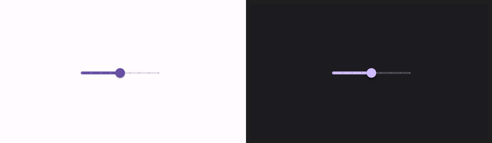
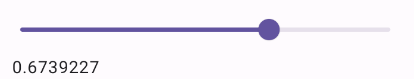
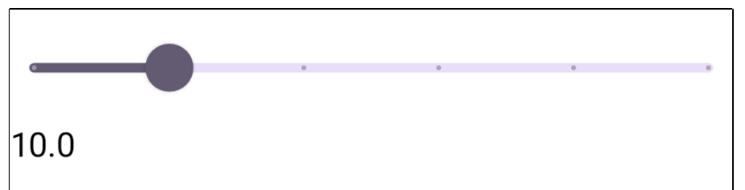
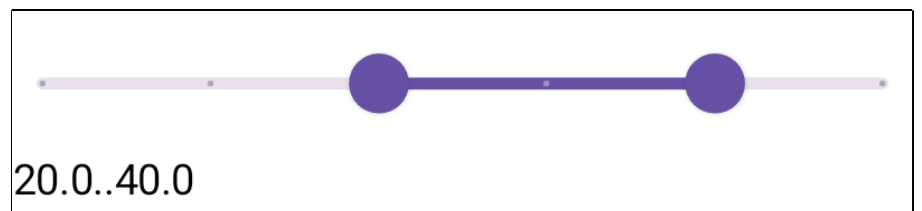

- [スライダー](#スライダー)


# スライダー

Slider コンポーザブルを使用すると、ユーザーは値の範囲から選択できます。スライダーを使用すると、ユーザーは次の操作を実行できます。

- 音量や明るさなど、値の範囲を使用する設定を調整する。

- 価格帯を設定するときのように、グラフでデータをフィルターする。

- レビューの評価を設定するなどのユーザー入力。

スライダーには、トラック、サム、値ラベル、目盛りが含まれます。

- **トラック**: トラックは、スライダーが取り得る値の範囲を表す水平バーです。
- **つまみ**: つまみは、スライダー上のドラッグ可能なコントロール要素で、ユーザーはこれを使用して、トラックで定義された範囲内で特定の値を選択できます。
- **目盛り**: 目盛りは、スライダーのトラックに沿って表示されるオプションの視覚マーカーまたはインジケーターです。




## 基本的な実装

完全な API 定義については、 [Slider](https://developer.android.com/reference/kotlin/androidx/compose/material3/package-summary?hl=ja&_gl=1*1i9di4s*_up*MQ..*_ga*NTY3MDY5MDA1LjE3MjQ2NTg1MjY.*_ga_6HH9YJMN9M*MTcyNTI0Njg0NC41LjAuMTcyNTI0Njg0NC4wLjAuMA..#Slider(androidx.compose.material3.SliderState,androidx.compose.ui.Modifier,kotlin.Boolean,androidx.compose.material3.SliderColors,androidx.compose.foundation.interaction.MutableInteractionSource,kotlin.Function1,kotlin.Function1)) リファレンスを参照してください。Slider コンポーザブルの主なパラメータは次のとおりです:

- `value`: スライダーの現在の値。

- `onValueChange`: 値が変更されるたびに呼び出されるラムダ。

- `enabled`: ユーザーがスライダーを操作できるかどうかを示すブール値。

次の例は、単純なスライダーです。ユーザーは 0.0 から 1.0 までの値を選択できます。ユーザーはその範囲内で任意の値を選択できるため、スライダーは連続的です。

```kotlin
@Preview
@Composable
fun SliderMinimalExample() {
    var sliderPosition by remember { mutableFloatStateOf(0f) }
    Column {
        Slider(
            value = sliderPosition,
            onValueChange = { sliderPosition = it }
        )
        Text(text = sliderPosition.toString())
    }
}
```

これを実装すると次のようになります。




## 高度な実装

より複雑なスライダーを実装する場合は、次のパラメータも使用できます。

- `colors`: スライダーの色を制御できる SliderColors のインスタンス。

- `valueRange`: スライダーが取り得る値の範囲。

- `steps`: スライダーのつまみが止まる場所の数。 (ただし、左端と右端を除く)

次のスニペットは、0.0 から 50.0 までの範囲の 4 つのステップを持つスライダーを実装します。つまみが各ステップに止まるため、このスライダーは離散的 (不連続) です。

```kotlin
@Preview
@Composable
fun SliderAdvancedExample() {
    var sliderPosition by remember { mutableFloatStateOf(0f) }
    Column {
        Slider(
            value = sliderPosition,
            onValueChange = { sliderPosition = it },
            colors = SliderDefaults.colors(
                thumbColor = MaterialTheme.colorScheme.secondary,
                activeTrackColor = MaterialTheme.colorScheme.secondary,
                inactiveTrackColor = MaterialTheme.colorScheme.secondaryContainer,
            ),
            steps = 4,
            valueRange = 0f..50f
        )
        Text(text = sliderPosition.toString())
    }
}
```

実装は次のようになります。



注: スライダーの最初と最後は「ステップ」としてカウントされます。範囲が 0f..50f でステップ数が 4 である前述の例では、スライダーの最初と最後もユーザーが選択できる間隔であるため、範囲に沿った各間隔は 10.0 です。

[Slider](https://developer.android.com/reference/kotlin/androidx/compose/material3/package-summary?_gl=1*dm3re4*_up*MQ..*_ga*NTY3MDY5MDA1LjE3MjQ2NTg1MjY.*_ga_6HH9YJMN9M*MTcyNTI0Njg0NC41LjAuMTcyNTI0Njg0NC4wLjAuMA..#Slider(androidx.compose.material3.SliderState,androidx.compose.ui.Modifier,kotlin.Boolean,androidx.compose.material3.SliderColors,androidx.compose.foundation.interaction.MutableInteractionSource,kotlin.Function1,kotlin.Function1)) に thumb (つまみ) と track コンポーザブルを渡して、コンポーネントの外観をより徹底的にカスタマイズすることもできます。


## 範囲スライダー

専用の RangeSlider コンポーザブルを使用することもできます。これを使用すると、ユーザーは 2 つの値を指定することができます。例えば、ユーザーが EC サイトで商品をフィルタリングする際に、最低価格と最高価格を指定したい場合などに便利です。

次の例は、連続範囲スライダーの比較的単純な例です。

```kotlin
@Preview
@Composable
fun RangeSliderExample() {

    // 範囲を指定する必要があるため、データは Range 型です。
    var sliderPosition by remember { mutableStateOf(0f..50f) }

    Column {
        RangeSlider(
            // スライダーの値 (value) には、 Range オブジェクトを渡します。
            value = sliderPosition,
            steps = 4,
            onValueChange = { range -> sliderPosition = range },
            // スライダの最小値 (左端) と最大値 (右端)
            valueRange = 0f..50f,
            onValueChangeFinished = {
                // launch some business logic update with the state you hold
                // viewModel.updateSelectedSliderValue(sliderPosition)
            },
        )
        Text(text = sliderPosition.toString())
    }
}
```

実装は次のようになります。




## 参考情報

- [マテリアル UI のドキュメント](https://m3.material.io/components/sliders/overview)
