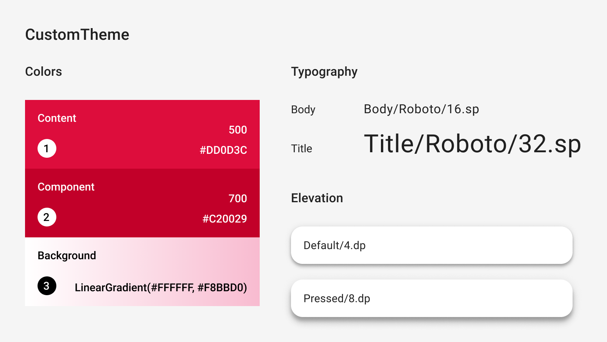

- [Compose のカスタムデザインシステム](#compose-のカスタムデザインシステム)
  - [マテリアルテーマの拡張](#マテリアルテーマの拡張)
    - [使用方法](#使用方法)
  - [マテリアルサブシステムの置き換え](#マテリアルサブシステムの置き換え)
    - [使用方法](#使用方法-1)
  - [フルカスタムデザインシステムを実装する](#フルカスタムデザインシステムを実装する)
    - [使用方法](#使用方法-2)


# Compose のカスタムデザインシステム

Material は弊社が推奨するデザイン システムであり、Jetpack Compose には Material の実装が同梱されていますが、使用を強制されるわけではありません。Material は完全にパブリック API 上に構築されているため、同じ方法で独自のデザイン システムを作成できます。

実行できるアプローチはいくつかあります。

- MaterialTheme を追加のテーマ設定値で拡張する
- 1 つ以上の Material システム (色、タイポグラフィ、またはシェイプ) をカスタム実装に置き換え、他の部分は維持する
- MaterialTheme を置き換えるために完全にカスタムのデザイン システムを実装する

カスタム デザイン システムで Material コンポーネントを引き続き使用することもできます。これを行うことは可能ですが、選択したアプローチに合わせて留意すべき点があります。

MaterialTheme とカスタム デザイン システムで使用される低レベルの構造と API の詳細については、 [Compose のテーマの構造ガイド](https://developer.android.com/develop/ui/compose/designsystems/anatomy?_gl=1*db47ok*_up*MQ..*_ga*MTUwODg0NTA4NS4xNzI2MTIyODUy*_ga_6HH9YJMN9M*MTcyNjEyMjg1MS4xLjAuMTcyNjEyMjg1MS4wLjAuMTEzMTg1Mzc1OQ..) をご覧ください。


## マテリアルテーマの拡張

Compose Material は、Material のテーマ設定を厳密にモデル化して、Material ガイドラインに従うのが簡単かつ型安全になるようにします。ただし、追加の値を使用して、色、タイポグラフィ、および形状セットを拡張することは可能です。

最も簡単な方法は、拡張プロパティを追加することです。

```kotlin
// MaterialTheme.colorScheme.snackbarAction として参照できる
// ColorScheme の拡張プロパティを定義
val ColorScheme.snackbarAction: Color
    @Composable
    get() = if (isSystemInDarkTheme()) Red300 else Red700

// MaterialTheme.typography.textFieldInput として参照できる
// Typography の拡張プロパティを定義
val Typography.textFieldInput: TextStyle
    get() = TextStyle(/* ... */)

// MaterialTheme.shapes.card として参照できる
// Shapes の拡張プロパティを定義
val Shapes.card: Shape
    get() = RoundedCornerShape(size = 20.dp)
```

これにより、MaterialTheme の使用 API との一貫性が確保されます。Compose でこの仕組みを使用している例としては、高度に応じて使用する Surface の色を決定する [surfaceColorAtElevation](https://developer.android.com/reference/kotlin/androidx/compose/material3/package-summary?_gl=1*k55gsw*_up*MQ..*_ga*MTUwODg0NTA4NS4xNzI2MTIyODUy*_ga_6HH9YJMN9M*MTcyNjEyMjg1MS4xLjAuMTcyNjEyMjg1MS4wLjAuMTEzMTg1Mzc1OQ..#(androidx.compose.material3.ColorScheme).surfaceColorAtElevation(androidx.compose.ui.unit.Dp)) があります。

注: このアプローチは、単純なテーマ設定値の追加、または異なるテーマで同じ値の場合のみ推奨されます。テーマが複数ある場合は、代わりに新しいプロパティを持つクラスを定義することをお勧めします。

別のアプローチは、MaterialTheme とその値を「ラップ」する拡張テーマを定義することです。

既存のマテリアルの色を維持しながら、caution と onCaution (やや危険なアクションに使用される黄色) の 2 つの追加色を追加するとします。

```kotlin
@Immutable
data class ExtendedColors(
    val caution: Color,
    val onCaution: Color
)

// 単なる data class の ExtendedColors をラップして、
// 新しい Composition Local を定義します。
val LocalExtendedColors = staticCompositionLocalOf {
    ExtendedColors(
        caution = Color.Unspecified,
        onCaution = Color.Unspecified
    )
}

// MaterialTheme を拡張した ExtendedTheme コンポーザブル関数を定義しています。
// 普段、 MaterialTheme コンポーザブルを使用しているところで、 MaterialTheme の変わりに使用します。
@Composable
fun ExtendedTheme(
    /* ... */
    content: @Composable () -> Unit
) {
    val extendedColors = ExtendedColors(
        caution = Color(0xFFFFCC02),
        onCaution = Color(0xFF2C2D30)
    )
    // Composition Local (LocalExtendedColors) に値を設定します。
    CompositionLocalProvider(LocalExtendedColors provides extendedColors) {
        MaterialTheme(
            /* colors = ..., typography = ..., shapes = ... */
            content = content
        )
    }
}

// ExtendedTheme を定義
object ExtendedTheme {
    val colors: ExtendedColors
        @Composable
        get() = LocalExtendedColors.current
}

// 使用側では、 ExtendedTheme.colors.caution のように記述することで、
// あたかも primary などを参照するかのように caution を参照することが可能です。
```

これは、MaterialTheme の API の使用方法に似ています。MaterialTheme と同じように ExtendedThemes をネストできるため、複数のテーマもサポートされます。


### 使用方法

Material Theming を拡張すると、既存の MaterialTheme 値が維持され、Material コンポーネントには適切なデフォルトが保持されます。

コンポーネントで拡張された値を使用する場合は、それらを独自のコンポーザブル関数でラップし、変更する値を直接設定し、その他の値を包含コンポーザブルのパラメータとして公開します。

```kotlin
@Composable
fun ExtendedButton(
    onClick: () -> Unit,
    modifier: Modifier = Modifier,
    content: @Composable RowScope.() -> Unit
) {
    Button(
        colors = ButtonDefaults.buttonColors(
            containerColor = ExtendedTheme.colors.caution,
            contentColor = ExtendedTheme.colors.onCaution
            /* その他の色は MaterialTheme から取得します。 */
        ),
        onClick = onClick,
        modifier = modifier,
        content = content
    )
}
```

次に、適切な場所で Button の使用箇所を ExtendedButton に置き換えます。

```kotlin
@Composable
fun ExtendedApp() {
    ExtendedTheme {
        /*...*/
        ExtendedButton(onClick = { /* ... */ }) {
            /* ... */
        }
    }
}
```


## マテリアルサブシステムの置き換え

マテリアル テーマを拡張する代わりに、色、タイポグラフィ、またはシェイプの 1 つ以上のシステムをカスタム実装に置き換え、他のシステムを維持する必要がある場合があります。

色システムを維持しながら、タイプ システムとシェイプ システムを置き換えるとします。

```kotlin
@Immutable
data class ReplacementTypography(
    val body: TextStyle,
    val title: TextStyle
)

@Immutable
data class ReplacementShapes(
    val component: Shape,
    val surface: Shape
)

val LocalReplacementTypography = staticCompositionLocalOf {
    ReplacementTypography(
        body = TextStyle.Default,
        title = TextStyle.Default
    )
}
val LocalReplacementShapes = staticCompositionLocalOf {
    ReplacementShapes(
        component = RoundedCornerShape(ZeroCornerSize),
        surface = RoundedCornerShape(ZeroCornerSize)
    )
}

@Composable
fun ReplacementTheme(
    /* ... */
    content: @Composable () -> Unit
) {
    val replacementTypography = ReplacementTypography(
        body = TextStyle(fontSize = 16.sp),
        title = TextStyle(fontSize = 32.sp)
    )
    val replacementShapes = ReplacementShapes(
        component = RoundedCornerShape(percent = 50),
        surface = RoundedCornerShape(size = 40.dp)
    )
    CompositionLocalProvider(
        LocalReplacementTypography provides replacementTypography,
        LocalReplacementShapes provides replacementShapes
    ) {
        MaterialTheme(
            // 一つ前のカスタムテーマでは、
            // colors , typography , shapes の全てを
            // ここで設定していましたが、今回は typography と
            // shaped は完全に独自のテーマにするため、
            // ここでは設定しません。

            /* colors = ... */
            content = content
        )
    }
}

object ReplacementTheme {
    val typography: ReplacementTypography
        @Composable
        get() = LocalReplacementTypography.current
    val shapes: ReplacementShapes
        @Composable
        get() = LocalReplacementShapes.current
}

// 使用側では、 ReplacementTheme.typography.body のように記述することで、
// あたかも primary などを参照するかのように body を参照することが可能です。
```


### 使用方法

MaterialTheme の 1 つ以上のシステムが置き換えられた場合、Material コンポーネントをそのまま使用すると、不要な Material の色、タイプ、または形状の値が発生する可能性があります。

コンポーネントで置き換え値を使用する場合は、独自のコンポーザブル関数でそれらをラップし、関連するシステムの値を直接設定し、その他の値を包含コンポーザブルのパラメータとして公開します。

注: すべての値が Material コンポーザブルのパラメータとして公開されるわけではありません。特に、CompositionLocal コンポーザブル (LocalTextStyle など) の場合です。このような場合は、コンテンツ ラムダをプロバイダ関数 (ProvideTextStyle など) でラップする必要がある場合があります。

```kotlin
@Composable
fun ReplacementButton(
    onClick: () -> Unit,
    modifier: Modifier = Modifier,
    content: @Composable RowScope.() -> Unit
) {
    Button(
        shape = ReplacementTheme.shapes.component,
        onClick = onClick,
        modifier = modifier,
        // content パラメータは、普段、 Text コンポーザブルを設定しているが、
        // ここにはどんなコンポーザブル関数を渡すことも可能です。
        content = {
            ProvideTextStyle(
                value = ReplacementTheme.typography.body
            ) {
                content()
            }
        }
    )
}
```

次に、適切な場所で Button の使用箇所を ReplacementButton に置き換えます。

```kotlin
@Composable
fun ReplacementApp() {
    ReplacementTheme {
        /*...*/
        ReplacementButton(onClick = { /* ... */ }) {
            Text(text = "押してね！")
        }
    }
}
```


## フルカスタムデザインシステムを実装する

マテリアル テーマを完全にカスタムのデザイン システムに置き換える必要がある場合があります。MaterialTheme には次のシステムがあることを考慮してください。

- Color , Typography , Shapes : いわゆるマテリアルテーマシステム。
- TextSelectionColors : Text および TextField によるテキスト選択に使用される色
- Ripple および RippleTheme : Indication のマテリアル実装

マテリアル コンポーネントを引き続き使用する場合は、不要な動作を回避するために、カスタム テーマでこれらのシステムの一部を置き換えるか、コンポーネントでシステムを処理する必要があります。

ただし、デザイン システムは、マテリアルが依存する概念に限定されません。既存のシステムを変更し、新しいクラスとタイプを使用してまったく新しいシステムを導入して、他の概念をテーマと互換性のあるものにすることができます。

次のコードでは、グラデーション ( `List<Color>` ) を含むカスタム カラー システムをモデル化し、タイプ システムを含め、新しい高度システムを導入し、MaterialTheme によって提供される他のシステムを除外します。



```kotlin
@Immutable
data class CustomColors(
    val content: Color,
    val component: Color,
    val background: List<Color>
)

@Immutable
data class CustomTypography(
    val body: TextStyle,
    val title: TextStyle
)

@Immutable
data class CustomElevation(
    val default: Dp,
    val pressed: Dp
)

val LocalCustomColors = staticCompositionLocalOf {
    CustomColors(
        content = Color.Unspecified,
        component = Color.Unspecified,
        background = emptyList()
    )
}
val LocalCustomTypography = staticCompositionLocalOf {
    CustomTypography(
        body = TextStyle.Default,
        title = TextStyle.Default
    )
}
val LocalCustomElevation = staticCompositionLocalOf {
    CustomElevation(
        default = Dp.Unspecified,
        pressed = Dp.Unspecified
    )
}

@Composable
fun CustomTheme(
    /* ... */
    content: @Composable () -> Unit
) {
    val customColors = CustomColors(
        content = Color(0xFFDD0D3C),
        component = Color(0xFFC20029),
        background = listOf(Color.White, Color(0xFFF8BBD0))
    )
    val customTypography = CustomTypography(
        body = TextStyle(fontSize = 16.sp),
        title = TextStyle(fontSize = 32.sp)
    )
    val customElevation = CustomElevation(
        default = 4.dp,
        pressed = 8.dp
    )
    CompositionLocalProvider(
        LocalCustomColors provides customColors,
        LocalCustomTypography provides customTypography,
        LocalCustomElevation provides customElevation,
        // content を MaterialThme でラップしていない点が、今までのカスタマイズとの違い
        content = content
    )
}

object CustomTheme {
    val colors: CustomColors
        @Composable
        get() = LocalCustomColors.current
    val typography: CustomTypography
        @Composable
        get() = LocalCustomTypography.current
    val elevation: CustomElevation
        @Composable
        get() = LocalCustomElevation.current
}

// 使用側では、 CustomTheme.elevation.small のように記述することで、
// あたかも primary などを参照するかのように body を参照することが可能です。
```

### 使用方法

MaterialTheme が存在しない場合、Material コンポーネントをそのまま使用すると、不要な Material の色、タイプ、形状の値と表示動作が発生します。

コンポーネントでカスタム値を使用する場合は、独自のコンポーザブル関数でラップし、関連するシステムの値を直接設定し、その他の値をコンポーザブル関数のパラメータとして公開します。

カスタム テーマから設定した値にアクセスすることをお勧めします。テーマで Color、TextStyle、Shape、またはその他のシステムが提供されていない場合は、それらをハードコードできます。

```kotlin
@Composable
fun CustomButton(
    onClick: () -> Unit,
    modifier: Modifier = Modifier,
    content: @Composable RowScope.() -> Unit
) {
    Button(
        colors = ButtonDefaults.buttonColors(
            containerColor = CustomTheme.colors.component,
            contentColor = CustomTheme.colors.content,
            disabledContainerColor = CustomTheme.colors.content
                .copy(alpha = 0.12f)
                .compositeOver(CustomTheme.colors.component),
            disabledContentColor = CustomTheme.colors.content
                .copy(alpha = 0.38f)

        ),
        shape = ButtonShape,
        elevation = ButtonDefaults.elevatedButtonElevation(
            defaultElevation = CustomTheme.elevation.default,
            pressedElevation = CustomTheme.elevation.pressed
            /* disabledElevation = 0.dp */
        ),
        onClick = onClick,
        modifier = modifier,
        content = {
            ProvideTextStyle(
                value = CustomTheme.typography.body
            ) {
                content()
            }
        }
    )
}

val ButtonShape = RoundedCornerShape(percent = 50)
```

注: Button は内部的に rememberRipple() を使用してリップル表示を提供します。既存のコンポーネントをラップする他のカスタム コンポーネントを実装する場合は、既存のソース コードを確認し、不要な実装が含まれていないことを確認することをお勧めします。

グラデーションを表す `List<Color>` などの新しいクラス タイプを導入した場合は、コンポーネントをラップするのではなく、最初から実装する方がよい場合があります。例として、Jetsnack サンプルの [JetsnackButton](https://github.com/android/compose-samples/blob/main/Jetsnack/app/src/main/java/com/example/jetsnack/ui/components/Button.kt) をご覧ください。


