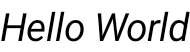
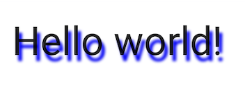
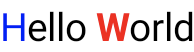

- [テキストのスタイルを設定する](#テキストのスタイルを設定する)
  - [一般的なテキストのスタイル設定](#一般的なテキストのスタイル設定)
    - [テキストの色を変更する](#テキストの色を変更する)
    - [文字サイズを変更する](#文字サイズを変更する)
    - [テキストを斜体にする](#テキストを斜体にする)
    - [テキストの太さを変える](#テキストの太さを変える)
    - [シャドウを追加](#シャドウを追加)
  - [テキストに複数のスタイルを追加する](#テキストに複数のスタイルを追加する)
  - [Brush で高度なスタイル設定を有効にする](#brush-で高度なスタイル設定を有効にする)
    - [ブラシを使用してテキストのスタイルを設定する](#ブラシを使用してテキストのスタイルを設定する)
    - [統合](#統合)
      - [SpanStyle を使用したその他のスタイル設定](#spanstyle-を使用したその他のスタイル設定)
        - [テキストの範囲にブラシを適用する](#テキストの範囲にブラシを適用する)
        - [テキストスパンの不透明度](#テキストスパンの不透明度)
    - [参考情報](#参考情報)
  - [テキストにマーキー効果を適用する](#テキストにマーキー効果を適用する)


# テキストのスタイルを設定する

Text コンポーザブルには、コンテンツのスタイルを設定するためのオプションのパラメータが複数あります。以下に、テキストの最も一般的な使用例をカバーするパラメータをリストしました。Text のすべてのパラメータについては、 [Compose Text のソースコード](https://cs.android.com/androidx/platform/frameworks/support/+/androidx-main:compose/material/material/src/commonMain/kotlin/androidx/compose/material/Text.kt;l=91) を参照してください。

これらのパラメータのいずれかを設定すると、テキスト値全体にスタイルが適用されます。同じ行または段落内に複数のスタイルを適用する必要がある場合は、 [複数のインラインスタイル](#テキストに複数のスタイルを追加する) に関するセクションを参照してください。


## 一般的なテキストのスタイル設定

次のセクションでは、テキストのスタイルを設定する一般的な方法について説明します。


### テキストの色を変更する

```kotlin
@Composable
fun BlueText() {
    Text("Hello World", color = Color.Blue)
}
```


### 文字サイズを変更する

```kotlin
@Composable
fun BigText() {
    Text("Hello World", fontSize = 30.sp)
}
```


### テキストを斜体にする

テキストを斜体にするには、fontStyle パラメータを使用します。または別の [FontStyle](https://developer.android.com/reference/kotlin/androidx/compose/ui/text/font/FontStyle?_gl=1*1jlm7qm*_up*MQ..*_ga*MTcwMzU5OTM3OS4xNzI2MTUyNTE0*_ga_6HH9YJMN9M*MTcyNjE1MjUxMy4xLjAuMTcyNjE1MjUxMy4wLjAuMTAzODExODk0NQ..) を設定することでも実現できますが、 FontStyle には Italic しか存在しないため、独自にフォントスタイルを定義する必要があります。

```kotlin
@Composable
fun ItalicText() {
    Text("Hello World", fontStyle = FontStyle.Italic)
}
```




### テキストの太さを変える

テキストの太さを変更するには、fontWeight パラメータを使用します。 [FontWeight](https://developer.android.com/reference/kotlin/androidx/compose/ui/text/font/FontWeight?_gl=1*16g1toh*_up*MQ..*_ga*MTcwMzU5OTM3OS4xNzI2MTUyNTE0*_ga_6HH9YJMN9M*MTcyNjE1MjUxMy4xLjAuMTcyNjE1MjUxMy4wLjAuMTAzODExODk0NQ..) 内には、複数の太さに関する設定が存在するため、自分の要望にあった太さを選択してください。

```kotlin
// FontWeight.Bold で太字にする例
@Composable
fun BoldText() {
    Text("Hello World", fontWeight = FontWeight.Bold)
}
```


### シャドウを追加

スタイル パラメータに [TextStyle](https://developer.android.com/reference/kotlin/androidx/compose/ui/text/TextStyle?_gl=1*1tzop56*_up*MQ..*_ga*MTcwMzU5OTM3OS4xNzI2MTUyNTE0*_ga_6HH9YJMN9M*MTcyNjE1MjUxMy4xLjAuMTcyNjE1MjUxMy4wLjAuMTAzODExODk0NQ..) タイプのオブジェクトを設定すると、影などの複数のパラメータを構成できます。 [Shadow](https://developer.android.com/reference/kotlin/androidx/compose/ui/graphics/Shadow?_gl=1*12jokjr*_up*MQ..*_ga*MTcwMzU5OTM3OS4xNzI2MTUyNTE0*_ga_6HH9YJMN9M*MTcyNjE1MjUxMy4xLjAuMTcyNjE1MjUxMy4wLjAuMTAzODExODk0NQ..) は、次のパラメータを受け取ります。

- 影の色
- オフセット or テキストに対する影の位置
- ぼかし半径 (ぼかしの程度を表す)

```kotlin
@Composable
fun TextShadow() {
    val offset = Offset(5.0f, 10.0f)
    Text(
        text = "Hello world!",
        style = TextStyle(
            fontSize = 24.sp,
            shadow = Shadow(
                color = Color.Blue,
                offset = offset,
                blurRadius = 3f
            )
        )
    )
}
```




## テキストに複数のスタイルを追加する

一つの [Text](https://developer.android.com/reference/kotlin/androidx/compose/material/package-summary?_gl=1*78tp5n*_up*MQ..*_ga*MTcwMzU5OTM3OS4xNzI2MTUyNTE0*_ga_6HH9YJMN9M*MTcyNjE1MjUxMy4xLjAuMTcyNjE1MjUxMy4wLjAuMTAzODExODk0NQ..#Text(androidx.compose.ui.text.AnnotatedString,androidx.compose.ui.Modifier,androidx.compose.ui.graphics.Color,androidx.compose.ui.unit.TextUnit,androidx.compose.ui.text.font.FontStyle,androidx.compose.ui.text.font.FontWeight,androidx.compose.ui.text.font.FontFamily,androidx.compose.ui.unit.TextUnit,androidx.compose.ui.text.style.TextDecoration,androidx.compose.ui.text.style.TextAlign,androidx.compose.ui.unit.TextUnit,androidx.compose.ui.text.style.TextOverflow,kotlin.Boolean,kotlin.Int,kotlin.Int,kotlin.collections.Map,kotlin.Function1,androidx.compose.ui.text.TextStyle)) コンポーザブル内で、文字単位で異なるスタイルを設定するには、任意のアノテーションスタイルで、アノテーションを付けることができる文字列である [AnnotatedString](https://developer.android.com/reference/kotlin/androidx/compose/ui/text/AnnotatedString?_gl=1*opfpay*_up*MQ..*_ga*MTcwMzU5OTM3OS4xNzI2MTUyNTE0*_ga_6HH9YJMN9M*MTcyNjE1MjUxMy4xLjAuMTcyNjE1MjUxMy4wLjAuMTAzODExODk0NQ..) を使用します。

AnnotatedString は、次のものを含むデータ クラスです。

- Text 値
- SpanStyleRange のリスト
  - 一文字単位で適用可能なタイプのスタイル
  - 例
    - 色
    - 太さ
    - 大きさ
- ParagraphStyleRange のリスト
  - 段落単位で適用可能なタイプのスタイル
  - 例
    - テキストの配置
    - テキストの方向
    - 行の高さ
    - テキストのインデント スタイル

TextStyle は Text コンポーザブルで使用し、 SpanStyle と ParagraphStyle は AnnotatedString で使用します。

段落内の複数のスタイルの詳細については、 [段落に複数のスタイルを追加する](./3.段落に対するスタイル設定.md/#段落に複数のスタイルを追加する) を参照してください。

AnnotatedString には、作成を容易にする [型セーフビルダー](https://kotlinlang.org/docs/reference/type-safe-builders.html) ( [buildAnnotatedString](https://developer.android.com/reference/kotlin/androidx/compose/ui/text/package-summary?_gl=1*1b6fgcz*_up*MQ..*_ga*MTcwMzU5OTM3OS4xNzI2MTUyNTE0*_ga_6HH9YJMN9M*MTcyNjE1MjUxMy4xLjAuMTcyNjE1MjUxMy4wLjAuMTAzODExODk0NQ..#buildAnnotatedString(kotlin.Function1)) ) があります。

```kotlin
@Composable
fun MultipleStylesInText() {
    Text(
        // buildAnnotatedString は、 AnnotatedString を返します。
        text = buildAnnotatedString {
            withStyle(style = SpanStyle(color = Color.Blue)) {
                append("H")
            }
            append("ello ")

            withStyle(style = SpanStyle(fontWeight = FontWeight.Bold, color = Color.Red)) {
                append("W")
            }
            append("orld")
        }
    )
}
```




## Brush で高度なスタイル設定を有効にする

より高度なテキスト スタイル設定を有効にするには、 [TextStyle](https://developer.android.com/reference/kotlin/androidx/compose/ui/text/TextStyle?_gl=1*18ku99v*_up*MQ..*_ga*MTcwMzU5OTM3OS4xNzI2MTUyNTE0*_ga_6HH9YJMN9M*MTcyNjE1MjUxMy4xLjAuMTcyNjE1MjUxMy4wLjAuMTAzODExODk0NQ..) および [SpanStyle](https://developer.android.com/reference/kotlin/androidx/compose/ui/text/SpanStyle?_gl=1*18ku99v*_up*MQ..*_ga*MTcwMzU5OTM3OS4xNzI2MTUyNTE0*_ga_6HH9YJMN9M*MTcyNjE1MjUxMy4xLjAuMTcyNjE1MjUxMy4wLjAuMTAzODExODk0NQ..) で [Brush](https://developer.android.com/reference/kotlin/androidx/compose/ui/graphics/Brush?_gl=1*18ku99v*_up*MQ..*_ga*MTcwMzU5OTM3OS4xNzI2MTUyNTE0*_ga_6HH9YJMN9M*MTcyNjE1MjUxMy4xLjAuMTcyNjE1MjUxMy4wLjAuMTAzODExODk0NQ..) API を使用します。通常 TextStyle または SpanStyle を使用する場所では、Brush も使用できるようになりました。

注意: TextStyle での Brush API の現在の使用は実験的なものです。実験的な API は将来変更される可能性があります。


### ブラシを使用してテキストのスタイルを設定する

TextStyle に組み込まれている [Brush](https://developer.android.com/reference/kotlin/androidx/compose/ui/graphics/Brush?_gl=1*mt0b0y*_up*MQ..*_ga*MTcwMzU5OTM3OS4xNzI2MTUyNTE0*_ga_6HH9YJMN9M*MTcyNjE1MjUxMy4xLjAuMTcyNjE1MjUxMy4wLjAuMTAzODExODk0NQ..) を使用してテキストを構成します。たとえば、次のようにしてテキストに [linearGradient](https://developer.android.com/reference/kotlin/androidx/compose/ui/graphics/Brush.Companion?_gl=1*1musi1c*_up*MQ..*_ga*MTcwMzU5OTM3OS4xNzI2MTUyNTE0*_ga_6HH9YJMN9M*MTcyNjE1MjUxMy4xLjAuMTcyNjE1MjUxMy4wLjAuMTAzODExODk0NQ..#linearGradient(kotlin.Array,androidx.compose.ui.geometry.Offset,androidx.compose.ui.geometry.Offset,androidx.compose.ui.graphics.TileMode)) ブラシを構成できます。

```kotlin
val gradientColors = listOf(Cyan, LightBlue, Purple /*...*/)

Text(
    text = text,
    style = TextStyle(
        brush = Brush.linearGradient(
            colors = gradientColors
        )
    )
)
```


この特定の配色や色付けスタイルに限定されるわけではありません。ここでは強調表示するための簡単な例を示しましたが、組み込みの [Brush](https://developer.android.com/reference/kotlin/androidx/compose/ui/graphics/Brush?_gl=1*mt0b0y*_up*MQ..*_ga*MTcwMzU5OTM3OS4xNzI2MTUyNTE0*_ga_6HH9YJMN9M*MTcyNjE1MjUxMy4xLjAuMTcyNjE1MjUxMy4wLjAuMTAzODExODk0NQ..) のいずれか、または [SolidColor](https://developer.android.com/reference/kotlin/androidx/compose/ui/graphics/SolidColor?_gl=1*mt0b0y*_up*MQ..*_ga*MTcwMzU5OTM3OS4xNzI2MTUyNTE0*_ga_6HH9YJMN9M*MTcyNjE1MjUxMy4xLjAuMTcyNjE1MjUxMy4wLjAuMTAzODExODk0NQ..) のみを使用してテキストを強調することもできます。

Brush は現時点 ( 2024 年 9 月時点) では、主にグラデーションを実装する機能だけ存在しているようです。


### 統合

Brush は TextStyle と SpanStyle の両方と一緒に使用できるため、 [TextField](https://developer.android.com/reference/kotlin/androidx/compose/material/package-summary?_gl=1*18q5317*_up*MQ..*_ga*MTcwMzU5OTM3OS4xNzI2MTUyNTE0*_ga_6HH9YJMN9M*MTcyNjE1MjUxMy4xLjAuMTcyNjE1MjUxMy4wLjAuMTAzODExODk0NQ..#TextField(androidx.compose.ui.text.input.TextFieldValue,kotlin.Function1,androidx.compose.ui.Modifier,kotlin.Boolean,kotlin.Boolean,androidx.compose.ui.text.TextStyle,kotlin.Function0,kotlin.Function0,kotlin.Function0,kotlin.Function0,kotlin.Boolean,androidx.compose.ui.text.input.VisualTransformation,androidx.compose.foundation.text.KeyboardOptions,androidx.compose.foundation.text.KeyboardActions,kotlin.Boolean,kotlin.Int,kotlin.Int,androidx.compose.foundation.interaction.MutableInteractionSource,androidx.compose.ui.graphics.Shape,androidx.compose.material.TextFieldColors)) および buildAnnotatedString との統合はシームレスです。

TextField 内での Brush API の使用の詳細については、 [Brush API を使用して、入力のスタイルを設定する](../3.ユーザー入力を処理する.md/#brush-api-によて入力のスタイルを設定する) を参照してください。


#### SpanStyle を使用したその他のスタイル設定

##### テキストの範囲にブラシを適用する

テキストの一部にのみブラシを適用する場合は、選択したブラシとグラデーションとともに、 [buildAnnotatedString](https://developer.android.com/reference/kotlin/androidx/compose/ui/text/package-summary?_gl=1*1cl3ss7*_up*MQ..*_ga*MTcwMzU5OTM3OS4xNzI2MTUyNTE0*_ga_6HH9YJMN9M*MTcyNjE1MjUxMy4xLjAuMTcyNjE1MjUxMy4wLjAuMTAzODExODk0NQ..#buildAnnotatedString(kotlin.Function1)) と [SpanStyle](https://developer.android.com/reference/kotlin/androidx/compose/ui/text/SpanStyle?_gl=1*1cl3ss7*_up*MQ..*_ga*MTcwMzU5OTM3OS4xNzI2MTUyNTE0*_ga_6HH9YJMN9M*MTcyNjE1MjUxMy4xLjAuMTcyNjE1MjUxMy4wLjAuMTAzODExODk0NQ..) API を使用します。

```kotlin
Text(
    text = buildAnnotatedString {
        append("Do not allow people to dim your shine\n")
        withStyle(
            SpanStyle(
                brush = Brush.linearGradient(
                    colors = rainbowColors
                )
            )
        ) {
            append("because they are blinded.")
        }
        append("\nTell them to put some sunglasses on.")
    }
)
```


##### テキストスパンの不透明度

特定のテキスト範囲の不透明度を調整するには、 [SpanStyle](https://developer.android.com/reference/kotlin/androidx/compose/ui/text/SpanStyle?_gl=1*1xlg8x4*_up*MQ..*_ga*MTcwMzU5OTM3OS4xNzI2MTUyNTE0*_ga_6HH9YJMN9M*MTcyNjE1MjUxMy4xLjAuMTcyNjE1MjUxMy4wLjAuMTAzODExODk0NQ..) のオプションの alpha パラメータを使用します。テキストの両方の部分に同じブラシを使用し、対応する範囲の alpha パラメータを変更します。コード サンプルでは、​​テキストの前半は、半分の不透明度 (alpha =.5f) で表示され、テキストの後半は完全な不透明度 (alpha = 1f) で表示されます。

```kotlin
val brush = Brush.linearGradient(colors = rainbowColors)

buildAnnotatedString {
    withStyle(
        SpanStyle(
            brush = brush, alpha = .5f
        )
    ) {
        append("Text in ")
    }
    withStyle(
        SpanStyle(
            brush = brush, alpha = 1f
        )
    ) {
        append("Compose ❤️")
    }
}
```


### 参考情報

その他のカスタマイズ例については、ブログ投稿 [Compose テキストの色付けのブラッシュアップ](https://medium.com/androiddevelopers/brushing-up-on-compose-text-coloring-84d7d70dd8fa) を参照してください。Brush が Animations API とどのように統合されるかについて詳しく知りたい場合は、 [Compose でのブラシ テキストの色付けのアニメーション化](https://medium.com/androiddevelopers/animating-brush-text-coloring-in-compose-%EF%B8%8F-26ae99d9b402) を参照してください。


## テキストにマーキー効果を適用する

[basicMarquee](https://developer.android.com/reference/kotlin/androidx/compose/ui/Modifier?_gl=1*1kurnaa*_up*MQ..*_ga*MTcwMzU5OTM3OS4xNzI2MTUyNTE0*_ga_6HH9YJMN9M*MTcyNjE1MjUxMy4xLjAuMTcyNjE1MjUxMy4wLjAuMTAzODExODk0NQ..#(androidx.compose.ui.Modifier).basicMarquee(kotlin.Int,androidx.compose.foundation.MarqueeAnimationMode,kotlin.Int,kotlin.Int,androidx.compose.foundation.MarqueeSpacing,androidx.compose.ui.unit.Dp)) 修飾子を任意のコンポーザブルに適用して、アニメーション化されたスクロール効果を生み出すことができます。コンテンツが幅広すぎて利用可能な制約に収まらない場合に、マーキー効果が発生します。デフォルトでは、basicMarquee には特定の構成 (速度や初期遅延など) が設定されていますが、これらのパラメータを変更して効果をカスタマイズできます。

次のスニペットは、Text コンポーザブルに基本的なマーキー効果を実装します。

```kotlin
@Composable
fun BasicMarqueeSample() {
    // マーキー効果は、コンテンツが制約の範囲内に収まらない場合のみ発生します。
    Column(Modifier.width(400.dp)) {
        Text(
            "Learn about why it's great to use Jetpack Compose",
            modifier = Modifier.basicMarquee(),
            fontSize = 50.sp
        )
    }
}
```

https://youtu.be/6x32T15lTpQ


