- [プレースホルダー](#プレースホルダー)
  - [型](#型)
    - [プレースホルダーの選択フロー](#プレースホルダーの選択フロー)
    - [Placeholder](#placeholder)
    - [Error](#error)
    - [Fallback](#fallback)
  - [FAQ](#faq)
    - [プレースホルダーは非同期で読み込まれますか?](#プレースホルダーは非同期で読み込まれますか)
    - [プレースホルダーに変換は適用されますか?](#プレースホルダーに変換は適用されますか)
    - [複数のビューで同じ Drawable をプレースホルダーとして使用しても問題ありませんか?](#複数のビューで同じ-drawable-をプレースホルダーとして使用しても問題ありませんか)


# プレースホルダー

## 型

Glide では、さまざまな状況で使用される 3 つの異なるプレースホルダーを指定できます:

- [placeholder](https://bumptech.github.io/glide/javadocs/400/com/bumptech/glide/request/RequestOptions.html#placeholder-int-)
- [error](https://bumptech.github.io/glide/javadocs/400/com/bumptech/glide/request/RequestOptions.html#error-int-)
- [fallback](https://bumptech.github.io/glide/javadocs/400/com/bumptech/glide/request/RequestOptions.html#fallback-int-)


### プレースホルダーの選択フロー




### Placeholder

プレースホルダーは、リクエストの進行中に表示される Drawable です。リクエストが正常に完了すると、プレースホルダーはリクエストされたリソースに置き換えられます。リクエストされたリソースがメモリからロードされた場合、プレースホルダーは表示されない可能性があります。リクエストが失敗し、エラー Drawable が設定されていない場合、プレースホルダーは引き続き表示されます。同様に、リクエストされた URL/モデルが null で、エラー Drawable もフォールバック Drawable も設定されていない場合、プレースホルダーも引き続き表示されます。

```java
Glide.with(fragment)
    .load(url)
    .placeholder(R.drawable.placeholder)
    .into(view);
```

もしくは、

```java
Glide.with(fragment)
    .load(url)
    .placeholder(new ColorDrawable(Color.BLACK))
    .into(view);
```


### Error

エラー Drawable は、リクエストが恒久的に失敗した場合に表示されます。リクエストされた URL/モデル が null で、フォールバック Drawable が設定されていない場合にも、エラー Drawable が表示されます。

```java
Glide.with(fragment)
    .load(url)
    .error(R.drawable.error)
    .into(view);

```

もしくは、

```java
Glide.with(fragment)
    .load(url)
    .error(new ColorDrawable(Color.RED))
    .into(view);
```


### Fallback

フォールバック Drawables は、要求された URL/モデル が null の場合に表示されます。フォールバック Drawables の主な目的は、 null が予想されるかどうかをユーザーが示すことができるようにすることです。たとえば、 null のプロフィール URL は、ユーザーがプロフィール写真を設定していないことを示し、デフォルトを使用する必要があることを示します。ただし、 null はメタデータが無効であるか、取得できなかったことを示している場合もあります。デフォルトでは、 Glide は null の URL/モデル をエラーとして扱うため、 null が予想されるユーザーはフォールバック Drawable を設定する必要があります。

```java
Glide.with(fragment)
    .load(url)
    .fallback(R.drawable.fallback)
    .into(view);
```

もしくは、

```java
Glide.with(fragment)
    .load(url)
    .fallback(new ColorDrawable(Color.GREY))
    .into(view);
```


## FAQ

### プレースホルダーは非同期で読み込まれますか?

いいえ。プレースホルダーはメインスレッドで Android リソースから読み込まれます。通常、プレースホルダーは小さく、システム リソース キャッシュによって簡単にキャッシュ可能であることが期待されます。


### プレースホルダーに変換は適用されますか?

いいえ。変換は要求されたリソースにのみ適用され、プレースホルダーには適用されません。

実行時に変換する必要があるリソースをアプリケーションに含めるのは非効率的です。ほとんどの場合、必要なサイズと形状に正確に一致するリソースのバージョンを含める方がよいでしょう。たとえば、円形の画像を読み込む場合は、円形のプレースホルダー リソースをアプリケーションに含めることをお勧めします。または、変換と同じ方法でプレースホルダーをクリップするカスタム ビューを検討することもできます。


### 複数のビューで同じ Drawable をプレースホルダーとして使用しても問題ありませんか?

通常は問題ありませんが、常にそうとは限りません。ステートレス Drawable (BitmapDrawable など) は、通常、一度に複数のビューに表示できます。ただし、ステートフル Drawable は、複数のビューで同時に状態が変更されるため、通常、複数のビューに同時に表示するのは安全ではありません。ステートフル Drawable の場合は、リソース ID を渡すか、newDrawable() を使用して各リクエストに新しいコピーを渡します。


