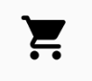

- [マテリアルアイコン](#マテリアルアイコン)
  - [アイコンのカスタマイズ例](#アイコンのカスタマイズ例)
  - [参考資料](#参考資料)


# マテリアルアイコン

Icon コンポーザブルは、 [Material Design ガイドライン](https://m2.material.io/design/iconography/system-icons.html#grid-and-keyline-shapes) に準拠した単色アイコンを画面上に描画する便利な方法です。Icon を使用するには、 [Compose Material ライブラリ](https://developer.android.com/jetpack/androidx/releases/compose-material?_gl=1*1x2a1hp*_up*MQ..*_ga*OTU2NjI5OTY2LjE3MjYzOTgxODU.*_ga_6HH9YJMN9M*MTcyNjQ2ODM2MS4yLjAuMTcyNjQ2ODM2MS4wLjAuMzU0MDU5MDk5) 、または [Compose Material 3 ライブラリ](https://developer.android.com/jetpack/androidx/releases/compose-material3?_gl=1*um4k2r*_up*MQ..*_ga*OTU2NjI5OTY2LjE3MjYzOTgxODU.*_ga_6HH9YJMN9M*MTcyNjQ2ODM2MS4yLjAuMTcyNjQ2ODM2MS4wLjAuMzU0MDU5MDk5) を含めます。

たとえば、Material のデフォルトでロードするベクター ドローアブルがある場合、次のように Icon コンポーザブルを使用できます。

```kotlin
Icon(
    painter = painterResource(R.drawable.baseline_directions_bus_24),
    contentDescription = stringResource(id = R.string.bus_content_description)
)
```

デフォルトでは、Icon コンポーザブルは LocalContentColor.current で色付けされ、サイズは 24.dp です。

色付けカラーパラメータ ( tint ) も公開されます (これは、 [画像の色付けセクション](./5.画像をカスタマイズする.md/#画像の色合いを調整する) で説明するのと同じメカニズムを利用して色付けします)。

Icon コンポーザブルは、小さなアイコン要素に使用することを目的としています。より多くのカスタマイズ オプションが必要な場合は、Image コンポーザブルを使用してください。

[Material Icon ライブラリ](https://developer.android.com/reference/kotlin/androidx/compose/material/icons/package-summary?hl=ja&_gl=1*1cho33a*_up*MQ..*_ga*OTU2NjI5OTY2LjE3MjYzOTgxODU.*_ga_6HH9YJMN9M*MTcyNjUzODM4Mi4yLjAuMTcyNjUzODM4Mi4wLjAuOTA1MzY1MjQ.) には、 SVG を個別にインポートしなくても Compose で使用できる定義済みアイコンのセットが含まれています。 [ショッピングカートアイコン](https://fonts.google.com/icons?icon.query=shopping+cart&hl=ja) の丸みを帯びたバージョンを描画するには、次のようにします。

```kotlin
Icon(
    Icons.Rounded.ShoppingCart,
    contentDescription = stringResource(id = R.string.shopping_cart_content_desc)
)
```



参考 : 内部的には、Icon は `Modifier.paint(painterResource(R.drawable.ic_bus_stop))` を使用して画面上に Icon を描画しているため、 VectorDrawable を画面上にレンダリングするために Icon を使用する必要はないらしいが、 ChatGPT によると、 `Modifier.paint()` は、既に非推奨になっているらしい。

使用可能なすべてのアイコンの詳細については、 [Icons ドキュメント](https://developer.android.com/reference/kotlin/androidx/compose/material/icons/package-summary?hl=ja&_gl=1*1la4bh1*_up*MQ..*_ga*OTU2NjI5OTY2LjE3MjYzOTgxODU.*_ga_6HH9YJMN9M*MTcyNjUzODM4Mi4yLjAuMTcyNjUzODM4Mi4wLjAuOTA1MzY1MjQ.) を参照してください。


## アイコンのカスタマイズ例

```kotlin
Icon(
    painter = painterResource(id = R.drawable.outline_inbox_24),
    contentDescription = stringResource(
    id = R.string.popular_icon_description
    ),
    modifier = Modifier
        // 角丸
        .clip(MaterialTheme.shapes.extraSmall)
        // 背景の塗りつぶし色
        .background(colorResource(id = R.color.gray))
        // 「背景のエッジ」と「アイコンそのもののエッジ」の余白
        .padding(6.dp)
        // アイコンそのもののサイズ
        .size(16.dp),
    tint = colorResource(id = R.color.white),
)
```

上記の例では、 Icon コンポーザブルのサイズは、余白とアイコンそのもののサイズによって決まります。


## 参考資料

- [Google のマテリアルアイコン一覧](https://fonts.google.com/icons)

