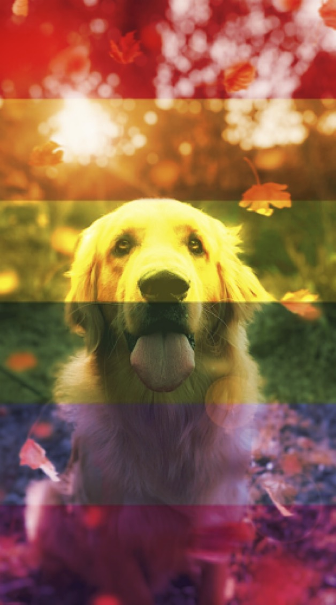

- [カスタムペインター](#カスタムペインター)


# カスタムペインター

Compose では、Painter オブジェクトは、描画可能なものを表し（Android で定義される Drawable API の代替）、それを使用している対応するコンポーザブルの測定とレイアウトに影響を与えます。

BitmapPainter は、画面に Bitmap を描画できる ImageBitmap を受け取ります。

ほとんどのユースケースでは、上記の painterResource() を使用すると、アセットの正しいペインタ（BitmapPainter または VectorPainter）が返されます。この 2 つの違いについて詳しくは、 [ImageBitmap と ImageVector のセクション](./3.ImageBitmap%20と%20ImageVector.md) をご覧ください。

Painter は DrawModifier とは異なります。DrawModifier は指定された境界内に厳密に描画し、コンポーザブルの測定またはレイアウトに影響を与えません。

カスタム ペインタを作成するには、Painter クラスを拡張し、onDraw メソッドを実装します。これにより、DrawScope にアクセスしてカスタム グラフィックを描画できるようになります。intrinsicSize をオーバーライドすることもでき、これを使用すると、含まれるコンポーザブルに影響を与えることができます。

```kotlin
class OverlayImagePainter constructor(
    private val image: ImageBitmap,
    private val imageOverlay: ImageBitmap,
    private val srcOffset: IntOffset = IntOffset.Zero,
    private val srcSize: IntSize = IntSize(image.width, image.height),
    private val overlaySize: IntSize = IntSize(imageOverlay.width, imageOverlay.height)
) : Painter() {

    private val size: IntSize = validateSize(srcOffset, srcSize)
    override fun DrawScope.onDraw() {
        // draw the first image without any blend mode
        drawImage(
            image,
            srcOffset,
            srcSize,
            dstSize = IntSize(
                this@onDraw.size.width.roundToInt(),
                this@onDraw.size.height.roundToInt()
            )
        )
        // draw the second image with an Overlay blend mode to blend the two together
        drawImage(
            imageOverlay,
            srcOffset,
            overlaySize,
            dstSize = IntSize(
                this@onDraw.size.width.roundToInt(),
                this@onDraw.size.height.roundToInt()
            ),
            blendMode = BlendMode.Overlay
        )
    }

    /**
     * Return the dimension of the underlying [ImageBitmap] as it's intrinsic width and height
     */
    override val intrinsicSize: Size get() = size.toSize()

    private fun validateSize(srcOffset: IntOffset, srcSize: IntSize): IntSize {
        require(
            srcOffset.x >= 0 &&
                srcOffset.y >= 0 &&
                srcSize.width >= 0 &&
                srcSize.height >= 0 &&
                srcSize.width <= image.width &&
                srcSize.height <= image.height
        )
        return srcSize
    }
}
```

カスタムの Painter を設定したので、次のように元の画像の上に任意の画像を重ねることができます。

```kotlin
val rainbowImage = ImageBitmap.imageResource(id = R.drawable.rainbow)
val dogImage = ImageBitmap.imageResource(id = R.drawable.dog)
val customPainter = remember {
    OverlayImagePainter(dogImage, rainbowImage)
}
Image(
    painter = customPainter,
    contentDescription = stringResource(id = R.string.dog_content_description),
    contentScale = ContentScale.Crop,
    modifier = Modifier.wrapContentSize()
)
```

カスタム ペインタで 2 つの画像を組み合わせた出力を以下に示します。



カスタム ペインタを `Modifier.paint(customPainter)` とともに使用して、次のようにコンポーザブルにコンテンツを描画することもできます。 (以前、 ChatGpt に `Modifier.paint(customPainter)` は非推奨になったといわれたが、実装してみたら、非推奨ではなかった。)

```kotlin
val rainbowImage = ImageBitmap.imageResource(id = R.drawable.rainbow)
val dogImage = ImageBitmap.imageResource(id = R.drawable.dog)
val customPainter = remember {
    OverlayImagePainter(dogImage, rainbowImage)
}
Box(
    modifier =
    Modifier.background(color = Color.Gray)
        .padding(30.dp)
        .background(color = Color.Yellow)
        .paint(customPainter)
) { /** intentionally empty **/ }
```

注 : 上記のカスタム ペインタは、DrawModifier を使用して実装することもできます。測定またはレイアウトに影響を与える必要がある場合は、Painter を使用する必要があります。指定された境界内でのみレンダリングすることを想定している場合は、 代わりに DrawModifier を使用してください。


