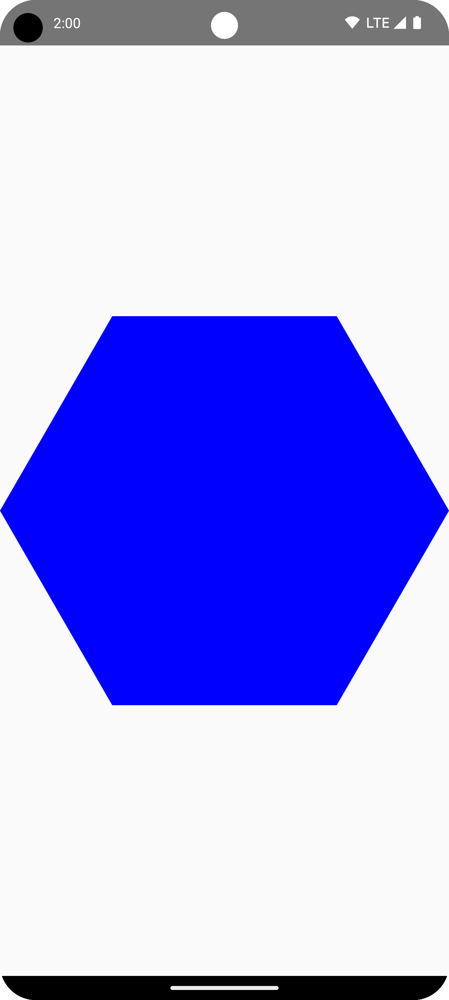
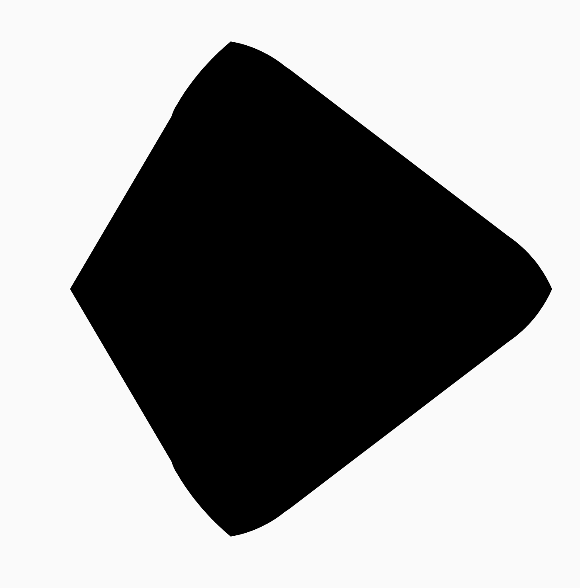
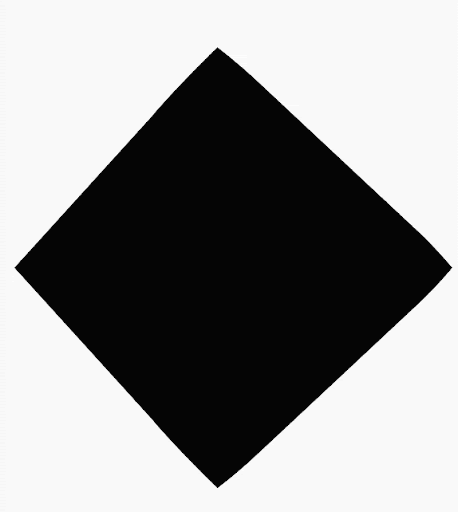
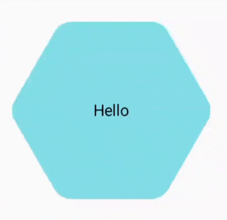
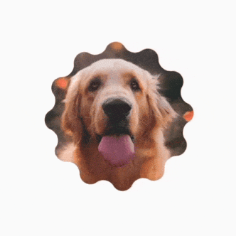
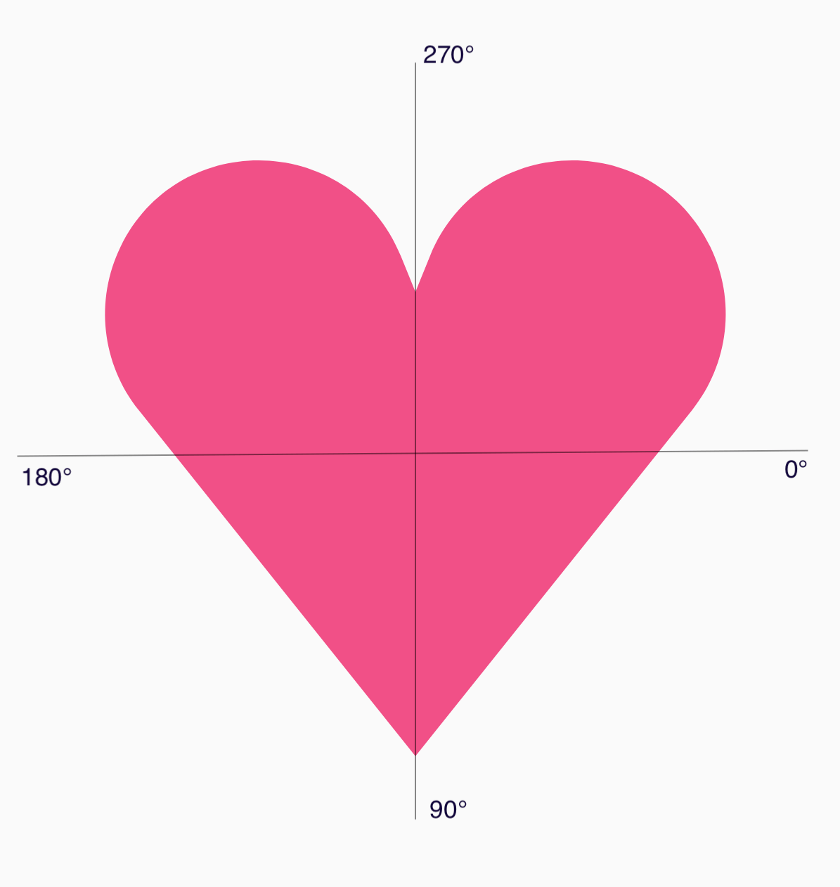
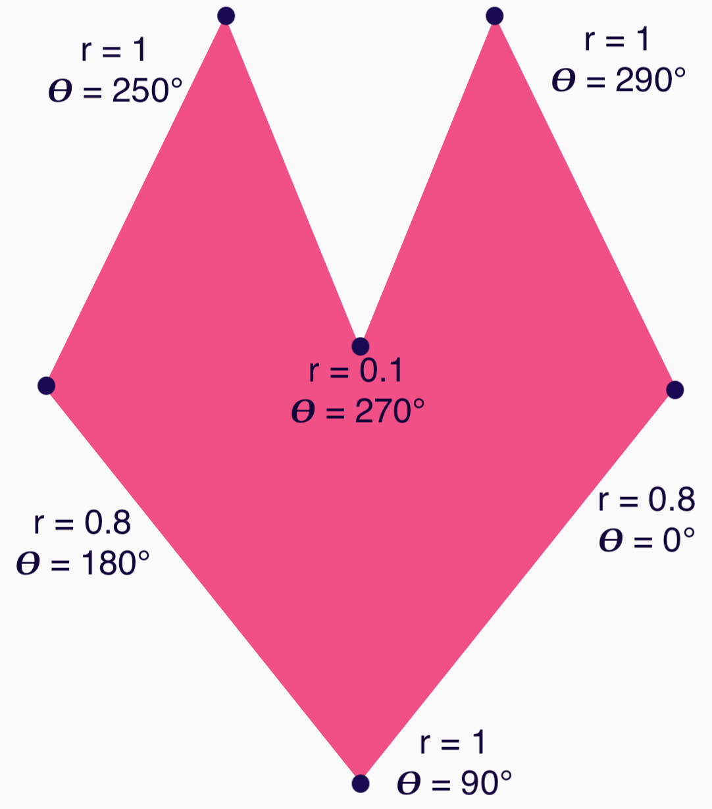

- [Compose のシェイプ](#compose-のシェイプ)
  - [ポリゴンを作成する](#ポリゴンを作成する)
    - [ポリゴンの角を丸くする](#ポリゴンの角を丸くする)
      - [半径（Radius）](#半径radius)
      - [スムージング](#スムージング)
    - [サイズと位置](#サイズと位置)
  - [図形を変形させる](#図形を変形させる)
  - [ポリゴンに沿って切り抜きを行う](#ポリゴンに沿って切り抜きを行う)
  - [クリックで変形ボタン](#クリックで変形ボタン)
  - [無限に変化する形状をアニメーション表示する](#無限に変化する形状をアニメーション表示する)
  - [カスタムポリゴン](#カスタムポリゴン)
  - [参考情報](#参考情報)


# Compose のシェイプ

Compose では、ポリゴンから作成されたシェイプを作成できます。たとえば 次のようなシェイプを作成できます。


Compose でカスタムの丸みを帯びたポリゴンを作成するには、app/build.gradle に [graphics-shapes](https://developer.android.com/jetpack/androidx/releases/graphics?_gl=1*d8j0jp*_up*MQ..*_ga*MTQ1NzI0ODE0NC4xNzI2NzI4Nzk2*_ga_6HH9YJMN9M*MTcyNjc5NzEyOS4yLjAuMTcyNjc5NzEyOS4wLjAuMTkzNTEzODc4Mw..) 依存関係を追加します。

```
implementation "androidx.graphics:graphics-shapes:1.0.0-rc01"
```

このライブラリを使用すると、ポリゴンからシェイプを作成できます。多角形のシェイプには直線のエッジと鋭角のみがありますが、これらのシェイプでは角を丸くすることもできます。簡単に 2 つの異なるプラットフォーム間で 適用できます。任意の形状でのモーフィング (※ 1 ) は難しく、 設計時の問題です。しかし、このライブラリはこれらの間でモーフィングすることで、 類似した多角形の構造を持つ複数の図形を描画します。

(※ 1 ) ある物体から別の物体へと自然に変形する映像をみせる。

注: [graphics-shapes](https://developer.android.com/jetpack/androidx/releases/graphics?_gl=1*1wz84ao*_up*MQ..*_ga*MTQ1NzI0ODE0NC4xNzI2NzI4Nzk2*_ga_6HH9YJMN9M*MTcyNjc5NzEyOS4yLjAuMTcyNjc5NzEyOS4wLjAuMTkzNTEzODc4Mw..) ライブラリは、組み込みの Compose シェイプ ( [RoundedCornerShape](https://developer.android.com/reference/kotlin/androidx/compose/foundation/shape/RoundedCornerShape?_gl=1*1wz84ao*_up*MQ..*_ga*MTQ1NzI0ODE0NC4xNzI2NzI4Nzk2*_ga_6HH9YJMN9M*MTcyNjc5NzEyOS4yLjAuMTcyNjc5NzEyOS4wLjAuMTkzNTEzODc4Mw..) など) とは別の [Shapes](https://developer.android.com/reference/kotlin/androidx/compose/ui/graphics/Shape?_gl=1*h3ncw3*_up*MQ..*_ga*MTQ1NzI0ODE0NC4xNzI2NzI4Nzk2*_ga_6HH9YJMN9M*MTcyNjc5NzEyOS4yLjAuMTcyNjc5NzEyOS4wLjAuMTkzNTEzODc4Mw..) セットです。graphics-shapes は、Compose または View システムで使用するために設計されています。graphics-shapes のシェイプは、結果のシェイプを Path オブジェクトに変換することで Compose シェイプに変換できます (以下のコード例の一部を参照)。

注意: このライブラリは、任意のパス間のモーフィング (再生アイコンから一時停止アイコンへのモーフィングなど) 用ではなく、これらのポリゴン シェイプ間のモーフィングのみを目的とします。任意のパスをそれらの間でモーフィングする必要がある場合は、代わりに [AnimatedVectorDrawables](https://developer.android.com/develop/ui/compose/animation/vectors?_gl=1*z5ntj6*_up*MQ..*_ga*MTQ1NzI0ODE0NC4xNzI2NzI4Nzk2*_ga_6HH9YJMN9M*MTcyNjc5NzEyOS4yLjAuMTcyNjc5NzEyOS4wLjAuMTkzNTEzODc4Mw..) を使用し、 [shapeshifter.design](https://shapeshifter.design/) などのサードパーティ ツールを使用してパス ポイントを正しく配置してください。


## ポリゴンを作成する

次のスニペットは、描画領域の中央に 6 つのポイントを持つ基本的な多角形シェイプを作成します。

```kotlin
Box(
    modifier = Modifier
        .drawWithCache {
            val roundedPolygon = RoundedPolygon(
                // number of vertices (頂点の数)の略。
                numVertices = 6,
                // minDimension は、 Canvas の幅と高さの大きさのうち小さい方を表します。
                radius = size.minDimension / 2,
                centerX = size.width / 2,
                centerY = size.height / 2
            )
            val roundedPolygonPath = roundedPolygon.toPath().asComposePath()
            onDrawBehind {
                drawPath(roundedPolygonPath, color = Color.Blue)
            }
        }
        .fillMaxSize()
)
```



この例では、ライブラリは要求された図形を表すジオメトリ (形状、サイズ、位置などの総称) を保持する RoundedPolygon を作成します。Compose アプリでその図形を描画するには、そこから Path オブジェクトを取得して、Compose が描画できる形式のデータを取得する必要があります。


### ポリゴンの角を丸くする

多角形の角を丸めるには、CornerRounding パラメータを使用します。このパラメータには、半径とスムージングの 2 つのパラメータが必要です。各丸い角は 1 ～ 3 個の 3 次曲線で構成され、その中心は円弧の形状を持ち、2 つの側面 ( 隣り合わせにある ) 曲線は形状の端から中心の曲線に移行します。


#### 半径（Radius）

半径は、頂点を丸めるために使用される円の半径です。

たとえば、次の角丸三角形について考えます。


半径 ( Radius ) r は、以下の部分の長さになります。


#### スムージング

スムージングは​​、角の円形の丸み部分からエッジに到達するまでにかかる時間を決定する係数です。スムージング係数が 0 (スムージングなし、CornerRounding の既定値) の場合、角は完全な円形の角になります。スムージング係数が 0 以外の場合 (最大 1.0)、角は 3 つの別々の曲線で丸められます。 1 に近づくほど、尖った感じに近づいていきますが、頂点の数が多い多角形になるにつれ、スムージングの差はなくなっていきます。

次の図は、スムージング係数が 0 の三角形です。完全な円になっています。


次の図は、スムージング係数が 0.75 の三角形です。完全な円ではなく、少し尖った感じになっています。尖ったといっても、図形の幅や高さが変わるわけではありません。曲線が円の内側を通るように角丸を形成します。


たとえば、以下のスニペットで、角の丸い三角形を描画します。

```kotlin
Box(
    modifier = Modifier
        .drawWithCache {
            val roundedPolygon = RoundedPolygon(
                numVertices = 3,
                radius = size.minDimension / 2,
                centerX = size.width / 2,
                centerY = size.height / 2,
                rounding = CornerRounding(
                    size.minDimension / 10f,
                    smoothing = 0.1f
                )
            )
            val roundedPolygonPath = roundedPolygon.toPath().asComposePath()
            onDrawBehind {
                drawPath(roundedPolygonPath, color = Color.Black)
            }
        }
        .size(100.dp)
)
```

左側の図は、スムージングを 0 に設定した場合で、右側の図は 1 に設定した場合です。


### サイズと位置

デフォルトでは、中心 (0, 0) の周囲に半径 1 の図形が作成されます。この半径は、図形のベースとなる多角形の中心と外側の頂点の間の距離を表します。角を丸めると、丸められた角が丸められていない頂点よりも中心に近くなるため、図形が小さくなることに注意してください。多角形のサイズを変更するには、半径の値を調整します。位置を調整するには、多角形の centerX または centerY を変更します。または、 [DrawScope#translate()](https://developer.android.com/reference/kotlin/androidx/compose/ui/graphics/drawscope/DrawScope?_gl=1*xnt0ss*_up*MQ..*_ga*MTQ1NzI0ODE0NC4xNzI2NzI4Nzk2*_ga_6HH9YJMN9M*MTcyNjc5NzEyOS4yLjAuMTcyNjc5NzEyOS4wLjAuMTkzNTEzODc4Mw..#(androidx.compose.ui.graphics.drawscope.DrawScope).translate(kotlin.Float,kotlin.Float,kotlin.Function1)) などの標準の DrawScope 変換関数を使用して、オブジェクトを変換し、サイズ、位置、回転を変更します。


## 図形を変形させる

Morph オブジェクトは、2 つの多角形間のアニメーションを表す新しい図形です。2 つの図形をモーフィングするには、2 つの RoundedPolygon と、これら 2 つの図形を取得する Morph オブジェクトを作成します。開始図形と終了図形間の図形を計算するには、0 から 1 の間の進行状況値を指定して、開始図形 (0) と終了図形 (1) 間の形状を決定します。

```kotlin
Box(
    modifier = Modifier
        .drawWithCache {
            val triangle = RoundedPolygon(
                numVertices = 3,
                radius = size.minDimension / 2f,
                centerX = size.width / 2f,
                centerY = size.height / 2f,
                rounding = CornerRounding(
                    size.minDimension / 10f,
                    smoothing = 0.1f
                )
            )
            val square = RoundedPolygon(
                numVertices = 4,
                radius = size.minDimension / 2f,
                centerX = size.width / 2f,
                centerY = size.height / 2f
            )

            val morph = Morph(start = triangle, end = square)
            val morphPath = morph
                .toPath(progress = 0.5f).asComposePath()

            onDrawBehind {
                drawPath(morphPath, color = Color.Black)
            }
        }
        .fillMaxSize()
)
```

上記の例では、進行状況は 2 つの形状 (角丸三角形と正方形) のちょうど中間にあり、次の結果が生成されます。



ほとんどのシナリオでは、モーフィングは単なる静的レンダリングではなく、アニメーションの一部として実行されます。これら 2 つの形状間でアニメーション化するには、 [Compose の標準 Animation API](../../8.アニメーション/) を使用して、時間の経過に伴う進行状況の値を変更します。たとえば、次のようにして、これら 2 つの形状間のモーフィングを無限にアニメーション化できます。

```kotlin
val infiniteAnimation = rememberInfiniteTransition(label = "infinite animation")
val morphProgress = infiniteAnimation.animateFloat(
    initialValue = 0f,
    targetValue = 1f,
    animationSpec = infiniteRepeatable(
        tween(500),
        repeatMode = RepeatMode.Reverse
    ),
    label = "morph"
)
Box(
    modifier = Modifier
        .drawWithCache {
            val triangle = RoundedPolygon(
                numVertices = 3,
                // この radius は、多角形の中心からいずれかの頂点までの距離
                radius = size.minDimension / 2f,
                centerX = size.width / 2f,
                centerY = size.height / 2f,
                rounding = CornerRounding(
                    // この radius は、角丸の半径
                    radius = size.minDimension / 10f,
                    smoothing = 0.1f
                )
            )
            val square = RoundedPolygon(
                numVertices = 4,
                radius = size.minDimension / 2f,
                centerX = size.width / 2f,
                centerY = size.height / 2f
            )

            val morph = Morph(start = triangle, end = square)
            val morphPath = morph
                .toPath(progress = morphProgress.value)
                .asComposePath()

            onDrawBehind {
                drawPath(morphPath, color = Color.Black)
            }
        }
        .fillMaxSize()
)
```




## ポリゴンに沿って切り抜きを行う

Composable のレンダリング方法を変更したり、クリッピング領域の周囲に描画される影を利用したりするには、 Compose の [clip](https://developer.android.com/reference/kotlin/androidx/compose/ui/Modifier?_gl=1*zrxkh1*_up*MQ..*_ga*MTQ1NzI0ODE0NC4xNzI2NzI4Nzk2*_ga_6HH9YJMN9M*MTcyNjc5NzEyOS4yLjAuMTcyNjc5NzEyOS4wLjAuMTkzNTEzODc4Mw..#(androidx.compose.ui.Modifier).clip(androidx.compose.ui.graphics.Shape)) 修飾子を使用するのが一般的です。そのクリップにポリゴンを渡す方法について説明します。

```kotlin
// 【参考】
// calculateBounds() は、 RoundedPolygon の関数です。
// let 関数は、ラムダ式の結果を返します。
// calculateBounds() 関数は、与えられた RoundedPolygon の
// left, top, right, bottom を格納した FloatArray を返します
fun RoundedPolygon.getBounds() = calculateBounds().let { Rect(it[0], it[1], it[2], it[3]) }

class RoundedPolygonShape(
    private val polygon: RoundedPolygon,
    private var matrix: Matrix = Matrix()
) : Shape {
    private var path = Path()
    override fun createOutline(
        // size は描画可能な領域のサイズ。この場合、
        // 次のスニペットで定義している Box のサイズ (単位:px)
        size: Size,
        layoutDirection: LayoutDirection,
        density: Density
    ): Outline {
        // Path の内容を削除します。(※ 1 )
        path.rewind()
        path = polygon.toPath().asComposePath()
        matrix.reset()
        val bounds = polygon.getBounds()
        // bounds.width は、多角形の幅。
        // この場合、多角形の半径がデフォルト値 1f になっているため、
        // bounds.width は、約 2 となる。
        // (実際には、頂点の丸めがあるため、もう少し短い)
        val maxDimension = max(bounds.width, bounds.height)
        // scale 関数の引数は、拡大・縮小の倍率を指定します。
        // このコードでは、例えば Pixel 8a では、
        // size.width = 525, maxDimension = 1.94 なので、
        // x の拡大率は、 269 倍となります。
        matrix.scale(size.width / maxDimension, size.height / maxDimension)
        // 多角形の中心地点は、デフォルトで (0,0) になっているため、
        // translate で移動させることで、多角形を任意の位置に表示する。
        matrix.translate(-bounds.left, -bounds.top)

        // 直前の scale や translate は、まだ Path に適用されていないため、 Path に適用する。
        path.transform(matrix)
        return Outline.Generic(path)
    }
}
```

```
(※ 1 ) Path.rewind() と Path.reset() の違い

- Path.reset() は完全にパスを初期化し、パスに関連するすべての状態をクリアします。まったく新しいパスを始めるための状態に戻ります。
- Path.rewind() はパスの内容をクリアしますが、パス自体の属性（塗りつぶしのルール、方向、サブパスの開始位置）は保持されます。
```

次のスニペットに示すように、ポリゴンをクリップとして使用できます。

```kotlin
val hexagon = remember {
    RoundedPolygon(
        // 頂点の丸めの半径 (radius) が指定されていないため、
        // デフォルト値の 1f が適用されます。

        6,
        rounding = CornerRounding(0.2f)
    )
}
val clip = remember(hexagon) {
    RoundedPolygonShape(polygon = hexagon)
}
Box(
    modifier = Modifier
        .clip(clip)
        .background(MaterialTheme.colorScheme.secondary)
        .size(200.dp)
) {
    Text(
        "Hello Compose",
        color = MaterialTheme.colorScheme.onSecondary,
        modifier = Modifier.align(Alignment.Center)
    )
}
```

実行結果は次のようになります。


これは、以前のレンダリングとそれほど変わらないように見えるかもしれませんが、Compose の他の機能を活用できます。たとえば、この手法を使用して、画像を切り取り、切り取った領域の周囲に影を適用できます。

```kotlin
val hexagon = remember {
    RoundedPolygon(
        6,
        rounding = CornerRounding(0.2f)
    )
}
val clip = remember(hexagon) {
    RoundedPolygonShape(polygon = hexagon)
}
Box(
    modifier = Modifier.fillMaxSize(),
    contentAlignment = Alignment.Center
) {
    Image(
        painter = painterResource(id = R.drawable.dog),
        contentDescription = "Dog",
        contentScale = ContentScale.Crop,
        modifier = Modifier
            .graphicsLayer {
                this.shadowElevation = 6.dp.toPx()
                this.shape = clip
                this.clip = true
                this.ambientShadowColor = Color.Black
                this.spotShadowColor = Color.Black
            }
            .size(200.dp)
    )
}
```


## クリックで変形ボタン

graphics-shape ライブラリを使用すると、押すと 2 つの図形が変形するボタンを作成できます。まず、Shape を拡張した MorphPolygonShape を作成し、適切にフィットするようにスケーリングおよび変換します。図形をアニメーション化できるように、進行状況を渡すことに注意してください。

```kotlin
class MorphPolygonShape(
    private val morph: Morph,
    private val percentage: Float
) : Shape {

    private val matrix = Matrix()
    override fun createOutline(
        size: Size,
        layoutDirection: LayoutDirection,
        density: Density
    ): Outline {
        // 以下では、デフォルトの半径 1f も、centerX と centerY の 0f も変更していないことを前提としています。
        // デフォルトでは、パスはコンテナーのサイズに合わせて伸縮されます。伸縮したくない場合は、x と y の両方に同じ size.width を使用します。
        matrix.scale(size.width / 2f, size.height / 2f)
        matrix.translate(1f, 1f)

        val path = morph.toPath(progress = percentage).asComposePath()
        path.transform(matrix)
        return Outline.Generic(path)
    }
}
```

このモーフシェイプを使用するには、shapeA と shapeB の 2 つのポリゴンを作成します。モーフを作成して記憶します。次に、タップ時のアニメーションの駆動力として、 interactionSource を使用して、モーフをクリップ アウトラインとしてボタンに適用します。

```kotlin
val shapeA = remember {
    RoundedPolygon(
        6,
        rounding = CornerRounding(0.2f)
    )
}
val shapeB = remember {
    RoundedPolygon.star(
        6,
        rounding = CornerRounding(0.1f)
    )
}
val morph = remember {
    Morph(shapeA, shapeB)
}
val interactionSource = remember {
    MutableInteractionSource()
}
val isPressed by interactionSource.collectIsPressedAsState()
val animatedProgress = animateFloatAsState(
    targetValue = if (isPressed) 1f else 0f,
    label = "progress",
    animationSpec = spring(dampingRatio = 0.4f, stiffness = Spring.StiffnessMedium)
)
Box(
    modifier = Modifier
        .size(200.dp)
        .padding(8.dp)
        .clip(MorphPolygonShape(morph, animatedProgress.value))
        .background(Color(0xFF80DEEA))
        .size(200.dp)
        .clickable(interactionSource = interactionSource, indication = null) {
        }
) {
    Text("Hello", modifier = Modifier.align(Alignment.Center))
}
```

これにより、ボックスをタップすると次のアニメーションが表示されます。




## 無限に変化する形状をアニメーション表示する

モーフシェイプを無限にアニメーション化するには、 [rememberInfiniteTransition](https://developer.android.com/develop/ui/compose/animation/value-based?_gl=1*zwfno6*_up*MQ..*_ga*MTQ1NzI0ODE0NC4xNzI2NzI4Nzk2*_ga_6HH9YJMN9M*MTcyNjk2NzAzOC40LjAuMTcyNjk2NzAzOC4wLjAuMzE2MTc2MjY5#rememberinfinitetransition) を使用します。以下は、時間の経過とともにシェイプが無限に変化 (および回転) するプロフィール写真の例です。このアプローチでは、上記の MorphPolygonShape に小さな調整を加えます。

```kotlin
class CustomRotatingMorphShape(
    private val morph: Morph,
    private val percentage: Float,
    private val rotation: Float
) : Shape {

    private val matrix = Matrix()
    override fun createOutline(
        size: Size,
        layoutDirection: LayoutDirection,
        density: Density
    ): Outline {
        matrix.scale(size.width / 2f, size.height / 2f)
        matrix.translate(1f, 1f)
        // 回転
        matrix.rotateZ(rotation)

        val path = morph.toPath(progress = percentage).asComposePath()
        path.transform(matrix)

        return Outline.Generic(path)
    }
}

@Preview
@Composable
private fun RotatingScallopedProfilePic() {
    val shapeA = remember {
        RoundedPolygon(
            12,
            rounding = CornerRounding(0.2f)
        )
    }
    val shapeB = remember {
        RoundedPolygon.star(
            12,
            rounding = CornerRounding(0.2f)
        )
    }
    val morph = remember {
        Morph(shapeA, shapeB)
    }
    // 無限アニメーション
    val infiniteTransition = rememberInfiniteTransition("infinite outline movement")
    val animatedProgress = infiniteTransition.animateFloat(
        initialValue = 0f,
        targetValue = 1f,
        animationSpec = infiniteRepeatable(
            tween(2000, easing = LinearEasing),
            repeatMode = RepeatMode.Reverse
        ),
        label = "animatedMorphProgress"
    )
    val animatedRotation = infiniteTransition.animateFloat(
        initialValue = 0f,
        targetValue = 360f,
        animationSpec = infiniteRepeatable(
            tween(6000, easing = LinearEasing),
            repeatMode = RepeatMode.Reverse
        ),
        label = "animatedMorphProgress"
    )
    Box(
        modifier = Modifier.fillMaxSize(),
        contentAlignment = Alignment.Center
    ) {
        Image(
            painter = painterResource(id = R.drawable.dog),
            contentDescription = "Dog",
            contentScale = ContentScale.Crop,
            modifier = Modifier
                .clip(
                    CustomRotatingMorphShape(
                        morph,
                        animatedProgress.value,
                        animatedRotation.value
                    )
                )
                .size(200.dp)
        )
    }
}
```

このコードにより、次のような楽しい結果が得られます。




## カスタムポリゴン

通常の多角形から作成された図形がユースケースをカバーしない場合は、頂点のリストを使用してよりカスタマイズされた図形を作成できます。たとえば、次のようなハートの形を作成するとします。


この図形の個々の頂点は、x、y 座標の float 配列を受け取る RoundedPolygon オーバーロードを使用して指定できます。

ハートのポリゴンを分解するには、極座標系を使用すると、直交座標系 (x、y) を使用するよりも簡単になります。極座標系では、0° が右側から始まり、時計回りに進み、12 時の位置で 270° になります。



各点の中心からの角度 (𝜭) と半径を指定することで、形状をより簡単に定義できるようになりました。



頂点を作成して RoundedPolygon 関数に渡すことができます。

```kotlin
val vertices = remember {
    val radius = 1f
    val radiusSides = 0.8f
    val innerRadius = .1f
    floatArrayOf(
        radialToCartesian(radiusSides, 0f.toRadians()).x,
        radialToCartesian(radiusSides, 0f.toRadians()).y,
        radialToCartesian(radius, 90f.toRadians()).x,
        radialToCartesian(radius, 90f.toRadians()).y,
        radialToCartesian(radiusSides, 180f.toRadians()).x,
        radialToCartesian(radiusSides, 180f.toRadians()).y,
        radialToCartesian(radius, 250f.toRadians()).x,
        radialToCartesian(radius, 250f.toRadians()).y,
        radialToCartesian(innerRadius, 270f.toRadians()).x,
        radialToCartesian(innerRadius, 270f.toRadians()).y,
        radialToCartesian(radius, 290f.toRadians()).x,
        radialToCartesian(radius, 290f.toRadians()).y,
    )
}
```

頂点は、次の radicalToCartesian 関数を使用して直交座標に変換する必要があります。

```kotlin
internal fun Float.toRadians() = this * PI.toFloat() / 180f

internal val PointZero = PointF(0f, 0f)
internal fun radialToCartesian(
    radius: Float,
    angleRadians: Float,
    center: PointF = PointZero
) = directionVectorPointF(angleRadians) * radius + center

internal fun directionVectorPointF(angleRadians: Float) =
    PointF(cos(angleRadians), sin(angleRadians))
```

上記のコードではハートの生の頂点が提供されますが、選択したハートの形にするには特定の角を丸める必要があります。90° と 270° の角は丸める必要はありませんが、他の角は丸める必要があります。個々の角にカスタムの丸めを行うには、perVertexRounding パラメーターを使用します。

```kotlin
val rounding = remember {
    val roundingNormal = 0.6f
    val roundingNone = 0f
    listOf(
        CornerRounding(roundingNormal),
        CornerRounding(roundingNone),
        CornerRounding(roundingNormal),
        CornerRounding(roundingNormal),
        CornerRounding(roundingNone),
        CornerRounding(roundingNormal),
    )
}

val polygon = remember(vertices, rounding) {
    RoundedPolygon(
        vertices = vertices,
        perVertexRounding = rounding
    )
}
Box(
    modifier = Modifier
        .drawWithCache {
            val roundedPolygonPath = polygon.toPath().asComposePath()
            onDrawBehind {
                scale(size.width * 0.5f, size.width * 0.5f) {
                    translate(size.width * 0.5f, size.height * 0.5f) {
                        drawPath(roundedPolygonPath, color = Color(0xFFF15087))
                    }
                }
            }
        }
        .size(400.dp)
)
```

結果はピンク色のハートになります:


前述のシェイプがユースケースをカバーしていない場合は、 [Path クラスを使用してカスタムシェイプを描画する](./1.概要.md/#パスを描画する) か、ディスクから [ImageVector](https://developer.android.com/develop/ui/compose/graphics/images/compare?_gl=1*7vz0tw*_up*MQ..*_ga*MTQ1NzI0ODE0NC4xNzI2NzI4Nzk2*_ga_6HH9YJMN9M*MTcyNjk2NzAzOC40LjAuMTcyNjk2NzAzOC4wLjAuMzE2MTc2MjY5#image-vector) ファイルを読み込むことを検討してください。graphics-shapes ライブラリは任意のシェイプに使用するためのものではなく、丸みを帯びたポリゴンの作成とそれらの間のモーフィング アニメーションを簡素化することを目的としています。


## 参考情報

For more information and examples, see the following resources:

- [Blog: The Shape of Things to Come - Shapes](https://medium.com/androiddevelopers/the-shape-of-things-to-come-1c7663d9dbc0)
- [Blog: Shape morphing in Android](https://medium.com/androiddevelopers/shape-morphing-in-android-f5c36416a979)
- [Shapes Github demonstration](https://github.com/chethaase/ShapesDemo)

