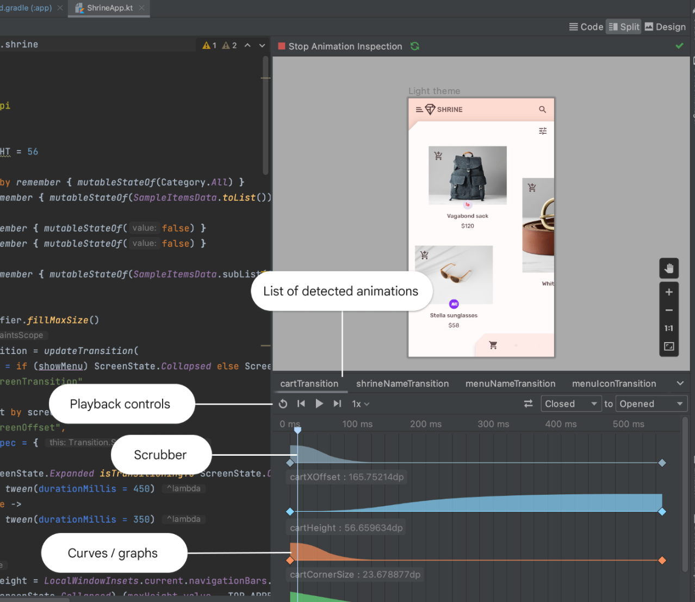

- [アニメーションツールのサポート](#アニメーションツールのサポート)

# アニメーションツールのサポート

Android Studio は、アニメーション プレビューでの [animate*AsState](https://developer.android.com/develop/ui/compose/value-based?hl=ja&_gl=1*g6uycy*_up*MQ..*_ga*OTQxMjc1NjExLjE3MjcwMTEwOTk.*_ga_6HH9YJMN9M*MTcyNzE3MjUyOC4zLjAuMTcyNzE3MjUyOC4wLjAuMTIyODExNjU3NQ..#animate-as-state) 、 [CrossFade](https://developer.android.com/develop/ui/compose/animation/composables-modifiers?hl=ja&_gl=1*g6uycy*_up*MQ..*_ga*OTQxMjc1NjExLjE3MjcwMTEwOTk.*_ga_6HH9YJMN9M*MTcyNzE3MjUyOC4zLjAuMTcyNzE3MjUyOC4wLjAuMTIyODExNjU3NQ..#crossfade) 、 [rememberInfiniteTransition](https://developer.android.com/develop/ui/compose/animation/value-based?hl=ja&_gl=1*g6uycy*_up*MQ..*_ga*OTQxMjc1NjExLjE3MjcwMTEwOTk.*_ga_6HH9YJMN9M*MTcyNzE3MjUyOC4zLjAuMTcyNzE3MjUyOC4wLjAuMTIyODExNjU3NQ..#rememberinfinitetransition) 、 [AnimatedContent](https://developer.android.com/develop/ui/compose/animation/composables-modifiers?hl=ja&_gl=1*g6uycy*_up*MQ..*_ga*OTQxMjc1NjExLjE3MjcwMTEwOTk.*_ga_6HH9YJMN9M*MTcyNzE3MjUyOC4zLjAuMTcyNzE3MjUyOC4wLjAuMTIyODExNjU3NQ..#animatedcontent) 、 [updateTransition](https://developer.android.com/develop/ui/compose/animation/value-based?hl=ja&_gl=1*g6uycy*_up*MQ..*_ga*OTQxMjc1NjExLjE3MjcwMTEwOTk.*_ga_6HH9YJMN9M*MTcyNzE3MjUyOC4zLjAuMTcyNzE3MjUyOC4wLjAuMTIyODExNjU3NQ..#updateTransition) 、 [animatedVisibility](https://developer.android.com/develop/ui/compose/animation/composables-modifiers?hl=ja&_gl=1*g6uycy*_up*MQ..*_ga*OTQxMjc1NjExLjE3MjcwMTEwOTk.*_ga_6HH9YJMN9M*MTcyNzE3MjUyOC4zLjAuMTcyNzE3MjUyOC4wLjAuMTIyODExNjU3NQ..#animatedvisibility) の検査をサポートしています。具体的には、次のことが可能です。

遷移をフレームごとにプレビューする
遷移内のアニメーションすべての値を検査する
初期状態とターゲット状態の間の遷移をプレビューする
複数のアニメーションを一度に検査して調整する
アニメーション プレビューを開始すると、プレビュー内の任意の遷移を実行できる [Animations] ペインが表示されます。遷移とその個々のアニメーション値には、デフォルト名のラベルが付けられます。ラベルをカスタマイズするには、updateTransition 関数と AnimatedVisibility 関数で label パラメータを指定します。詳しくは、 [アニメーションプレビュー](https://developer.android.com/develop/ui/compose/tooling/animation-preview?hl=ja&_gl=1*tscz3p*_up*MQ..*_ga*OTQxMjc1NjExLjE3MjcwMTEwOTk.*_ga_6HH9YJMN9M*MTcyNzE3MjUyOC4zLjAuMTcyNzE3MjUyOC4wLjAuMTIyODExNjU3NQ..) をご覧ください。

