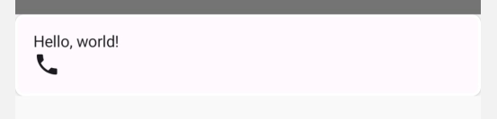
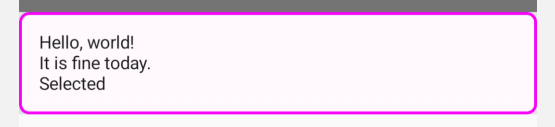

- [値ベースのアニメーション](#値ベースのアニメーション)
  - [animate\*AsState で単一の値をアニメーション化する](#animateasstate-で単一の値をアニメーション化する)
  - [transition で複数のプロパティを同時にアニメーション化する](#transition-で複数のプロパティを同時にアニメーション化する)
    - [AnimatedVisibility と AnimatedContent で transition を使用する](#animatedvisibility-と-animatedcontent-で-transition-を使用する)
    - [遷移をカプセル化して再利用可能にする（コンポーザブルとアニメーションの分離）](#遷移をカプセル化して再利用可能にするコンポーザブルとアニメーションの分離)
  - [rememberInfiniteTransition で無限に繰り返すアニメーションを作成する](#rememberinfinitetransition-で無限に繰り返すアニメーションを作成する)
  - [低レベルアニメーション API](#低レベルアニメーション-api)
    - [Animatable: コルーチンベースの単一の値のアニメーション](#animatable-コルーチンベースの単一の値のアニメーション)
    - [Animation: 手動で制御するアニメーション](#animation-手動で制御するアニメーション)
      - [TargetBasedAnimation](#targetbasedanimation)
      - [DecayAnimation](#decayanimation)


# 値ベースのアニメーション

## animate*AsState で単一の値をアニメーション化する

[animate*AsState](https://developer.android.com/reference/kotlin/androidx/compose/animation/core/package-summary?hl=ja&_gl=1*1npg9tn*_up*MQ..*_ga*OTQxMjc1NjExLjE3MjcwMTEwOTk.*_ga_6HH9YJMN9M*MTcyNzAxMTA5OC4xLjAuMTcyNzAxMTA5OS4wLjAuNTgwNTQzODM5#animateDpAsState(androidx.compose.ui.unit.Dp,androidx.compose.animation.core.AnimationSpec,kotlin.String,kotlin.Function1)) 関数は、Compose で単一の値をアニメーション化するための最もシンプルなアニメーション API です。ターゲット値（または終了値）を指定するのみで、API が現在の値から指定された値までのアニメーション化を開始します。

この API を使用してアルファ値をアニメーション化する例を以下に示します。ターゲット値を [animateFloatAsState](https://developer.android.com/reference/kotlin/androidx/compose/animation/core/package-summary?hl=ja&_gl=1*i6u6fp*_up*MQ..*_ga*OTQxMjc1NjExLjE3MjcwMTEwOTk.*_ga_6HH9YJMN9M*MTcyNzAxMTA5OC4xLjAuMTcyNzAxMTA5OS4wLjAuNTgwNTQzODM5#animateFloatAsState(kotlin.Float,androidx.compose.animation.core.AnimationSpec,kotlin.Float,kotlin.String,kotlin.Function1)) でラップするのみで、アルファ値は指定した値 (この場合は 1f から 0.5f まで) の間のアニメーション値になります。

```kotlin
var enabled by remember { mutableStateOf(true) }

val alpha: Float by animateFloatAsState(if (enabled) 1f else 0.5f)
Box(
    Modifier.fillMaxSize()
        .graphicsLayer(alpha = alpha)
        .background(Color.Red)
)
```

アニメーション クラスのインスタンスを作成したり、割り込みを処理したりする必要はありません。内部では、アニメーション オブジェクト（Animatable インスタンス）がコールサイトで作成および記憶され、最初のターゲット値が初期値として指定されます。その後、このコンポーザブルに別のターゲット値を指定すると、その値までのアニメーションが自動的に開始されます。実行中のアニメーションがある場合、アニメーションは現在の値から同じ速度で開始し、ターゲット値までアニメーション化します。アニメーション中に、このコンポーザブルは再コンポーズされ、更新されたアニメーション値をフレームごとに返します。

Compose には、Float、Color、Dp、Size、Offset、Rect、Int、IntOffset、IntSize 用の animate*AsState 関数が、すぐに使える状態で用意されています。汎用型を受け入れる animateValueAsState に TwoWayConverter を指定することにより、他のデータ型のサポートを簡単に追加できます。

[AnimationSpec](https://developer.android.com/reference/kotlin/androidx/compose/animation/core/AnimationSpec?hl=ja&_gl=1*97zx5y*_up*MQ..*_ga*OTQxMjc1NjExLjE3MjcwMTEwOTk.*_ga_6HH9YJMN9M*MTcyNzAxMTA5OC4xLjAuMTcyNzAxMTA5OS4wLjAuNTgwNTQzODM5) を指定することで、アニメーションの仕様をカスタマイズできます。詳細については、 [AnimationSpec を使用してアニメーションをカスタマイズする](./8.アニメーションをカスタマイズする.md/#animationspec-パラメータを使用してアニメーションをカスタマイズする) をご覧ください。


## transition で複数のプロパティを同時にアニメーション化する

[Transition](https://developer.android.com/reference/kotlin/androidx/compose/animation/core/Transition?hl=ja&_gl=1*yo9t8o*_up*MQ..*_ga*OTQxMjc1NjExLjE3MjcwMTEwOTk.*_ga_6HH9YJMN9M*MTcyNzAxMTA5OC4xLjAuMTcyNzAxMTA5OS4wLjAuNTgwNTQzODM5) は、1 つ以上のアニメーションを子として管理し、複数の状態間で同時に実行します。

この状態はどのデータ型でもかまいません。多くの場合、次の例のようにカスタムの enum 型を使用することで型の安全性を確保できます。

```kotlin
Transition は、1 つ以上のアニメーションを子として管理し、複数の状態間で同時に実行します。

この状態はどのデータ型でもかまいません。多くの場合、次の例のようにカスタムの enum 型を使用することで型の安全性を確保できます。
```

[updateTransition](https://developer.android.com/reference/kotlin/androidx/compose/animation/core/package-summary?hl=ja&_gl=1*yo9t8o*_up*MQ..*_ga*OTQxMjc1NjExLjE3MjcwMTEwOTk.*_ga_6HH9YJMN9M*MTcyNzAxMTA5OC4xLjAuMTcyNzAxMTA5OS4wLjAuNTgwNTQzODM5#updateTransition(kotlin.Any,kotlin.String)) は Transition のインスタンスを作成して記憶し、その状態を更新します。

```kotlin
var currentState by remember { mutableStateOf(BoxState.Collapsed) }
val transition = updateTransition(currentState, label = "box state")
```

次に、animate* 拡張関数のいずれかを使用して、この遷移で子アニメーションを定義できます。各状態のターゲット値を指定します。これらの animate* 関数は、遷移状態が updateTransition で更新されると、アニメーション中にフレームごとに更新されるアニメーション値を返します。

```kotlin
val rect by transition.animateRect(label = "rectangle") { state ->
    when (state) {
        BoxState.Collapsed -> Rect(0f, 0f, 100f, 100f)
        BoxState.Expanded -> Rect(100f, 100f, 300f, 300f)
    }
}
val borderWidth by transition.animateDp(label = "border width") { state ->
    when (state) {
        BoxState.Collapsed -> 1.dp
        BoxState.Expanded -> 0.dp
    }
}
```

必要に応じて、transitionSpec パラメータを渡して、遷移状態の変更の各組み合わせごとに異なる AnimationSpec を指定できます。詳細については、 [AnimationSpec パラメータを使用してアニメーションをカスタマイズする](./8.アニメーションをカスタマイズする.md/#animationspec-パラメータを使用してアニメーションをカスタマイズする) をご覧ください。

```kotlin
val color by transition.animateColor(
    transitionSpec = {
        when {
            BoxState.Expanded isTransitioningTo BoxState.Collapsed ->
                spring(stiffness = 50f)
            else ->
                tween(durationMillis = 500)
        }
    }, label = "color"
) { state ->
    when (state) {
        BoxState.Collapsed -> MaterialTheme.colorScheme.primary
        BoxState.Expanded -> MaterialTheme.colorScheme.background
    }
}
```

遷移がターゲット状態に到達すると、Transition.currentState は Transition.targetState と同じになります。これは、遷移が完了したかどうかのシグナルとして使用できます。

動作する完全なコードが公式ドキュメントには存在しなかっため、自分で実装してみたものを以下に掲載します。

```kotlin
enum class BoxState {
    Collapsed,
    Expanded
}

@Composable
fun MyScreen() {
    var currentState by remember { mutableStateOf(BoxState.Collapsed) }
    val transition = updateTransition(currentState, label = "box state")

    val color by transition.animateColor(
        transitionSpec = {
            when {
                BoxState.Expanded isTransitioningTo BoxState.Collapsed ->
                    spring(stiffness = 50f)

                else ->
                    tween(durationMillis = 500)
            }
        }, label = "color"
    ) { state ->
        when (state) {
            BoxState.Collapsed -> MaterialTheme.colorScheme.primary
            BoxState.Expanded -> MaterialTheme.colorScheme.background
        }
    }

    val rect by transition.animateRect(label = "rectangle") { state ->
        when (state) {
            BoxState.Collapsed -> Rect(0f, 0f, 100f, 100f)
            BoxState.Expanded -> Rect(100f, 100f, 300f, 300f)
        }
    }
    val borderWidth by transition.animateDp(label = "border width") { state ->
        when (state) {
            BoxState.Collapsed -> 4.dp
            BoxState.Expanded -> 0.dp
        }
    }

    Column {
        val dpWith = rect.right.dp - rect.left.dp
        val dpHeight = rect.bottom.dp - rect.top.dp
        var pxWith: Float
        var pxHeight: Float
        with(LocalDensity.current) {
            pxWith = dpWith.toPx()
            pxHeight = dpHeight.toPx()
        }
        Box(
            modifier = Modifier
                .size(
                    width = dpWith,
                    height = dpHeight
                )
                .border(width = borderWidth, color = Color.Gray)
        ) {
            Canvas(modifier = Modifier) {
                drawRect(
                    color = color,
                    size = Size(
                        width = pxWith,
                        height = pxHeight
                    )
                )
            }
            Text(text = "aaa")
        }
        Button(onClick = { currentState = BoxState.Expanded }) {
            Text("展開")
        }
        Button(onClick = { currentState = BoxState.Collapsed }) {
            Text("折畳")
        }
    }
}
```

最初のターゲット状態とは異なる初期状態が必要になる場合があります。これを実現するには、updateTransition を MutableTransitionState とともに使用します。たとえば、コードがコンポジションに入り次第、アニメーションを開始できます。


```kotlin
// Start in collapsed state and immediately animate to expanded
var currentState = remember { MutableTransitionState(BoxState.Collapsed) }
currentState.targetState = BoxState.Expanded
val transition = updateTransition(currentState, label = "box state")
// ……
```

複数のコンポーズ可能な関数が関係する複雑な遷移の場合は、 [createChildTransition](https://developer.android.com/reference/kotlin/androidx/compose/animation/core/Transition?hl=ja&_gl=1*1w1j7lr*_up*MQ..*_ga*OTQxMjc1NjExLjE3MjcwMTEwOTk.*_ga_6HH9YJMN9M*MTcyNzAxMTA5OC4xLjAuMTcyNzAxMTA5OS4wLjAuNTgwNTQzODM5#(androidx.compose.animation.core.Transition).createChildTransition(kotlin.String,kotlin.Function1)) を使用して子遷移を作成できます。この手法を使うと、複雑なコンポーザブルで複数のサブコンポーネントに関心を分離できます。親遷移は、子遷移のすべてのアニメーション値を認識します。

```kotlin
enum class DialerState { DialerMinimized, NumberPad }

@Composable
fun DialerButton(isVisibleTransition: Transition<Boolean>) {
    // `isVisibleTransition` spares the need for the content to know
    // about other DialerStates. Instead, the content can focus on
    // animating the state change between visible and not visible.
}

@Composable
fun NumberPad(isVisibleTransition: Transition<Boolean>) {
    // `isVisibleTransition` spares the need for the content to know
    // about other DialerStates. Instead, the content can focus on
    // animating the state change between visible and not visible.
}

@Composable
fun Dialer(dialerState: DialerState) {
    val transition = updateTransition(dialerState, label = "dialer state")
    Box {
        // Creates separate child transitions of Boolean type for NumberPad
        // and DialerButton for any content animation between visible and
        // not visible
        NumberPad(
            transition.createChildTransition {
                it == DialerState.NumberPad
            }
        )
        DialerButton(
            transition.createChildTransition {
                it == DialerState.DialerMinimized
            }
        )
    }
}
```


### AnimatedVisibility と AnimatedContent で transition を使用する

[AnimatedVisibility](https://developer.android.com/reference/kotlin/androidx/compose/animation/package-summary?hl=ja&_gl=1*rm1aq9*_up*MQ..*_ga*OTQxMjc1NjExLjE3MjcwMTEwOTk.*_ga_6HH9YJMN9M*MTcyNzAxMTA5OC4xLjAuMTcyNzAxMTA5OS4wLjAuNTgwNTQzODM5#(androidx.compose.animation.core.Transition).AnimatedVisibility(kotlin.Function1,androidx.compose.ui.Modifier,androidx.compose.animation.EnterTransition,androidx.compose.animation.ExitTransition,kotlin.Function1)) と [AnimatedContent](https://developer.android.com/reference/kotlin/androidx/compose/animation/package-summary?hl=ja&_gl=1*rm1aq9*_up*MQ..*_ga*OTQxMjc1NjExLjE3MjcwMTEwOTk.*_ga_6HH9YJMN9M*MTcyNzAxMTA5OC4xLjAuMTcyNzAxMTA5OS4wLjAuNTgwNTQzODM5#(androidx.compose.animation.core.Transition).AnimatedContent(androidx.compose.ui.Modifier,kotlin.Function1,androidx.compose.ui.Alignment,kotlin.Function2)) は、Transition の拡張関数として使用できます。Transition.AnimatedVisibility と Transition.AnimatedContent の targetState は、Transition から派生し、Transition の targetState が変更されたときに、必要に応じて enter / exit 遷移をトリガーします。これらの拡張関数により、AnimatedVisibility / AnimatedContent の内部に入っていたであろう enter / exit / sizeTransform アニメーションが、すべて Transition に取り込まれます。これらの拡張関数を使用すると、AnimatedVisibility / AnimatedContent の状態変化を外部から監視できます。このバージョンの AnimatedVisibility は、ブール値の visible パラメータではなく、親遷移のターゲット状態をブール値に変換するラムダを取ります。

詳細については、 [AnimatedVisibility](./4.アニメーションの修飾子とコンポーザブル.md/#animatedvisibility-で出現と消失をアニメーション化する) と [AnimatedContent](./4.アニメーションの修飾子とコンポーザブル.md/#animatedcontent-を使用してターゲットの状態に基づいてアニメーション化する) をご覧ください。

```kotlin
var selected by remember { mutableStateOf(false) }
// Animates changes when `selected` is changed.
val transition = updateTransition(selected, label = "selected state")
val borderColor by transition.animateColor(label = "border color") { isSelected ->
    if (isSelected) Color.Magenta else Color.White
}
val elevation by transition.animateDp(label = "elevation") { isSelected ->
    if (isSelected) 10.dp else 2.dp
}
Surface(
    onClick = { selected = !selected },
    shape = RoundedCornerShape(8.dp),
    border = BorderStroke(2.dp, borderColor),
    elevation = elevation
) {
    Column(modifier = Modifier.fillMaxWidth().padding(16.dp)) {
        Text(text = "Hello, world!")
        // AnimatedVisibility as a part of the transition.
        transition.AnimatedVisibility(
            visible = { targetSelected -> targetSelected },
            enter = expandVertically(),
            exit = shrinkVertically()
        ) {
            Text(text = "It is fine today.")
        }
        // AnimatedContent as a part of the transition.
        transition.AnimatedContent { targetState ->
            if (targetState) {
                Text(text = "Selected")
            } else {
                Icon(imageVector = Icons.Default.Phone, contentDescription = "Phone")
            }
        }
    }
}
```

実行結果は次の通りです。

- 未選択状態



- 選択済み状態




### 遷移をカプセル化して再利用可能にする（コンポーザブルとアニメーションの分離）

シンプルなユースケースでは、UI と同じコンポーザブルで遷移アニメーションを定義することは、有効な選択肢です。ただし、多数のアニメーション値を持つ複雑なコンポーネントを作成している場合は、アニメーション実装をコンポーザブル UI から分離することをおすすめします。

そのためには、すべてのアニメーション値を保持するクラスと、そのクラスのインスタンスを返す「update」関数を作成します。遷移の実装は、新しい別の関数に抽出できます。このパターンは、アニメーション ロジックを一元管理する必要がある場合や、複雑なアニメーションを再利用可能にする必要がある場合に役立ちます。

```kotlin
enum class BoxState { Collapsed, Expanded }

@Composable
fun AnimatingBox(boxState: BoxState) {
    val transitionData = updateTransitionData(boxState)
    // UI tree
    Box(
        modifier = Modifier
            .background(transitionData.color)
            .size(transitionData.size)
    )
}

// アニメーションに使用する値の保持
private class TransitionData(
    color: State<Color>,
    size: State<Dp>
) {
    val color by color
    val size by size
}

// 状態に応じてアニメーションの値を返すクラス
@Composable
private fun updateTransitionData(boxState: BoxState): TransitionData {
    val transition = updateTransition(boxState, label = "box state")
    val color = transition.animateColor(label = "color") { state ->
        when (state) {
            BoxState.Collapsed -> Color.Gray
            BoxState.Expanded -> Color.Red
        }
    }
    val size = transition.animateDp(label = "size") { state ->
        when (state) {
            BoxState.Collapsed -> 64.dp
            BoxState.Expanded -> 128.dp
        }
    }
    return remember(transition) { TransitionData(color, size) }
}
```


## rememberInfiniteTransition で無限に繰り返すアニメーションを作成する

[InfiniteTransition](https://developer.android.com/reference/kotlin/androidx/compose/animation/core/InfiniteTransition?hl=ja&_gl=1*18ujj96*_up*MQ..*_ga*OTQxMjc1NjExLjE3MjcwMTEwOTk.*_ga_6HH9YJMN9M*MTcyNzAxMTA5OC4xLjAuMTcyNzAxMTA5OS4wLjAuNTgwNTQzODM5) は 1 つ以上の子アニメーション（Transition など）を保持します。それらのアニメーションはコンポジションに入るとすぐに開始し、削除されない限り停止しません。

InfiniteTransition のインスタンスは rememberInfiniteTransition で作成できます。

子アニメーションは、animateColor、animatedFloat、animatedValue を使用して追加できます。

また、アニメーションの仕様を指定するには、 [infiniteRepeatable](https://developer.android.com/reference/kotlin/androidx/compose/animation/core/package-summary?_gl=1*e46w0a*_up*MQ..*_ga*MTE5NjE3NjY3My4xNzI3MTQ0MDk4*_ga_6HH9YJMN9M*MTcyNzE0NDA5Ny4xLjAuMTcyNzE0NDA5Ny4wLjAuMTU1MzQxOTMxNQ..#infiniteRepeatable(androidx.compose.animation.core.DurationBasedAnimationSpec,androidx.compose.animation.core.RepeatMode,androidx.compose.animation.core.StartOffset)) を指定する必要があります。

```kotlin
val infiniteTransition = rememberInfiniteTransition()
val color by infiniteTransition.animateColor(
    initialValue = Color.Red,
    targetValue = Color.Green,
    animationSpec = infiniteRepeatable(
        animation = tween(1000, easing = LinearEasing),
        repeatMode = RepeatMode.Reverse
    )
)

Box(Modifier.fillMaxSize().background(color))
```


## 低レベルアニメーション API

前のセクションで説明したすべての高レベル アニメーション API は、低レベル アニメーション API の基盤の上に構築されています。

animate*AsState 関数は最もシンプルな API で、即時の値の変化をアニメーション値としてレンダリングします。これらの関数は、単一の値をアニメーション化するコルーチン ベースの API である Animatable によってサポートされています。updateTransition は、複数の値のアニメーション化を管理し、状態変化に基づいて実行する遷移オブジェクトを作成します。rememberInfiniteTransition はこれと似ていますが、無限に実行される複数のアニメーションを管理できる無限遷移を作成します。Animatable を除き、これらの API はすべてコンポーザブルであるため、これらのアニメーションはコンポジションの外部で作成できます。

これらの API はすべて、さらに基本的な Animation API に基づいています。ほとんどのアプリは Animation と直接やり取りはしませんが、Animation のカスタマイズ機能の中には、高レベル API を通じて利用できるものもあります。AnimationVector と AnimationSpec の詳細については、 [アニメーションをカスタマイズする](./8.アニメーションをカスタマイズする.md) をご覧ください。


### Animatable: コルーチンベースの単一の値のアニメーション

[Animatable](https://developer.android.com/reference/kotlin/androidx/compose/animation/core/Animatable?hl=ja&_gl=1*15ig0uq*_up*MQ..*_ga*OTQxMjc1NjExLjE3MjcwMTEwOTk.*_ga_6HH9YJMN9M*MTcyNzAxMTA5OC4xLjAuMTcyNzAxMTA5OS4wLjAuNTgwNTQzODM5) は animateTo を介して変化する値をアニメーション化できる値ホルダーです。この API は、animate*AsState の実装をバックアップします。一貫した継続性と相互排他性が保証されるため、値の変化は常に連続的となり、進行中のアニメーションはキャンセルされます。

Animatable の多くの機能（animateTo を含む）は suspend 関数として提供されるため、適切なコルーチン スコープでラップする必要があります。たとえば、LaunchedEffect コンポーザブルを使用して、指定された Key-Value の持続時間だけスコープを作成できます。

```kotlin
// Start out gray and animate to green/red based on `ok`
val color = remember { Animatable(Color.Gray) }
LaunchedEffect(ok) {
    color.animateTo(if (ok) Color.Green else Color.Red)
}
Box(Modifier.fillMaxSize().background(color.value))
```

上記の例では、Animatable のインスタンスを初期値 Color.Gray で作成および記憶しています。ブール値フラグ ok の値に応じて、Color.Green または Color.Red へのアニメーションが行われます。その後ブール値を変更すると、他の色へのアニメーションが開始されます。値が変更されたときに進行中のアニメーションが存在した場合、アニメーションはキャンセルされ、新しいアニメーションが、現在のスナップショットの値から、現在の速度で開始されます。

これは、前のセクションで説明した `animate*AsState` API をバックアップするアニメーションの実装です。 `animate*AsState` と比較した場合、Animatable を直接使用することにより、いくつかの点でより細かい制御が可能になります。

まず、Animatable には最初のターゲット値とは異なる初期値を設定できます。たとえば、上のサンプルコードでは、最初にグレーのボックスが表示された後、すぐに緑色または赤色へのアニメーションが開始されます。

次に、Animatable は、コンテンツ値に対する他のオペレーション（snapTo と animateDecay）を提供します。

snapTo は、現在の値を直ちにターゲット値に設定します。これは、アニメーション自体が唯一の信頼できる情報源ではなく、タップイベントなどの他の状態と同期する必要がある場合に便利です。

animateDecay は、指定された速度より遅くなるアニメーションを開始します。これは、フリング動作を実装する際に役立ちます。詳細については、 [操作とアニメーション](./7.高度なアニメーションの例.md) をご覧ください。

Animatable ですぐに使用できるのは Float と Color のみですが、TwoWayConverter を指定することで、すべてのデータ型を使用できます。詳細については、 [AnimationVector](./8.アニメーションをカスタマイズする.md/#animationvector-との間で変換を行いカスタムデータ型をアニメーション化する) をご覧ください。

AnimationSpec を指定することで、アニメーションの仕様をカスタマイズできます。詳細については、 [AnimationSpec](./8.アニメーションをカスタマイズする.md/#animationspec-パラメータを使用してアニメーションをカスタマイズする) をご覧ください。


### Animation: 手動で制御するアニメーション

[Animation](https://developer.android.com/reference/kotlin/androidx/compose/animation/core/Animation?hl=ja&_gl=1*nsq5by*_up*MQ..*_ga*OTQxMjc1NjExLjE3MjcwMTEwOTk.*_ga_6HH9YJMN9M*MTcyNzAxMTA5OC4xLjAuMTcyNzAxMTA5OS4wLjAuNTgwNTQzODM5) は、利用可能な最も低いレベルのアニメーション API です。これまでに見てきたアニメーションの多くは、Animation の上に構築されています。Animation のサブタイプには、 [TargetBasedAnimation](https://developer.android.com/reference/kotlin/androidx/compose/animation/core/TargetBasedAnimation?hl=ja&_gl=1*nsq5by*_up*MQ..*_ga*OTQxMjc1NjExLjE3MjcwMTEwOTk.*_ga_6HH9YJMN9M*MTcyNzAxMTA5OC4xLjAuMTcyNzAxMTA5OS4wLjAuNTgwNTQzODM5) と [DecayAnimation](https://developer.android.com/reference/kotlin/androidx/compose/animation/core/DecayAnimation?hl=ja&_gl=1*eu0y4t*_up*MQ..*_ga*OTQxMjc1NjExLjE3MjcwMTEwOTk.*_ga_6HH9YJMN9M*MTcyNzAxMTA5OC4xLjAuMTcyNzAxMTA5OS4wLjAuNTgwNTQzODM5) の 2 つがあります。

Animation は、アニメーションの時間を手動で制御する場合にのみ使用します。Animation はステートレスであり、ライフサイクルのコンセプトはありません。上位レベルの API で使用されるアニメーション計算エンジンとして機能します。

注: タイミングを手動で制御する必要がない限り、通常は、これらのクラスの上に構築された上位レベルのアニメーション API を使用することをおすすめします。


#### TargetBasedAnimation

他の API はほとんどのユースケースに対応していますが、TargetBasedAnimation を直接使用すると、アニメーションの再生時間を自分で制御できます。以下の例では、TargetAnimation の再生時間は withFrameNanos で指定されたフレーム時間に基づいて手動で制御されます。

```kotlin
val anim = remember {
    TargetBasedAnimation(
        animationSpec = tween(200),
        typeConverter = Float.VectorConverter,
        initialValue = 200f,
        targetValue = 1000f
    )
}
var playTime by remember { mutableStateOf(0L) }

LaunchedEffect(anim) {
    val startTime = withFrameNanos { it }

    do {
        playTime = withFrameNanos { it } - startTime
        val animationValue = anim.getValueFromNanos(playTime)
    } while (someCustomCondition())
}
```


#### DecayAnimation

参考 : Decay という単語には、 「減衰」 という意味があります。

TargetBasedAnimation と異なり、 [DecayAnimation](https://developer.android.com/reference/kotlin/androidx/compose/animation/core/DecayAnimation?hl=ja&_gl=1*rdmuit*_up*MQ..*_ga*OTQxMjc1NjExLjE3MjcwMTEwOTk.*_ga_6HH9YJMN9M*MTcyNzAxMTA5OC4xLjAuMTcyNzAxMTA5OS4wLjAuNTgwNTQzODM5) では targetValue を指定する必要はありません。代わりに、initialVelocity と initialValue、および指定の DecayAnimationSpec によって設定された開始条件に基づいて targetValue を計算します。

DecayAnimatioin は多くの場合、フリング操作の後に使用され、要素の速度を遅くして停止させます。アニメーションの速度は、initialVelocityVector で設定された値から始まり、時間の経過とともに遅くなります。

