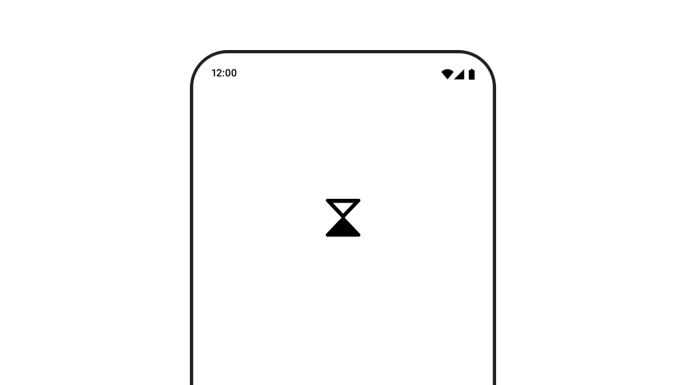

- [Compose でのアニメーション化されたベクター画像](#compose-でのアニメーション化されたベクター画像)
  - [アニメーション化ベクター型ドローアブル（試験運用版）](#アニメーション化ベクター型ドローアブル試験運用版)


# Compose でのアニメーション化されたベクター画像

Compose でベクターをアニメーション化するには、いくつかの方法があります。次のいずれかを使用できます。

- AnimatedVectorDrawable ファイル形式

- ImageVector と Compose アニメーション API（ [こちらの Medium の記事](https://medium.com/androiddevelopers/making-jellyfish-move-in-compose-animating-imagevectors-and-applying-agsl-rendereffects-3666596a8888) を参照）

- [Lottie](https://airbnb.design/lottie/) などのサードパーティ ソリューション


## アニメーション化ベクター型ドローアブル（試験運用版）



[AnimatedVectorDrawable](https://developer.android.com/reference/android/graphics/drawable/AnimatedVectorDrawable?hl=ja&_gl=1*m60an1*_up*MQ..*_ga*OTQxMjc1NjExLjE3MjcwMTEwOTk.*_ga_6HH9YJMN9M*MTcyNzE1MTM1OS4yLjAuMTcyNzE1MTM1OS4wLjAuMjI4MzEzOTA.) リソースを使用するには、animatedVectorResource を使用してドローアブル ファイルを読み込み、boolean を渡してドローアブルの開始状態と終了状態を切り替えて、アニメーションを実行します。

```kotlin
@Composable
fun AnimatedVectorDrawable() {
    val image = AnimatedImageVector.animatedVectorResource(R.drawable.ic_hourglass_animated)
    var atEnd by remember { mutableStateOf(false) }
    Image(
        painter = rememberAnimatedVectorPainter(image, atEnd),
        contentDescription = "Timer",
        modifier = Modifier.clickable {
            atEnd = !atEnd
        },
        contentScale = ContentScale.Crop
    )
}
```

ドローアブル ファイルの形式について詳しくは、 [ドローアブルグラフィックをアニメーションにする](https://developer.android.com/guide/topics/graphics/drawable-animation?hl=ja&_gl=1*m60an1*_up*MQ..*_ga*OTQxMjc1NjExLjE3MjcwMTEwOTk.*_ga_6HH9YJMN9M*MTcyNzE1MTM1OS4yLjAuMTcyNzE1MTM1OS4wLjAuMjI4MzEzOTA.) をご覧ください。
