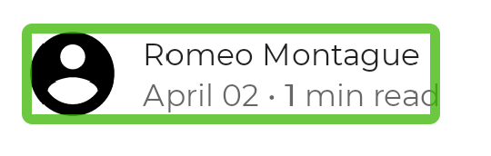

- [Compose のユーザー補助機能を改善する主な手順](#compose-のユーザー補助機能を改善する主な手順)


# Compose のユーザー補助機能を改善する主な手順

ユーザー補助機能を必要とするユーザーがアプリを適切に使用できるように、 Compose で、主要なユーザー補助機能の要件に対応できます。


## タップターゲットの最小サイズを検討する

注: Compose 1.1.0 ではタップ ターゲットの動作が変更されました。それより前のバージョンのライブラリは、動作が異なる場合があります。
クリック、タップなど、ユーザーが操作できる画面上の要素はすべて、確実に操作できるよう十分な大きさにする必要があります。これらの要素のサイズを設定する際は、 マテリアル デザインに沿って最小サイズを 48 dp に設定することが強く推奨されます。


### 最小サイズの自動設定

マテリアル コンポーネント ( Checkbox、RadioButton、Switch、 Slider、Surface など) では、この最小サイズを内部で設定しいるため、これらの UI 要素がタップ可能である場合は、タップターゲットの最小サイズが 48 dp になっています。そのため、通常は、別途、タップターゲットサイズの最小値を設定する必要はありません。

例えば、次のチェックボックスは、タップターゲットサイズの最小値が 48 dp に設定されています。

```kotlin
@Composable
private fun CheckableCheckbox() {
    Checkbox(checked = true, onCheckedChange = {})
}
```


しかし、以下のように、 onCheckedChanged に null が設定されているなどの場合は、パディングがなくなり、タップターゲットサイズの最小サイズの保証はなくなります。

```kotlin
@Composable
private fun NonClickableCheckbox() {
    Checkbox(checked = true, onCheckedChange = null)
}
```


### タップイベントを親コンテナで処理する場合

選択コントロール（Switch、RadioButton、 Checkbox の場合、通常はクリック可能な動作を親コンテナにリフトします。 コンポーザブルのクリック コールバックを null に設定し、toggleable または selectable 修飾子を親コンポーザブルに追加します。

```kotlin
@Composable
private fun CheckableRow() {
    MaterialTheme {
        var checked by remember { mutableStateOf(false) }
        Row(
            Modifier
                .toggleable(
                    value = checked,
                    role = Role.Checkbox,
                    onValueChange = { checked = !checked }
                )
                .padding(16.dp)
                .fillMaxWidth()
        ) {
            Text("Option", Modifier.weight(1f))
            Checkbox(checked = checked, onCheckedChange = null)
        }
    }
}
```


### タップターゲットサイズの自動拡張

クリック可能なコンポーザブルのサイズが 48 dp より小さい場合、タップターゲットのサイズをコンポーザブルのサイズよりも大きくする必要があります。 clickable 修飾子は、 UI 要素のサイズが 48 dp よりも小さい場合に、そのタップ可能な領域を自動的に 48 dp に設定してくれます。

以下の例には、非常に小さいクリック可能な Box が含まれています。タップ可能領域は Box の境界を超えて自動的に拡張されるため、 横にある Box でもクリック イベントがトリガーされます。

```kotlin
@Composable
private fun SmallBox() {
    var clicked by remember { mutableStateOf(false) }
    Box(
        Modifier
            .size(100.dp)
            .background(if (clicked) Color.DarkGray else Color.LightGray)
    ) {
        Box(
            Modifier
                .align(Alignment.Center)
                .clickable { clicked = !clicked }
                .background(Color.Black)
                .size(1.dp)
        )
    }
}
```


### UI コンポーネントの最小サイズを指定する

タップミスを防ぐためには、常に コンポーザブルに十分な大きさの最小サイズを使用します。この例では、 sizeIn 修飾子を使用して、内側のボックスの最小サイズを設定する方法を採用しています。 sizeIn 修飾子は、 minWidth, minHeight, maxWidth, maxHeight の4つのプロパティを持っており、幅と高さの最小値と最大値を設定することが可能です。

```kotlin
@Composable
private fun LargeBox() {
    var clicked by remember { mutableStateOf(false) }
    Box(
        Modifier
            .size(100.dp)
            .background(if (clicked) Color.DarkGray else Color.LightGray)
    ) {
        Box(
            Modifier
                .align(Alignment.Center)
                .clickable { clicked = !clicked }
                .background(Color.Black)
                .sizeIn(minWidth = 48.dp, minHeight = 48.dp)
        )
    }
}
```


## クリックラベルを追加する

クリック ラベル ( onClickLabel ) を使用すると、コンポーザブルのクリック動作に意味を定義することができます。クリック ラベルは、ユーザーがコンポーザブルを操作したときに何が起こるかを説明します。アクセシビリティ サービスでは、クリック ラベルを使用して、ユーザーにアプリの動作を説明します。

クリック ラベルを設定するには、クリック可能な修飾子にパラメータを渡します。

```kotlin
@Composable
private fun ArticleListItem(openArticle: () -> Unit) {
    Row(
        Modifier.clickable(
            // R.string.action_read_article = "read article"
            onClickLabel = stringResource(R.string.action_read_article),
            onClick = openArticle
        )
    ) {
        // ..
    }
}
```

あるいは、 clickable 修飾子にアクセスできない場合は、 [semantics 修飾子](https://developer.android.com/reference/kotlin/androidx/compose/ui/Modifier?_gl=1*1czex6c*_up*MQ..*_ga*MjA3NTExNzk4Ny4xNzI3MTczOTI5*_ga_6HH9YJMN9M*MTcyNzIxNTIxOS4zLjAuMTcyNzIxNTY5MS4wLjAuODA4NjM0MTQz#(androidx.compose.ui.Modifier).semantics(kotlin.Boolean,kotlin.Function1)) の label でクリック ラベルを設定します。

```kotlin
@Composable
private fun LowLevelClickLabel(openArticle: () -> Boolean) {
    // R.string.action_read_article = "read article"
    val readArticleLabel = stringResource(R.string.action_read_article)
    Canvas(
        Modifier.semantics {
            onClick(label = readArticleLabel, action = openArticle)
        }
    ) {
        // ..
    }
}
```


## 視覚要素（画像やアイコン）を説明する

Image または Icon コンポーザブルを定義する場合、Android フレームワークがアプリが何を表示しているかを自動的に理解する方法はありません。ビジュアル要素のテキスト説明を渡すことで、理解を手助けします。

ユーザーが現在のページを友人と共有できる画面を想像してください。この画面には、クリック可能な共有アイコンが含まれています。


アイコンだけに基づいて、Android フレームワークは視覚障害のあるユーザーにアイコンを説明することができません。Android フレームワークには、アイコンの追加のテキストによる説明が必要です。

contentDescription パラメータは視覚要素を説明します。ユーザーに表示されるので、ローカライズされた文字列を使用します。

```kotlin
@Composable
private fun ShareButton(onClick: () -> Unit) {
    IconButton(onClick = onClick) {
        Icon(
            imageVector = Icons.Filled.Share,
            contentDescription = stringResource(R.string.label_share)
        )
    }
}
```

一部の視覚要素は純粋に装飾的なものであり、ユーザーに伝えたくない場合があります。contentDescription パラメータを null に設定すると、この要素に関連付けられたアクションや状態がないことが Android フレームワークに示されます。

```kotlin
@Composable
private fun PostImage(post: Post, modifier: Modifier = Modifier) {
    val image = post.imageThumb ?: painterResource(R.drawable.placeholder_1_1)

    Image(
        painter = image,
        // この Image が意味の説明が不要であることを示します。
        contentDescription = null,
        modifier = modifier
            .size(40.dp, 40.dp)
            .clip(MaterialTheme.shapes.small)
    )
}
```

特定の視覚要素に contentDescription が必要かどうかは、あなた次第です。要素が、ユーザーがタスクを実行するために必要な情報を伝えているかどうかを自問してください。そうでない場合は、説明を省略する方がよいでしょう。


## 要素を結合する

Talkback や Switch Access などのアクセシビリティ サービスを使用すると、ユーザーは画面上の要素間でフォーカスを移動できます。要素が適切な粒度でフォーカスされていることが重要です。画面内のすべての低レベルのコンポーザブルが個別にフォーカスされている場合、ユーザーは画面上を移動するために多くの操作を行う必要があります。要素が過度に結合されると、ユーザーはどの要素が一緒に属しているかを理解できない可能性があります

[clickable](https://developer.android.com/reference/kotlin/androidx/compose/foundation/package-summary?_gl=1*vtxam9*_up*MQ..*_ga*MjA3NTExNzk4Ny4xNzI3MTczOTI5*_ga_6HH9YJMN9M*MTcyNzIxNTIxOS4zLjAuMTcyNzIxNTY5MS4wLjAuODA4NjM0MTQz#clickable(androidx.compose.ui.Modifier,kotlin.Boolean,kotlin.String,androidx.compose.ui.semantics.Role,kotlin.Function0)) 修飾子をコンポーザブルに適用すると、Compose はコンポーザブルに含まれるすべての要素を自動的に結合します。これは [ListItem](https://developer.android.com/reference/kotlin/androidx/compose/material/package-summary?_gl=1*1r9o0j3*_up*MQ..*_ga*MjA3NTExNzk4Ny4xNzI3MTczOTI5*_ga_6HH9YJMN9M*MTcyNzIxNTIxOS4zLjAuMTcyNzIxNTY5MS4wLjAuODA4NjM0MTQz#ListItem(androidx.compose.ui.Modifier,kotlin.Function0,kotlin.Function0,kotlin.Boolean,kotlin.Function0,kotlin.Function0,kotlin.Function0)) にも当てはまります。リスト項目内の要素は結合され、アクセシビリティ サービスはそれらを 1 つの要素として表示します。

clickable 修飾子も付与されておらず、 ListItem の要素でもない UI コンポーネントについて、アクセシビリティ サービスではそれを 1 つの要素として認識させたい場合があります。たとえば、ユーザーのアバター、名前、およびいくつかの追加情報を表示するコンポーザブルを想像してください。


semantics 修飾子の mergeDescendants パラメータを使用して、Compose がこれらの要素を結合できるようにすることができます。これにより、アクセシビリティ サービスは結合された要素のみを選択し、子孫のすべてのセマンティクス プロパティが結合されます。

```kotlin
@Composable
private fun PostMetadata(metadata: Metadata) {
    // Merge elements below for accessibility purposes
    Row(modifier = Modifier.semantics(mergeDescendants = true) {}) {
        Image(
            imageVector = Icons.Filled.AccountCircle,
            contentDescription = null // decorative
        )
        Column {
            Text(metadata.author.name)
            Text("${metadata.date} • ${metadata.readTimeMinutes} min read")
        }
    }
}
```

これで、アクセシビリティ サービスは、コンテナー全体に一度に焦点を当て、そのコンテンツをマージするようになりました。



注: mergeDescendants を true に設定した子孫はマージに含まれません。これにより、マージが過度に強力になることを防止できます。


## カスタムアクションを追加する

以下のリストアイテムをご覧ください。


Talkback などのスクリーン リーダーを使用して画面に表示されている内容を読み上げる場合、最初に項目全体が選択され、次にブックマーク アイコンが選択されます。


リストが長い場合、これは非常に繰り返しが多くなります。より良い方法は、ユーザーがアイテムをブックマークできるようにするカスタム アクションを定義することです。アクセシビリティ サービスによってブックマーク アイコンが選択されないようにするには、ブックマーク アイコン自体の動作を明示的に削除する必要があることにも注意してください。これは、 [clearAndSetSemantics](https://developer.android.com/reference/kotlin/androidx/compose/ui/semantics/package-summary?_gl=1*1qnr21y*_up*MQ..*_ga*MjA3NTExNzk4Ny4xNzI3MTczOTI5*_ga_6HH9YJMN9M*MTcyNzIxNTIxOS4zLjAuMTcyNzIxNTY5MS4wLjAuODA4NjM0MTQz#clearAndSetSemantics(androidx.compose.ui.Modifier,kotlin.Function1)s) 修飾子を使用して行います。

```kotlin
@Composable
private fun PostCardSimple(
    /* ... */
    isFavorite: Boolean,
    onToggleFavorite: () -> Boolean
) {
    val actionLabel = stringResource(
        if (isFavorite) R.string.unfavorite else R.string.favorite
    )
    Row(
        modifier = Modifier
            .clickable(onClick = { /* ... */ })
            .semantics {
                // カスタムアクションを定義
                customActions = listOf(
                    CustomAccessibilityAction(actionLabel, onToggleFavorite)
                )
            }
    ) {
        /* ... */
        BookmarkButton(
            isBookmarked = isFavorite,
            onClick = onToggleFavorite,
            // ブックマークアイコンが選択されないようにする。
            modifier = Modifier.clearAndSetSemantics { }
        )
    }
}
```


## 要素の状態について説明する

コンポーザブルは、Android フレームワークがコンポーザブルの状態を読み取るために使用するセマンティクスの [stateDescription](https://developer.android.com/reference/kotlin/androidx/compose/ui/semantics/package-summary?_gl=1*1w5v8as*_up*MQ..*_ga*MjA3NTExNzk4Ny4xNzI3MTczOTI5*_ga_6HH9YJMN9M*MTcyNzIxNTIxOS4zLjAuMTcyNzIxNTY5MS4wLjAuODA4NjM0MTQz#stateDescription(androidx.compose.ui.semantics.SemanticsPropertyReceiver)) を定義できます。たとえば、切り替え可能なコンポーザブルは、「チェック済み」または「チェックなし」のいずれかの状態になります。

場合によっては、Compose が使用するデフォルトの stateDescription をオーバーライドする必要があります。これを行うには、コンポーザブルを toggleable として定義する前に、 stateDescription を明示的に指定します。

```kotlin
@Composable
private fun TopicItem(itemTitle: String, selected: Boolean, onToggle: () -> Unit) {

    val stateSubscribed = stringResource(R.string.subscribed)
    val stateNotSubscribed = stringResource(R.string.not_subscribed)

    Row(
        modifier = Modifier
            .semantics {
                // Set any explicit semantic properties
                stateDescription = if (selected) stateSubscribed else stateNotSubscribed
            }
            .toggleable(
                value = selected,
                onValueChange = { onToggle() }
            )
    ) {
        /* ... */
    }
}
```


## 見出しを定義する

アプリでは、スクロール可能なコンテナ内の 1 つの画面に大量のコンテンツが表示されることがあります。たとえば、ユーザーが読んでいる記事の全内容が画面に表示されることがあります。


アクセシビリティを必要とするユーザーは、このような画面をナビゲートするのが困難です。ナビゲーションを容易にするために、どの要素が見出しであるかを示します。上記のような画面では、各セクションのタイトルをアクセシビリティの見出しとして定義できます。Talkback などの一部のアクセシビリティ サービスでは、ユーザーが見出しから見出しへ直接ナビゲートできます。

Compose では、コンポーザブルが見出し ( [heading](https://developer.android.com/reference/kotlin/androidx/compose/ui/semantics/package-summary?_gl=1*17tbo8m*_up*MQ..*_ga*MjA3NTExNzk4Ny4xNzI3MTczOTI5*_ga_6HH9YJMN9M*MTcyNzIxNTIxOS4zLjAuMTcyNzIxNTY5MS4wLjAuODA4NjM0MTQz#(androidx.compose.ui.semantics.SemanticsPropertyReceiver).heading()) ) であることを示すために、そのセマンティクス プロパティを定義します。

```kotlin
@Composable
private fun Subsection(text: String) {
    Text(
        text = text,
        style = MaterialTheme.typography.headlineSmall,
        // このコンポーザブルが見出しであることを定義します。
        modifier = Modifier.semantics { heading() }
    )
}
```


## カスタムコンポーザブルを処理する

アプリ内の特定のマテリアル コンポーネントをカスタム バージョンに置き換えるときは、アクセシビリティの考慮事項を常に念頭に置く必要があります。

たとえば、 Material [Checkbox](https://developer.android.com/reference/kotlin/androidx/compose/material/package-summary?_gl=1*txr9t7*_up*MQ..*_ga*MjA3NTExNzk4Ny4xNzI3MTczOTI5*_ga_6HH9YJMN9M*MTcyNzIxNTIxOS4zLjAuMTcyNzIxNTY5MS4wLjAuODA4NjM0MTQz#Checkbox(kotlin.Boolean,kotlin.Function1,androidx.compose.ui.Modifier,kotlin.Boolean,androidx.compose.foundation.interaction.MutableInteractionSource,androidx.compose.material.CheckboxColors)) を独自の実装に置き換えるとします。このコンポーネントのアクセシビリティ プロパティを処理する [triStateToggleable](https://developer.android.com/reference/kotlin/androidx/compose/foundation/selection/package-summary?_gl=1*txr9t7*_up*MQ..*_ga*MjA3NTExNzk4Ny4xNzI3MTczOTI5*_ga_6HH9YJMN9M*MTcyNzIxNTIxOS4zLjAuMTcyNzIxNTY5MS4wLjAuODA4NjM0MTQz#triStateToggleable(androidx.compose.ui.Modifier,androidx.compose.ui.state.ToggleableState,kotlin.Boolean,androidx.compose.ui.semantics.Role,kotlin.Function0)) 修飾子を追加することを忘れる可能性があります。

経験則として、マテリアル ライブラリ内のコンポーネントの実装を確認し、見つかったアクセシビリティの動作を模倣します。さらに、UI レベルの修飾子ではなく、Foundation 修飾子を多用します。これらには、アクセシビリティの考慮事項がすぐに組み込まれているからです。

複数のアクセシビリティ サービスを使用してカスタム コンポーネントの実装をテストし、その動作を確認します。


## 参考情報

- [アクセシビリティ](https://developer.android.com/guide/topics/ui/accessibility?_gl=1*1yappl1*_up*MQ..*_ga*MjA3NTExNzk4Ny4xNzI3MTczOTI5*_ga_6HH9YJMN9M*MTcyNzIxNTIxOS4zLjAuMTcyNzIxNTY5MS4wLjAuODA4NjM0MTQz): すべての Android アプリ開発に共通する基本的な概念とテクニック

- [アクセシビリティの高いアプリの構築](https://developer.android.com/guide/topics/ui/accessibility/apps?_gl=1*1yappl1*_up*MQ..*_ga*MjA3NTExNzk4Ny4xNzI3MTczOTI5*_ga_6HH9YJMN9M*MTcyNzIxNTIxOS4zLjAuMTcyNzIxNTY5MS4wLjAuODA4NjM0MTQz): アプリのアクセシビリティを高めるために実行できる重要な手順

- [アプリのアクセシビリティを向上させるための原則](https://developer.android.com/guide/topics/ui/accessibility/apps?_gl=1*1igz94r*_up*MQ..*_ga*MjA3NTExNzk4Ny4xNzI3MTczOTI5*_ga_6HH9YJMN9M*MTcyNzIxNTIxOS4zLjAuMTcyNzIxNTY5MS4wLjAuODA4NjM0MTQz): アプリのアクセシビリティを高めるために留意すべき重要な原則

- [アクセシビリティのテスト](https://developer.android.com/guide/topics/ui/accessibility/testing?_gl=1*1igz94r*_up*MQ..*_ga*MjA3NTExNzk4Ny4xNzI3MTczOTI5*_ga_6HH9YJMN9M*MTcyNzIxNTIxOS4zLjAuMTcyNzIxNTY5MS4wLjAuODA4NjM0MTQz): Android アクセシビリティのテスト原則とツール

