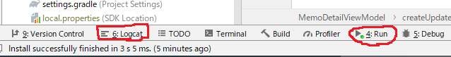

<!-- TOC depthFrom:1 depthTo:6 withLinks:1 updateOnSave:1 orderedList:0 -->

- [logcatに表示されないことがある](#logcatに表示されないことかある)

<!-- /TOC -->

# logcatに表示されないことがある

通常、アプリがクラッシュした時のエラーログはLogcatに出力されるが、どう考えても起こり得ないようなエラーがLogcatに出力されることがある。

その場合、本当のクラッシュ原因は他のコードに存在していることがある。

本当のクラッシュ原因は、`Logcat`ではなく、`Run`に出力されていることがあるため、そちらも確認した方が良い。

前回は、Logcatに表示されているエラー発生箇所にブレークポイントを貼って、そこで止めようとしたところ、止まらずにアプリがクラッシュした。

その時に、`Run`のログを見ると原因がわかった。

