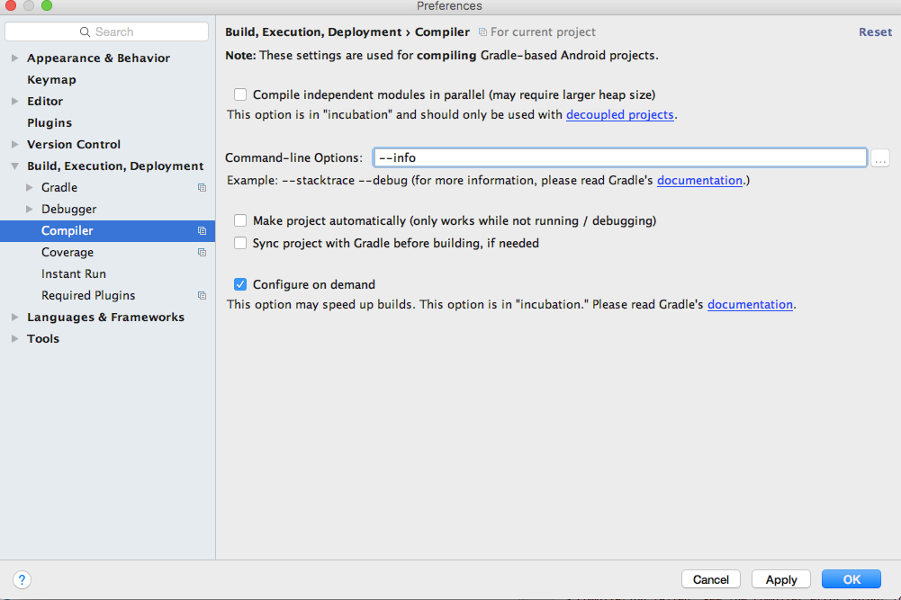
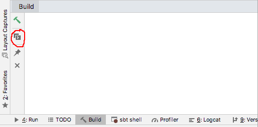

<!-- TOC depthFrom:1 depthTo:6 withLinks:1 updateOnSave:1 orderedList:0 -->

- [コンパイルエラーの詳細確認方法](#コンハイルエラーの詳細確認方法)
	- [see the compiler error output for details が表示された時、どこに詳細が表示されるのか](#see-the-compiler-error-output-for-details-が表示された時どこに詳細が表示されるのか)

<!-- /TOC -->

# コンパイルエラーの詳細確認方法

## 事前準備

「command-line Options」に「--debug」を指定する。「--info」でも良いかもしれない。（←ハイフンが一つに見えるかもしれないが、二つがくっついているだけ）

## see the compiler error output for details が表示された時、どこに詳細が表示されるのか

### Android studio 4.0未満

赤丸の「Toggle View」をクリックすると詳細が表示されるので、赤字の先頭数行を見ると原因が書かれている。

「Toggle View」のメニューバー自体が表示されていない場合は、右端のネジ「Show Options Menu」をクリックし、「Show Toolbar」をクリックすると表示される。

### Android studio 4.0以上

「Build」タブの「Build Output」タブを開いた時に、右半分にエラーが出力されている。

