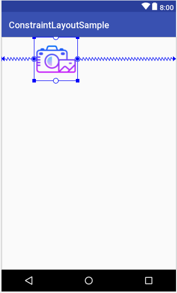

- [余白を比率指定したい場合_bias](#余白を比率指定したい場合_bias)

# 余白を比率指定したい場合_bias

```xml
<ConstraintLayout>
    <!-- bias="0.25" の場合、左側の余白と右側の余白の長さの比率は 1:3 になる。 -->
    <ImageView
        app:layout_constraintHorizontal_bias="0.25" >
</ConstraintLayout>
```


