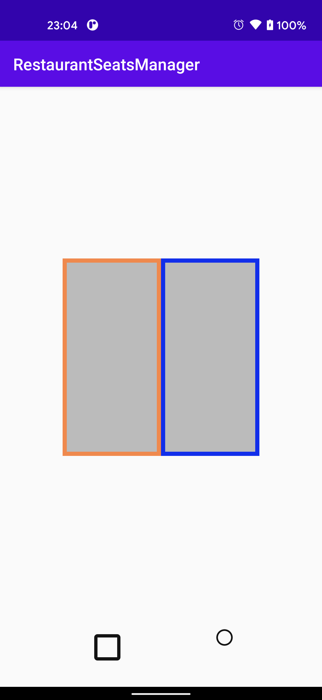

<!-- TOC START min:1 max:3 link:true asterisk:false update:true -->
- [動的にViewを追加する](#動的にviewを追加する)
  - [サンプル](#サンプル)
<!-- TOC END -->


# 動的にViewを追加する

## サンプル

`ConstraintLayout` は xml で静的に定義し、その中の View は、 Java で動的に生成するサンプル



**MainActivity.java**

```java
public class MainActivity extends AppCompatActivity {

    ConstraintLayout matrix;

    @Override
    protected void onCreate(Bundle savedInstanceState) {
        super.onCreate(savedInstanceState);
        setContentView(R.layout.activity_main);

        matrix = findViewById(R.id.matrix);

        View childView1 = new View(this);
        childView1.setId(View.generateViewId());
        matrix.addView(childView1);

        View childView2 = new View(this);
        childView2.setId(View.generateViewId());
        matrix.addView(childView2);

        ConstraintSet constraintSet = new ConstraintSet();
        constraintSet.clone(matrix);
        constraintSet.constrainWidth(childView1.getId(), ConstraintSet.MATCH_CONSTRAINT);
        constraintSet.constrainWidth(childView2.getId(), ConstraintSet.MATCH_CONSTRAINT);
        // xmlで以下の一文を表現すると、
        // childView1 の app:layout_constraintStart_toStartOf="parent" に該当する。
        constraintSet.connect(childView1.getId(), ConstraintSet.START, ConstraintSet.PARENT_ID, ConstraintSet.START);
        constraintSet.connect(childView1.getId(), ConstraintSet.END, childView2.getId(), ConstraintSet.START);
        constraintSet.connect(childView2.getId(), ConstraintSet.START, childView1.getId(), ConstraintSet.END);
        constraintSet.connect(childView2.getId(), ConstraintSet.END, ConstraintSet.PARENT_ID, ConstraintSet.END);
        constraintSet.applyTo(matrix);
    }
}
```

**activity_main.xml**

```xml
<?xml version="1.0" encoding="utf-8"?>
<androidx.constraintlayout.widget.ConstraintLayout xmlns:android="http://schemas.android.com/apk/res/android"
    xmlns:app="http://schemas.android.com/apk/res-auto"
    xmlns:tools="http://schemas.android.com/tools"
    android:layout_width="match_parent"
    android:layout_height="match_parent"
    tools:context=".MainActivity">

    <androidx.constraintlayout.widget.ConstraintLayout
        android:id="@+id/matrix"
        android:layout_width="240dp"
        android:layout_height="240dp"
        android:background="@color/colorAccent"
        app:layout_constraintBottom_toTopOf="@id/table_image_view"
        app:layout_constraintEnd_toEndOf="parent"
        app:layout_constraintStart_toStartOf="parent"
        app:layout_constraintTop_toTopOf="parent" />

</androidx.constraintlayout.widget.ConstraintLayout>
```
