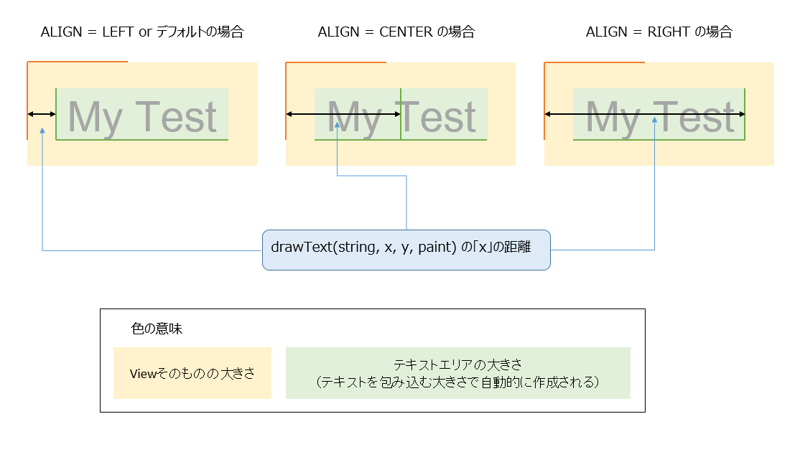

<!-- TOC depthFrom:1 depthTo:6 withLinks:1 updateOnSave:1 orderedList:0 -->

- [CanvasとPaintの基本的な使い方](#canvasとpaintの基本的な使い方)
	- [インスタンスの生成](#インスタンスの生成)
	- [テキスト系](#テキスト系)
		- [テキストサイズの指定](#テキストサイズの指定)
		- [テキストの色の指定](#テキストの色の指定)
		- [テキストALIGNの設定](#テキストalignの設定)
		- [テキストの描画（描画位置指定）](#テキストの描画描画位置指定)

<!-- /TOC -->


# CanvasとPaintの基本的な使い方

## インスタンスの生成

```Java
Paint paint = new Paint(Paint.ANTI_ALIAS_FLAG);
```

`Paint.ANTI_ALIAS_FLAG`は、曲線や斜線を描画する際になめらかに表示する機能である。

なめらかにできるためこのパラメータを渡した方が良い。


## テキスト系

### テキストサイズの指定

`Paint.setTextSize(float textSize)`

パラメータ | 説明
-----------|---------------------------------
textSize   | テキストサイズ（単位：ピクセル）


### テキストの色の指定

`Paint.setColor(int color)`

パラメータ | 説明
-----------|---------------------------------
color  | テキストの色（`android.graphics.Color`で指定する）

`android.graphics.Color`については別紙参照


### テキストALIGNの設定

```Java
Paint.setTextAlign(Paint.Align.LEFT)
Paint.setTextAlign(Paint.Align.CENTER)
Paint.setTextAlign(Paint.Align.RIGHT)
```

詳しい使用方法は、次項「テキストの描画（描画位置指定）」で説明します。


### テキストの描画（描画位置指定）

`Canvas.drawText(String text, float x, float y, Paint paint)`

パラメータ | 説明
-----------|--------------------------------------------------------------------------------------------------------
text       | 描画する文字列
x          | Viewの原点（左上）から文字列の原点（LEFT or CENTER or RIGHT）までの右方向への移動距離（単位：ピクセル）
y          | Viewの原点（左上）から文字列のベースラインまでの下方向への移動距離（単位：ピクセル）
paint      | 描画情報を詰め込んだPaintオブジェクト

**パラメータxについて**




