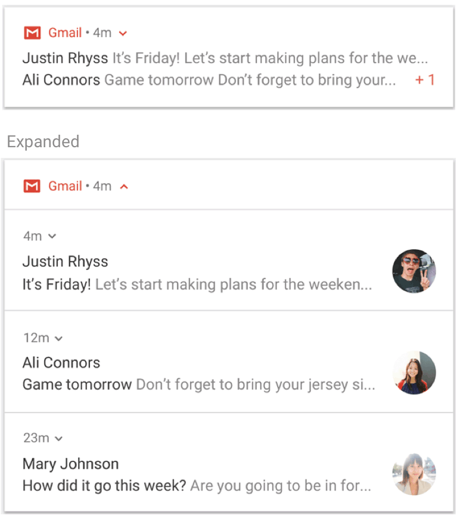

- [通知の概要](#通知の概要)
  - [通知関連の各部の名称](#通知関連の各部の名称)
  - [通知の種類](#通知の種類)
    - [通知場所の違い](#通知場所の違い)
    - [レイアウトの違い](#レイアウトの違い)
    - [目的の違い](#目的の違い)
  - [ウェアラブルデバイスへの表示](#ウェアラブルデバイスへの表示)
  - [通知の操作](#通知の操作)
    - [折りたたまれた通知は下へドラッグで開くことが可能](#折りたたまれた通知は下へドラッグで開くことが可能)
  - [通知ドロワー](#通知ドロワー)
    - [通知ドロワーを展開する](#通知ドロワーを展開する)
    - [フォアグラウンドサービスを停止するボタン](#フォアグラウンドサービスを停止するボタン)
  - [通知の消失](#通知の消失)
  - [通知の構造](#通知の構造)
  - [通知の操作](#通知の操作-1)
  - [通知の更新](#通知の更新)
  - [通知チャネル](#通知チャネル)
  - [通知の重要度](#通知の重要度)
  - [サイレントモード](#サイレントモード)
  - [短時間での連続した通知の投稿](#短時間での連続した通知の投稿)
  - [短時間での連続した通知の更新](#短時間での連続した通知の更新)

# 通知の概要

## 通知関連の各部の名称

ステータスバー

通知ドロワー

## 通知の種類

### 通知場所の違い

- 通知ドロワーへの通知
- ロック画面への通知
- ヘッドアップ通知
- 通知ドット（アイコンバッジ）
- ウェアラブルデバイスへの通知

### レイアウトの違い

- デフォルトレイアウト (一行レイアウト)
- デフォルトレイアウト (折りたたみ式レイアウト)
  - 受信トレイスタイルなど...
- カスタムレイアウト

### 目的の違い

- 通常の通知
- フォアグラウンドサービスを実行するための通知

## ウェアラブルデバイスへの表示

特別な実装を行わなくても、通知は、ウェアラブルデバイスにも送られます。

## 通知の操作

### 折りたたまれた通知は下へドラッグで開くことが可能

折りたたまれた通知は下へドラッグすると開くことが可能です。

## 通知ドロワー

### 通知ドロワーを展開する

通知ドロワーを下にスワイプすると展開することが可能です。

### フォアグラウンドサービスを停止するボタン

Android 13 以降では、展開された通知ドロワーには、ユーザーがフォアグラウンドサービスを進行中のアプリを停止できるボタンが含まれています。

## 通知の消失

通知ドロワーに表示される通知は、アプリまたはユーザーが閉じるまで通知ドロワーに表示されたままになります。

ヘッドアップ通知の場合は、表示後、しばらくすると消えますが、通知ドロワーには閉じられるまで残ります。

フォアグラウンドサービスを実行するための通知は、サービスを停止するか、フォアグラウンド状態を解除するまで削除できません。

## 通知の構造

一般的な通知の構造は以下の通りです。

| 項番 | 名称           | 必須性 | 設定方法                                                                                                              |
| ---- | -------------- | ------ | --------------------------------------------------------------------------------------------------------------------- |
| 1    | 小さいアイコン | 必須   | `setSmallIcon()` で設定します。                                                                                       |
| 2    | アプリ名       | -      | 自動で設定されます。                                                                                                  |
| 3    | タイムスタンプ | -      | 自動で設定されますが、 `setWhen()` を使用してオーバーライドしたり、 `setShowWhen(false)` を指定して非表示にできます。 |
| 4    | 大きいアイコン | 省略可 | `setLargeIcon()` で設定します。アプリアイコンは設定しないでください。                                                 |
| 5    | タイトル       | 省略可 | `setContentTitle()` で設定します。                                                                                    |
| 6    | テキスト       | 省略可 | `setContentText()` で設定します。                                                                                     |

## 通知の操作

通知に対する操作には、以下のものがあります。

- 通知本体をタップ
- アクションボタンをタップ (※ 1 )
  - 自分で設定したボタン
  - OS が自動生成するボタン
  - ボタンタップ後のロック解除
- 通知を展開 or 折りたたむ (※ 2 )
- 通知グループを展開 or 折りたたむ (※ 3 )

(※ 1 ) アクションボタン付きの通知

(※ 2 ) 通知が折りたたまれた状態と展開された状態

(※ 3 ) 通知グループが折りたたまれた状態と展開された状態

## 通知の更新

既に表示されている通知の内容を更新することが可能です。

## 通知チャネル

別紙に記載しています。

## 通知の重要度

重要度ごとの違い

- 緊急
  - 音が鳴り、ヘッドアップ通知として表示されます。
- 高
  - 音が鳴ります。
- 中
  - 音は鳴りません。
- 低
  - 音は鳴らず、ステータスバーにも表示されません。

すべての通知は、重要度にかかわらず、システム UI の邪魔にならない場所 (通知ドロワー内やランチャーアイコン上のバッジなど) に表示されます。

## サイレントモード

Android 5.0 ( API レベル 21 ) 以降では、すべての通知の音とバイブレーションをオフにするサイレント モードを有効にできます。

サイレント モードには三つのレベルがあります。

- サイレント
  - すべて (アラーム、音楽、動画、ゲームなど) の音とバイブレーションをブロックします。
- アラームのみ
  - アラームを除くすべての音とバイブレーションをブロックします。
- 優先する通知のみ
  - ユーザーは、割り込みを許可するシステム全体のカテゴリ（アラーム、リマインダー、イベント、通話、メッセージのみなど）を設定できます。メッセージと通話については、 (※ 1 ) に示すように、送信者または呼び出し元でフィルタできます。

(※ 1 ) 左は Messages / Calls というアプリのカテゴリ。右は From anyone などの相手のカテゴリ。

Android 8.0 以降では、デバイス全体の設定とは別に、通知チャネルごとにサイレントモード時の挙動をカスタマイズすることが可能です。

## 短時間での連続した通知の投稿

Android 8.1 ( API レベル 27 ) 以降では、アプリで通知音を 1 秒に 1 回を超えて鳴らすことはできません。アプリが 1 秒以内に複数の通知を送信した場合、通知はすべて想定どおりに表示されますが、音が鳴るのは各秒ごとに最初の通知だけです。

## 短時間での連続した通知の更新

通知の更新頻度にはレート制限が存在します。 1 つの通知に対してあまりに頻繁に更新を送信すると ( 1 秒以内に多数の更新を送信するなど) 、システムによって更新が破棄されることがあります。

