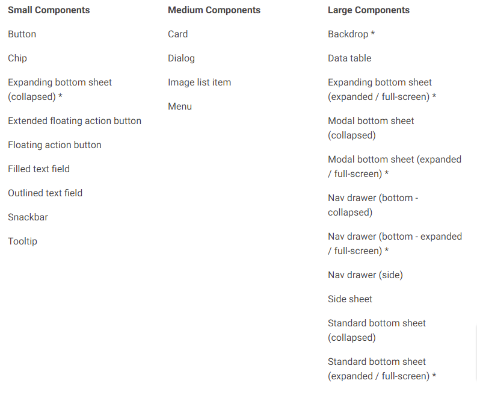

- [Shape](#shape)
  - [例 1 : 既存の Shape をカスタマイズした Style を定義する](#例-1--既存の-shape-をカスタマイズした-style-を定義する)
  - [例 2 : 独自の Shape を Theme 属性の Shape に設定する](#例-2--独自の-shape-を-theme-属性の-shape-に設定する)
  - [Overlayの例 1 : 個別の View で Overlay する](#overlayの例-1--個別の-view-で-overlay-する)
  - [Overlayの例 2 : Style タグの中で Overlay する](#overlayの例-2--style-タグの中で-overlay-する)
  - [各ウィジェットがデフォルトで大中小のどれに分類されるか](#各ウィジェットがデフォルトで大中小のどれに分類されるか)


# Shape

## 例 1 : 既存の Shape をカスタマイズした Style を定義する

```xml
<style name="ShapeAppearance.Owl.SmallComponent"
        parent="ShapeAppearance.MaterialComponents.SmallComponent">
    <item name="cornerFamily">rounded</item>
    <item name="cornerSize">0px</item>
    <item name="cornerSizeTopLeft">@dimen/small_comp_tl_radius</item>
</style>
```


## 例 2 : 独自の Shape を Theme 属性の Shape に設定する

```xml
<style name="xxx">
    <item name="shapeAppearanceSmallComponent">
        @style/ShapeAppearance.Owl.SmallComponent</item>
    <item name="shapeAppearanceMediumComponent">
        @style/ShapeAppearance.Owl.MediumComponent</item>
    <item name="shapeAppearanceLargeComponent">
        @style/ShapeAppearance.Owl.LargeComponent</item>
</style>
```


## Overlayの例 1 : 個別の View で Overlay する

**テーマの定義**

```xml
<style name="ShapeAppearanceOverlay.Owl.Cut" parent="">
    <item name="cornerFamily">cut</item>
</style>
```

**レイアウトxml**

```xml
<com.google.android.material.card.MaterialCardView
    app:shapeAppearanceOverlay="@style/ShapeAppearanceOverlay.Owl.Cut">
```

Shape は、 Theme とは別ものなので、 `android:theme` 属性ではなく、  
`app:shapeAppearanceOverlay` 属性を使用する点に注意すること。


## Overlayの例 2 : Style タグの中で Overlay する

```xml
<style name="Widget.MaterialComponents.BottomSheet" parent="...">
    <item name="shapeAppearance">
        ?attr/shapeAppearanceLargeComponent</item>
    <item name="shapeAppearanceOverlay">
        @style/ShapeAppearanceOverlay.MaterialComponents.BottomSheet</item>
</style>

<style name="ShapeAppearanceOverlay.MaterialComponents.BottomSheet" parent="">
    <item name="cornerSizeBottomRight">0dp</item>
    <item name="cornerSizeBottomLeft">0dp</item>
</style>
```

上記で定義した Style `"Widget.MaterialComponents.BottomSheet"` を最終的には、  
`Theme` に取り込んだりします。以下は、その例になります。

```xml
<!-- 引用：https://m2.material.io/components/buttons/android#theming-buttons -->
<style name="Theme.App" parent="Theme.MaterialComponents.*">
    ...
    <item name="colorPrimary">@color/shrine_pink_100</item>
    <item name="colorOnPrimary">@color/shrine_pink_900</item>
    <item name="textAppearanceButton">@style/TextAppearance.App.Button</item>
    <item name="shapeAppearanceSmallComponent">@style/ShapeAppearance.App.SmallComponent</item>
</style>

<style name="TextAppearance.App.Button" parent="TextAppearance.MaterialComponents.Button">
    <item name="fontFamily">@font/rubik</item>
    <item name="android:fontFamily">@font/rubik</item>
</style>

<style name="ShapeAppearance.App.SmallComponent" parent="ShapeAppearance.MaterialComponents.SmallComponent">
    <item name="cornerFamily">cut</item>
    <item name="cornerSize">4dp</item>
</style>
```


## 各ウィジェットがデフォルトで大中小のどれに分類されるか



出典：[Shape scheme - Material Design](https://m2.material.io/design/shape/applying-shape-to-ui.html#shape-scheme)

