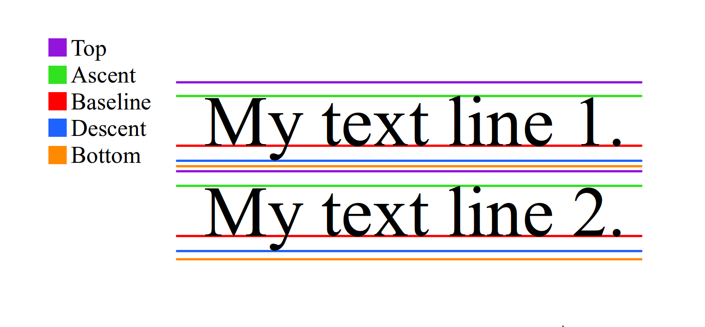
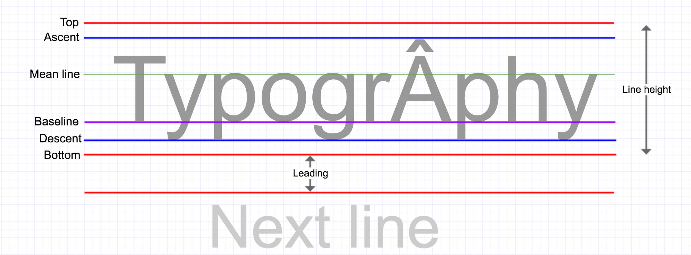

- [drawText](#drawtext)
	- [void drawText (String text, float x, float y, Paint paint)](#void-drawtext-string-text-float-x-float-y-paint-paint)
	- [void drawText(String text, int start, int end, float x, float y, Paint paint)](#void-drawtextstring-text-int-start-int-end-float-x-float-y-paint-paint)
	- [void drawText (char[] text, int index, int count, float x, float y, Paint paint)](#void-drawtext-char-text-int-index-int-count-float-x-float-y-paint-paint)
	- [void drawText(CharSequence text, int start, int end, float x, float y, Paint paint)](#void-drawtextcharsequence-text-int-start-int-end-float-x-float-y-paint-paint)
	- [void drawTextOnPath(String text, Path path, float hOffset, float vOffset, Paint paint)](#void-drawtextonpathstring-text-path-path-float-hoffset-float-voffset-paint-paint)
	- [void drawTextOnPath(char[] text, int index, int count, Path path, float hOffset, float vOffset, Paint paint)](#void-drawtextonpathchar-text-int-index-int-count-path-path-float-hoffset-float-voffset-paint-paint)
	- [void drawPosText(String text, float[] pos, Paint paint)](#void-drawpostextstring-text-float-pos-paint-paint)
	- [void drawPosText(char[] text, int index, int count, float[] pos, Paint paint)](#void-drawpostextchar-text-int-index-int-count-float-pos-paint-paint)

# drawText

## void drawText (String text, float x, float y, Paint paint)

text : 表示する文字列  
x : テキストの左端を指定するX座標(※3)（設定(※1)により右端、中央にすることも可能）  
y : テキストが表示されるベースライン(※2)のY座標

(※1)設定方法 `Paint.setTextAlign(Paint.Align.RIGHT)`  
(※2)ベースラインは以下を参照

(※3)座標はViewの左上を原点`(x,y) = (0,0)`とし、X軸のプラスの値は右へ、Y軸のプラスの値は下へ進む。

## void drawText(String text, int start, int end, float x, float y, Paint paint)

座標 (x, y) の位置を基点に文字列 text の start+1 文字目から end+1 文字目までのテキストの描画します。

## void drawText (char[] text, int index, int count, float x, float y, Paint paint)

座標 (x, y) の位置を基点に char 型配列 text の index 要素位置から文字数 count 分のテキストの描画します。

index : パラメータ `char[] text` の描画開始位置を指定します。  
count : パラメータ `char[] text` の描画要素数を指定します。

## void drawText(CharSequence text, int start, int end, float x, float y, Paint paint)

座標 (x, y) の位置を基点に CharSequence 型文字列 text の start+1 文字目から end+1 文字目までのテキストの描画します。

## void drawTextOnPath(String text, Path path, float hOffset, float vOffset, Paint paint)

Path オブジェクト（後述）で指定された位置にそってテキストを描画します。  
Path オブジェクトの位置より hOffset と vOffset 分だけ移動した位置を基点に描画されます。

## void drawTextOnPath(char[] text, int index, int count, Path path, float hOffset, float vOffset, Paint paint)

Path オブジェクトで指定された位置にそって char 型配列 text の index 要素位置から文字数 count 分のテキストの描画します。  

## void drawPosText(String text, float[] pos, Paint paint)  

float 型配列 pos で指定された位置に沿って文字列 text を描画します。

## void drawPosText(char[] text, int index, int count, float[] pos, Paint paint)

float 型配列 pos で指定された位置に沿って char 型配列 text の index 要素位置から文字数 count 分のテキストの描画します。
