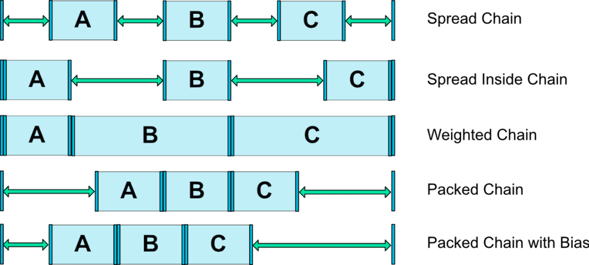

- [チェーンのスタイル](#チェーンのスタイル)
  - [チェーンの概要](#チェーンの概要)
    - [Spread](#spread)
    - [Spread inside](#spread-inside)
    - [Packed (Packed Chain with Bias)](#packed-packed-chain-with-bias)
    - [Weighted Chain](#weighted-chain)

# チェーンのスタイル

## チェーンの概要

以下は、チェーンの一覧です。

チェーンのスタイルは三種類あります。

`chainStyle` 属性に設定できる値は `spread` / `spread_inside` / `packed` の三つです。  
上記の図の **Weighted Chain** と **Packed Chain with Bias** は応用と考えてください。

 `chainStyle` 属性は、チェーンヘッドと呼ばれる View に設定します。  
 チェーンヘッドとは、水平方向のチェーンでは一番左端にある View を示し、  
 垂直方向のチェーンでは一番上端にある View を示します。

### Spread

複数のViewを均等に配置します。  
`Spread inside` との違いは、端の View と ParentView との間にもスペースができることです。

### Spread inside

複数の View を均等に配置します。  
`Spread`との違いは、端の View と ParentView との間にはスペースができないことです。

### Packed (Packed Chain with Bias)

複数の View を中央にくっつけて配置します。  
端の View と ParentView との間のみにスペースができます。

どれか一つのViewのバイアスを設定することで全体にバイアスがかかり、  
**Packed Cahin with Bias** のようになります。

### Weighted Chain

**Weighted Chain** は、 View の幅を `0dp` に設定し、  
`wieght` 属性で View の幅や高さを比率で指定する方法です。  
このとき、 **Chain Style** 属性は定義しません。  
定義したとしても、無効になるはずです。
