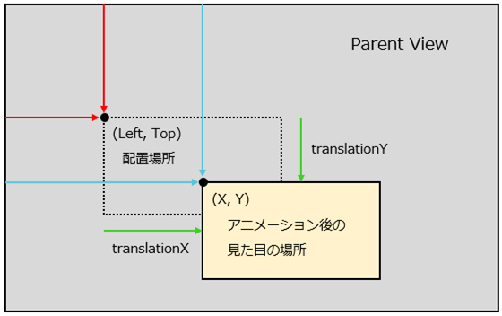

<!-- TOC depthFrom:1 depthTo:6 withLinks:1 updateOnSave:1 orderedList:0 -->

- [XY_translationXY_TopLeftの違い](#xytranslationxytopleft違)

<!-- /TOC -->

# XY_translationXY_TopLeftの違い

**前提**

として、Viewには、「配置場所」と「見た目の場所」の二つの場所がされている。  
デフォルトでは、これらは同じ場所であるが、アニメーションの実行によって、見た目の場所だけが変わることがある。

**三つのプロパティの違い**

イメージは以下の通り。

- Top / Left
  - 親ViewGroupの Top / Left からの距離を示す。
  - アニメーションが実行されて見た目の場所が変わったとしても、Top / Left が示す配置場所は変わらない。
  - 値を更新した後は、`requestLayout()`メソッドで描画を更新する。
- X / Y
  - 親ViewGroupの Top / Left からの距離を示す。
  - アニメーションが実行されて見た目の場所が変わった場合は、X / Y が示す場所も変わる。
  - 値を更新した後は、`requestLayout()`メソッド、もしくは`invalidate()`メソッドで描画を更新する。
- translationX / translationY
  - X / Y と Top / Left の差分を示す。

アニメーションで使用するプロパティは、"X / Y"か"translationX / translationY"である。
