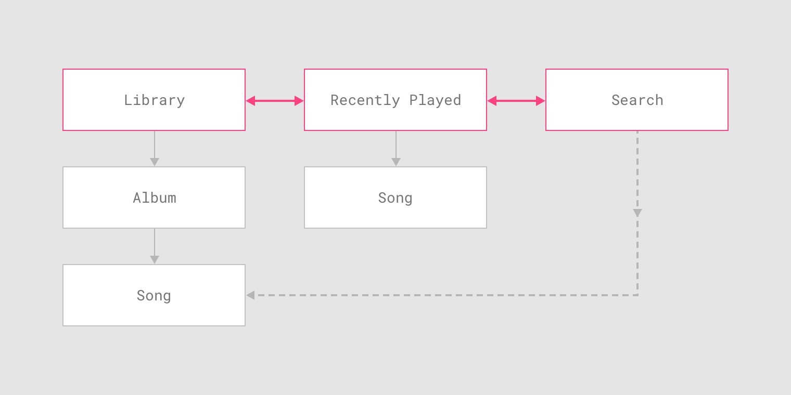
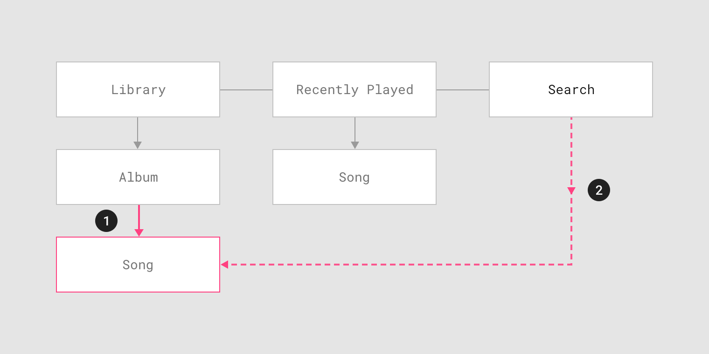
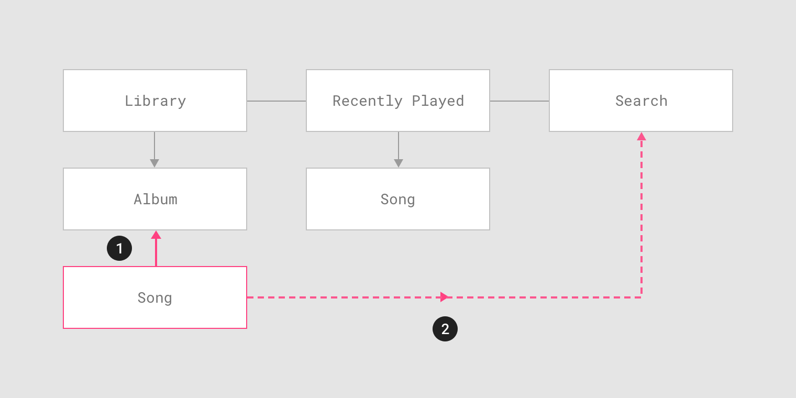

# 良いUIとは

## ナビゲーション

ナビゲーションとは画面遷移を提供するUIパーツ、およびそのUIが提供する画面遷移のことである。

### ナビゲーションの種類

ナビゲーションの種類は主に以下の三つである。

- 横方向のナビゲーション
- 縦方向のナビゲーション
  - 順方向のナビゲーション
  - 逆方向のナビゲーション

#### 横方向のナビゲーション

アプリケーションは最終的には、ある一つもしくは二つ程度の目的を提供する。
その最終的な目的を達成する為の入り口となる画面が複数ある場合、それらの画面を移動することを横方向のナビゲーションという。

**横方向のナビゲーションを提供するウィジェット**

- NavigationDrawer
  - 入り口が5つ以上ある場合に向いています。
- 下部のタブ
  - 入り口が2〜5つある場合に向いています。
- 上部のタブ
  - 入り口が2つ以上ある場合（上限は特段なし）に向いています。

#### 順方向のナビゲーション

#### 逆方向のナビゲーション

