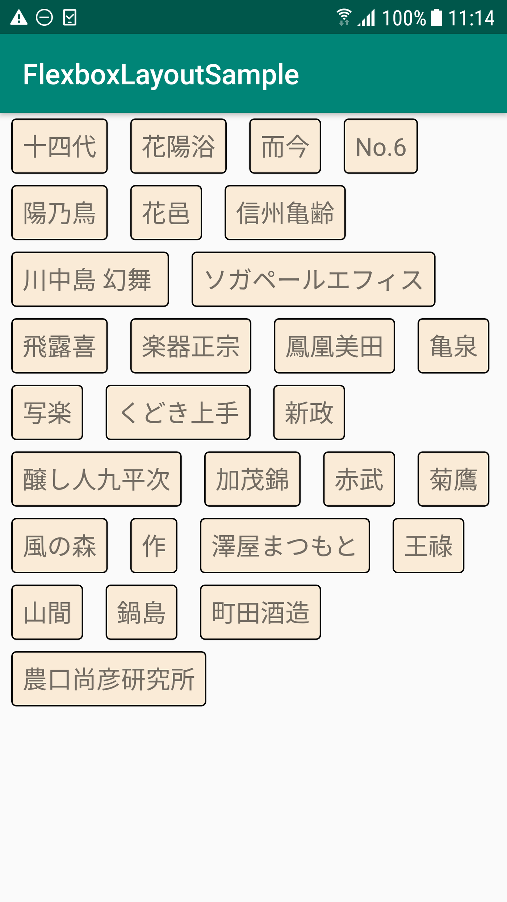
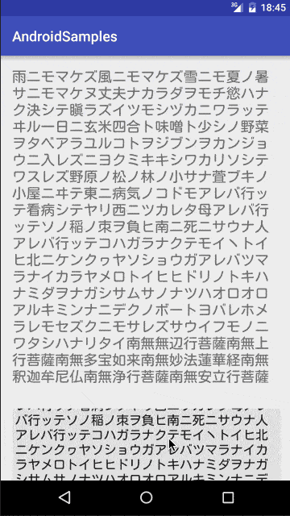

<!-- TOC depthFrom:1 depthTo:6 withLinks:1 updateOnSave:1 orderedList:0 -->

- [ウィジェット逆引き辞書](#ウィジェット逆引き辞書)
	- [複数のViewを表示し、幅が足りない時に自動で折り返すレイアウト](#複数のviewを表示し幅が足りない時に自動で折り返すレイアウト)
	- [スクロール可能なViewの中にさらにスクロール可能なVeiwを配置する](#スクロール可能なviewの中にさらにスクロール可能なveiwを配置する)

<!-- /TOC -->

# ウィジェット逆引き辞書

## 複数のViewを表示し、幅が足りない時に自動で折り返すレイアウト

FlexboxLayout

Composable では、 [FlowRow や FlowColumn](../Android%20Developers/開発/主要分野/UI/ガイド/3.アプリのレイアウトを開発する/7.Flow%20レイアウト.md) が、このレイアウトに該当します。

## スクロール可能なViewの中にさらにスクロール可能なVeiwを配置する

NestedScrollView

