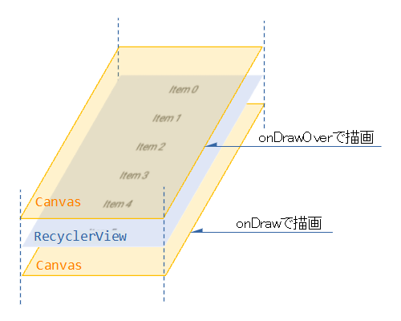
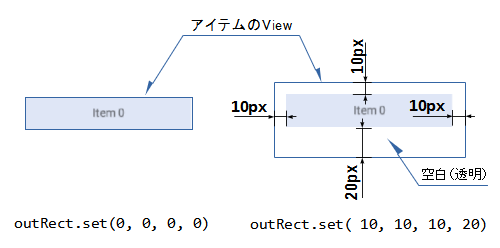

- [余白や区切り線の付け方](#余白や区切り線の付け方)
  - [概要](#概要)
  - [ItemDecoration の実装と登録](#itemdecoration-の実装と登録)
  - [DividerItemDecoration の実装](#divideritemdecoration-の実装)
  - [余白と区切り線を同時に使用したい場合](#余白と区切り線を同時に使用したい場合)
  - [参考資料](#参考資料)


# 余白や区切り線の付け方

## 概要

余白をつけるには、 `RecyclerView.ItemDecoration` クラスを使用します。

区切り線をつけるには、 `DividerItemDecoration` クラスを使用します。 `DividerItemDecoration` クラスは、 `ItemDecoration` クラスを継承したクラスです。


## ItemDecoration の実装と登録

アイテムの装飾はItemDecorationクラスを実装して、RecyclerViewへ登録すれば行われます。

RecyclerViewと同サイズのCanvasが2枚あり（RecyclerViewの上に表示、下に表示）、そのCanvasに描いた内容がRecyclerViewに重ねて表示されるという仕組みです。

アイテム毎に装飾を付けたければ、Canvas中のアイテムの位置を算出しなければなりません。この点が少々面倒です。

```kotlin
rcySample = findViewById<RecyclerView>(R.id.rcySample)
 
val _deco = object : RecyclerView.ItemDecoration() {  // ItemDecorationの実装
    override fun onDraw(
            c: Canvas, parent: RecyclerView,
            state: RecyclerView.State) {
        // Canvasへ装飾を描画
        // アイテムが描画される前に描画されるため、アイテムの下に表示
    }
 
    override fun onDrawOver(
            c: Canvas, parent: RecyclerView,
            state: RecyclerView.State) {
        // Canvasへ装飾を描画
        // アイテムが描画された後に描画されるため、アイテムの上に表示
    }
 
    override fun getItemOffsets(
            outRect: Rect, view: View, parent: RecyclerView,
            state: RecyclerView.State) {
        // アイテムの上下左右へ空間を設ける
        // outRect.set(leftの空間, topの空間, rightの空間, bottomの空間)
    }
}
 
rcySample.addItemDecoration(_deco)  // ItemDecorationの登録
```

2枚あるCanvasのどちらに装飾を描画するかでRecyclerViewとの上下関係が変わってきます。これはスクリーンへ描画する順番が違うためです。



また、getItemOffsetsでoutRect（Rect型）引数へ値を設定すれば、アイテムの周りに空白（透明）を設けることが出来ます。

空白のサイズ指定はピクセル（px）です。

アイテムのViewのサイズはこの空白も含めたサイズになるので注意してください。




## DividerItemDecoration の実装

`DividerItemDecoration` クラスは、 `ItemDecoration` クラスを継承しているため、使用方法は `ItemDecoration` クラスとほぼ同じです。

デフォルトの線は灰色っぽい実線です。 `public void setDrawable(@NonNull Drawable drawable)` メソッドが用意されているため、そちらを呼び出せば、任意の見た目の線を引くことができそうです。

注意点は以下の二点です。

1. 区切り線の高さ (幅) の分だけアイテムの View のサイズが大きくなります。

つまり、線を引く場所の余白が確保され、そこに線が引かれます。

2. `public void setOrientation(int orientation)` を呼び出して、水平方向のリストなのか垂直方向のリストなのかを指定する必要がありそうです。

引数には、 `DividerItemDecoration.HORIZONTAL` or `DividerItemDecoration.VERTICAL` を使用します。


## 余白と区切り線を同時に使用したい場合

【注意】 やったことがないので、以下は推測となります。

`DividerItemDecoration` クラスを継承して、独自クラスを作成し、 `getItemOffsets()` をオーバーライドすれば良いと思われます。

注意点として、余白と区切り線を同時に使用する場合は、もともと `DividerItemDecoration` クラスが線の太さ分の余白を設定いているため、それを無視しないように追加の余白を確保する必要があります。

`DividerItemDecoration` では、以下のようにして、線の太さ分の余白が確保されています。

```java
@Override
public void getItemOffsets(Rect outRect, View view, RecyclerView parent,
        RecyclerView.State state) {
    if (mDivider == null) {
        outRect.set(0, 0, 0, 0);
        return;
    }
    if (mOrientation == VERTICAL) {
        outRect.set(0, 0, 0, mDivider.getIntrinsicHeight());
    } else {
        outRect.set(0, 0, mDivider.getIntrinsicWidth(), 0);
    }
}
```

よって、 `getItemOffsets()` をオーバーライドする際に、以下のようにして、自分が確保したい余白と線の太さ分の余白を確保すると上手くいくと思われます。

```java
@Override
public void getItemOffsets(Rect outRect, View view, RecyclerView parent,
        RecyclerView.State state) {

    int customMargin = 12
    
    if (mDivider == null) {
        outRect.set(0, 0, 0, 0);
        return;
    }
    if (mOrientation == VERTICAL) {
        outRect.set(0, 0, 0, mDivider.getIntrinsicHeight() + customMargin);
    } else {
        outRect.set(0, 0, mDivider.getIntrinsicWidth() + customMargin, 0);
    }
}
```


## 参考資料

[RecyclerView：アイテムの装飾（ItemDecoration） - Y_SUZUKI's Android Log](https://android.suzu-sd.com/2021/05/recyclerview_itemdecoration/)  
このサイトは、 RecyclerView のあれこれについてとても詳しく書かれているので、何かのときは、まずこの人の資料を見てみると良さそう。ページ一番下の関連記事のところに RecyclerView に関する記事がいろいろあります。


