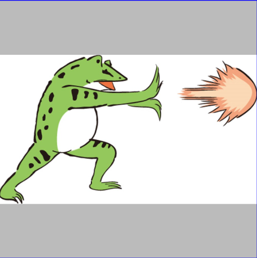

<!-- TOC depthFrom:1 depthTo:6 withLinks:1 updateOnSave:1 orderedList:0 -->

- [表示方法まとめ](#表示方法まとめ)
	- [wrap_contentではないの場合（画像のサイズによってImageViewのサイズが変わらない場合）](#wrap_contentではないの場合画像のサイズによってimageviewのサイズが変わらない場合)
		- [まとめ（表形式）](#まとめ表形式)
		- [まとめ（特徴を箇条書き）](#まとめ特徴を箇条書き)
		- [まとめ（サンプルイメージ）](#まとめサンプルイメージ)
		- [まとめ（一般的な用途）](#まとめ一般的な用途)
	- [wrap_contentの場合（画像のサイズによってImageViewのサイズが変わる場合）](#wrap_contentの場合画像のサイズによってimageviewのサイズが変わる場合)
		- [別紙の補足](#別紙の補足)

<!-- /TOC -->


# 表示方法まとめ

## wrap_contentではないの場合（レイアウトとしてImageViewのサイズが決まっているため、画像のサイズによってImageViewのサイズが変わらない場合）

### まとめ（表形式）

scaleType                  | 縦横比保持 | 画像全体が表示される | 画像が拡大される | 画像が縮小される | ImageViewと画像の間に隙間ができる
---------------------------|------------|----------------------|------------------|------------------|----------------------------------
FIT_CENTER（デフォルト値） | ○          | ○                    | ○                | ○                | ○
CENTER_CROP                | ○          | ×                    | ○                |                  | ×
FIT_XY                     | ×          | ○                    | ○                |                  | ×
CENTER                     | ○          | ×                    | ×                | ×                | ○
CENTER_INSIDE              | ○          | ○                    | ×                | ○                | ○


### まとめ（特徴を箇条書き）

- FIT_CENTER
  - 画像の縦横比を維持したまま、画像全体がImageViewに収まる最大サイズで、Viewの中心に画像を表示する。
- CENTER_CROP
  - 画像の縦横比を維持したまま、縦横どちらかがImageViewに収まる最大サイズで、ImageViewの中心に画像を表示する。
- FIT_XY
  - ImageViewのサイズに合わせて画像を拡大・縮小して表示する。


### まとめ（サンプルイメージ）



**FIT_CENTER**


**CENTER_CROP**


**FIT_XY**


### まとめ（一般的な用途）

- FIT_CENTER
  - 写真、絵、アイコンなど
- CENTER_CROP
  - 写真、絵、アイコンなど
  - 一覧表示用の縮小イメージ
- FIT_XY
  - 9Patch画像のボタンなど


## wrap_contentの場合（画像のサイズによってImageViewのサイズが変わる場合）

別紙「画像のサイズによってImageViewのサイズが変わる場合のImageViewのサイズの指定方法」を参照

### 別紙の補足

```xml
<ImageView
  android:src="..."
  android:adjustViewBounds="true" />
```

`android:adjustViewBounds="true"`を指定する場合は、画像を`background`属性ではなく、`src`属性に指定する必要がある。
