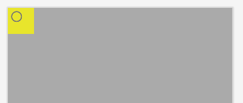
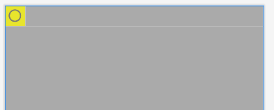
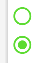

- [UI調整](#ui調整)
  - [wrap\_content を指定しても余計な余白ができてしまう場合](#wrap_content-を指定しても余計な余白ができてしまう場合)
  - [ラジオボタンの塗りつぶし色の指定](#ラジオボタンの塗りつぶし色の指定)


# UI調整

## wrap_content を指定しても余計な余白ができてしまう場合

例えば、以下の黄色の部分が `RadioButton` のエリアですが、  
`layout_width` にも `layout_height` にも `wrap_content` を指定しているにも関わらず、  
ラジオボタン丸部分の右側と下側に、余計な余白ができてしまっています。



この余計な余白を消すには、 `minWidth` や `minHeight` に `0dp` を指定します。  
すると、以下のように余計な余白が削除されます。




## ラジオボタンの塗りつぶし色の指定

ボタンの塗りつぶし (丸部分) の色を変更するには `buttonTint` 属性を使用します。

```xml
	<RadioButton
		android:id="@+id/rb_primary_color_green"
		android:layout_width="wrap_content"
		android:layout_height="wrap_content"
		android:buttonTint="@color/green"
		tools:checked="false"/>
```

例えば、緑を指定すると、以下のような感じになります。




