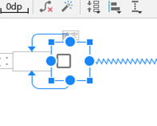

<!-- TOC START min:1 max:3 link:true asterisk:false update:true -->
- [右側にできる余計なスペースの削除方法](#右側にできる余計なスペースの削除方法)
  - [概要](#概要)
  - [解消方法](#解消方法)
<!-- TOC END -->


# 右側にできる余計なスペースの削除方法

## 概要



チェックボックスにテキストがない場合、チェックボックスのDrawableが上記の図のように  
左寄りになってしまう。


## 解消方法

```XML
<CheckBox
    android:id="@+id/division_number_confirm_checkbox"
    android:layout_width="wrap_content"
    android:layout_height="wrap_content"
    android:minWidth="0dp"
    android:minHeight="0dp" />
```

`minWidth` と `minHeight` に `0dp` を指定することで中央寄せにすることができる。
