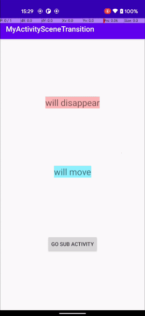

<!-- TOC depthFrom:1 depthTo:6 withLinks:1 updateOnSave:1 orderedList:0 -->

- [Transition](#transition)
	- [概要](#概要)
	- [仕組み](#仕組)

<!-- /TOC -->

# Transition

## 概要

`android.transition.Transition`クラスは、どのようにアニメーションを行うかを定義する様々なクラスの親クラスです。  
例えば、`android.transition.Fade`クラスは、Viewのフェードイン/フェードアウトのアニメーションを定義しています。  

## 仕組み

`Transition`クラスは、Viewのあるプロパティを参照し、そのプロパティの変更に応じたアニメーションを行います。  
例えば、`Fade`クラスは、`visible`プロパティを参照し、フェードインを行うか、フェードアウトを行うかを決定します。

## addTargetメソッド

このトランジションがアニメーション化の対象とするターゲットビューを設定します。  
デフォルトでは、ターゲットはなく、トランジションは、トランジション先のシーンのsceneRootの下にある階層内のすべてのビューの変更をリッスンします。  
ターゲットを設定すると、設定されたビューのみがアニメーションの対象となります。  
他のすべてのビューはアニメーションの対象外となります。

## removeTarget

`addTarget`メソッドでaddしたターゲットをremoveします。
ターゲットが設定されている際の動作については、addTargetメソッドの項目を参照してください。

## excludeTarget

ターゲットを除外リストに追加するか、除外リストから削除するのに使用します。

第二引数に`true`を指定すれば除外リストに追加し、`false`を指定すれば除外リストから削除します。

## excludeChildren

対象のViewGroupの全ての子Viewを一気に除外リストに追加するか、一気に除外リストから削除するかを指定するのに使用します。

## Transitionの種類

- Visivility系（遷移の前後でViewが表示される、もしくは、非表示になる系）
  - Explode
    - ViewGroupの中心点から波紋が広がるように、子Viewが広がりながら消えてゆく。もしくは、逆に波紋が巻き戻し再生されるように中心に向かってViewがViewGroupの端から寄っきて表示される。
  - Fade
    - 透明なViewがだんだん不透明になって表示される。もしくは、だんだん透明になって消えてゆく。
  - Slide
    - ViewGroupの端から水平もしくは垂直に子Viewが表示される。もしくは、表示位置から水平もしくは垂直に子Viewが移動してViewGroupの端へ消えてゆく。
- 移動/変形系
  - ChangeBounds
    - Viewの四隅の描画位置を変更します。
      - Activity間で共有要素にこの遷移を適用すると、遷移後のActivityおよびその子孫Viewが共有要素と同じ方向への移動を行うアニメーションが行われます。（図１を参照）
  -

（図１：「will move」と書かれた水色のViewが共有要素で「move」という黄色のViewへ繊維している。その際、緑色のViewや「Back」ボタンを含む遷移後のActivity全体が斜めに移動しているのがわかる
）

