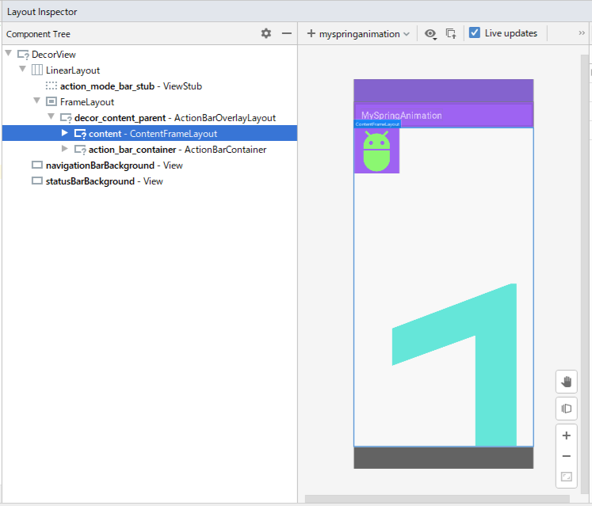
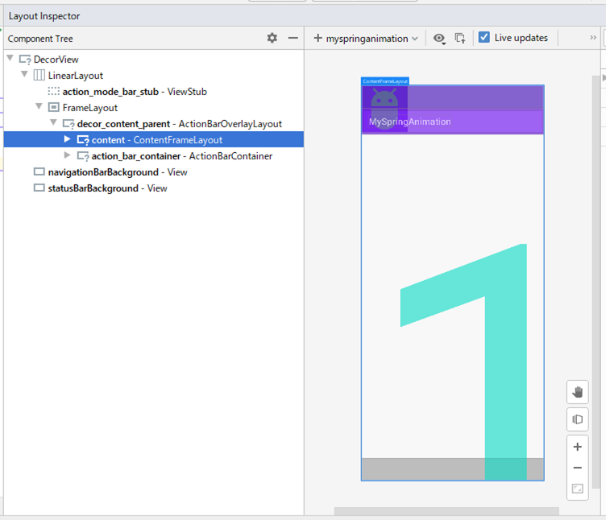
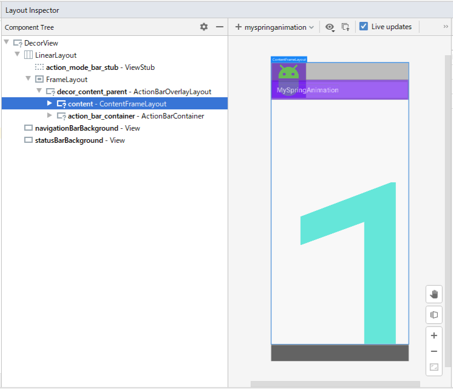
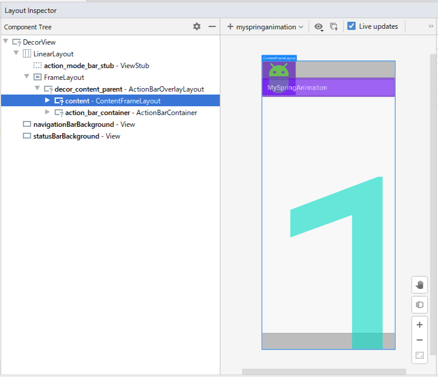

<!-- TOC depthFrom:1 depthTo:6 withLinks:1 updateOnSave:1 orderedList:0 -->

- [アプリバー_ステータスバーの高さの取得](#高取得)

<!-- /TOC -->


# アプリバー_ステータスバーの高さの取得

```Java
// ActivityのonCreateが終わってからしか値が取得できないため注意すること。
// ステータスバーの下端からナビゲーションボタンの上端までの領域
// 座標の原点は、ステータスバーも含めた画面の一番左上である。
Rect appViewRect = new Rect();
Window window = getWindow(); // これはActivityのメソッド
window.getDecorView().getWindowVisibleDisplayFrame(appViewRect);

// ステータスバーを半透明にした場合もステータスバーの高さを取得する。
int statusBarHeight = appViewRect.top;

// 3ボタンナビゲーションが表示されている場合はナビゲーションバーのTopの座標を取得する。
// 3ボタンナビゲーションが半透明の場合でもナビゲーションバーのTopの座標を取得する。
// ジェスチャーナビゲーションが表示されている場合はジェスチャーナビゲーションのTopの座標を取得する。
int contentsViewBottm = appViewRect.bottom;

// ステータスバー or ナビゲーションバーのどちらか一つでも透明にするとアプリバーの高さが正しく取得できないため注意すること。
int appBarHeight = window.findViewById(Window.ID_ANDROID_CONTENT).getTop();
int contentsViewTop = appBarHeight + statusBarHeight;
```

`window.findViewById(Window.ID_ANDROID_CONTENT)`で取得できるコンテンツエリアViewの大きさは、ステータスバー、ナビゲーションバーの透明/不透明の状況によって、変わります。  
各状況下におけるコンテンツエリアViewの大きさについて、以下の表にまとめました。  
ステータスバー、ナビゲーションバーの状況によって、座標の原点、コンテンツViewの上端/下端が変化します。

ステータスバー | ナビゲーションバー | 座標の原点(※)         | コンテンツViewの上端 | コンテンツViewの下端
---------------|--------------------|--------------------|----------------------|-------------------------
不透明         | 不透明             | アプリバーの左上   | アプリバーの下端     | ナビゲーションバーの上端
不透明         | 透明               | ディスプレイの左上 | ディスプレイの上端   | ディスプレイの下端
透明           | 不透明             | ディスプレイの左上 | ディスプレイの上端   | ナビゲーションバーの上端
透明           | 透明               | ディスプレイの左上 | ディスプレイの上端   | ディスプレイの下端

(※)座標の原点は親ViewGroupの左上の座標を示しており、コンテンツエリアView.getLeft()やgetTop()で取得した座標は、そこからの距離を示します。

ステータスバー、ナビゲーションバーの各状況下におけるコンテンツエリアViewの大きさを示す図を以下に添付します。



上の図は「ステータスばー：不透明　ナビゲーションバー：不透明」の場合



上の図は「ステータスばー：不透明　ナビゲーションバー：透明」の場合



上の図は「ステータスばー：透明　ナビゲーションバー：不透明」の場合



上の図は「ステータスばー：透明　ナビゲーションバー：透明」の場合
