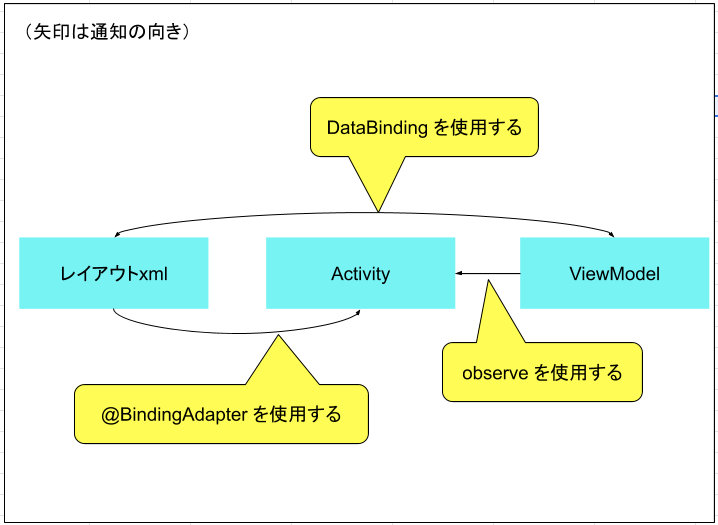

<!-- TOC depthFrom:1 depthTo:6 withLinks:1 updateOnSave:1 orderedList:0 -->

- [LiveDataとDatabindingを組み合わせる](#livedataとdatabindingを組み合わせる)
	- [コード](#コード)

<!-- /TOC -->


# LiveDataとDatabindingを組み合わせる

## コード

**MainViewModel**

```Java
public class MainViewModel extends ViewModel {

    // ここでフィールドをfinalで定義して初期値を代入するのはNG.
    // ここで初期化してしまうと、双方向データバインディングした時に、
    // getTextが無限に呼び出され続けるため。
    private MutableLiveData<String> text;

    // 双方向データバインディングの場合は、返値の型を「MutableLiveData」にする必要があります。
    public LiveData<String> getText() {
        // ここでtextのnullチェックをして、nullの場合に初期化すること。
        if (text == null) {
            text = new MutableLiveData<>();
        }
        return text;
    }

    public void onClick(View view) {
        text.setValue("time: " + System.currentTimeMillis());
    }
}
```


**activity_main.xml**

```xml
<?xml version="1.0" encoding="utf-8"?>
<layout xmlns:android="http://schemas.android.com/apk/res/android">

    <data>

        <variable
            name="viewModel"
            type="com.kurodai0715.mydatabindinglivedata.MainViewModel" />
    </data>

    <LinearLayout
        android:layout_width="match_parent"
        android:layout_height="match_parent"
        android:orientation="vertical">

        <!-- ViewModelにsetterメソッドがなくても@={}にすれば双方向を実現できる -->
        <TextView
            android:layout_width="match_parent"
            android:layout_height="wrap_content"
            android:text="@{viewModel.text}"
            android:textAlignment="center" />

        <Button
            android:id="@+id/button"
            android:layout_width="wrap_content"
            android:layout_height="wrap_content"
            android:onClick="@{viewModel::onClick}"
            android:text="Button" />

    </LinearLayout>
</layout>
```


**MainActivity**

```Java
public class MainActivity extends AppCompatActivity {

    private ActivityMainBinding binding;

    private MainViewModel viewModel = new ViewModelProvider(
                getViewModelStore(), getDefaultViewModelProviderFactory()).get(MainViewModel.class);

    @Override
    protected void onCreate(Bundle savedInstanceState) {
        super.onCreate(savedInstanceState);
        binding = DataBindingUtil.setContentView(this, R.layout.activity_main);

        // ＜注意＞setLifecycleOwnerを忘れるとLiveDataの値を更新しても画面が更新されない！
        binding.setLifecycleOwner(this);
        binding.setViewModel(viewModel);
    }
}
```




## Navigation コンポーネントと組み合わせる場合

### setLifecycleOwner() に渡すオブジェクトについて

Navigation コンポーネントを利用する場合には、 `setLifecycleOwner()` メソッドの引数に  
`this` で、 Fragment 自身をそのまま渡すより、 Navigation のバックスタックオブジェクトとして  
Fragment を渡す方が良いでしょう。

```Java
// Fragment の onCreate() で NavBackStackEntry オブジェクトを取得する。
NavController navController = NavHostFragment.findNavController(this);
NavBackStackEntry backStackEntry = navController.getCurrentBackStackEntry();

// Fragment の onViewCreated() or DialogFragment の onCreateDialog() で
// setLifecycleOwner() メソッドを実行し、
// 取得しておいた BackStackEntry を渡す。
binding.setLifecycleOwner(backStackEntry);
```
