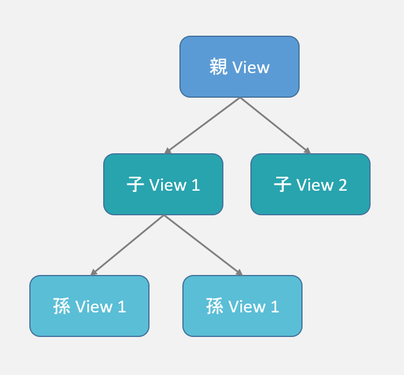

- [タッチイベントの透過と優先順位](#タッチイベントの透過と優先順位)
  - [View ツリー上のタッチイベントの伝搬](#view-ツリー上のタッチイベントの伝搬)
  - [タッチイベントを消化する権利](#タッチイベントを消化する権利)
    - [イベントを消化する権利の破棄](#イベントを消化する権利の破棄)
  - [イベントを消化する権利の優先順位の決め方](#イベントを消化する権利の優先順位の決め方)
    - [View の背景色が透明かどうかは関係ない](#view-の背景色が透明かどうかは関係ない)
    - [invisible と gone の View は権利を破棄する](#invisible-と-gone-の-view-は権利を破棄する)
    - [Button の elevation に注意](#button-の-elevation-に注意)


# タッチイベントの透過と優先順位

## View ツリー上のタッチイベントの伝搬

タッチイベントは、 View ツリーのルート View から、その子 View へと伝搬していきます。



上記の View ツリーは、 xml で表現すると以下のようになります。

```xml
<View android:id="@+id/parent">
    <View android:id="@+id/child_1">
        <View android:id="@+id/grand_child_1">
        </View>
        <View android:id="@+id/grand_child_2">
        </View>
    </View>
    <View android:id="@+id/child_2">
    </View>
</View>
```

親 View は、タッチされたポイントに子 View が存在していれば、  
その子 View にタッチされたことを知らせるイベントを発生させます。  
子 View がいなければ、子 View へのイベントの伝搬は終了します。


## タッチイベントを消化する権利

タッチイベントを消化するたにめには、その権利を手に入れる必要があります。

基本的には、タッチイベントを消化する権利を手に入れられる View は一つのみです。  
どれか一つの View でタッチイベントが消化されれば、  
他の View ではタッチイベントは発生しません。

イベントを消化する権利を手に入れた View が、その権利を破棄した場合には、  
次に優先順位が高い View が、その権利を手に入れます。


### イベントを消化する権利の破棄

`onClick()` コールバックを実装していない View は、  
イベントを消化する権利を破棄したことになります。 

`enabled` 属性が `false` になっていたとしても、  
その View が `onClick()` コールバックを実装していれば、  
権利を破棄したことにはなりません。  
つまり、次に優先順位が高い View が権利を取得することはありません。


## イベントを消化する権利の優先順位の決め方

以下の順番で、イベントを消化する View は決定されます。  
(各ステップで同等のものがなければ、その時点でイベントを消化する View が決定します。)

1. View ツリーの子 View が優先
2. View の elevation が高い方が優先
3. 親の ViewGroup に後から inflate された View が優先


### View の背景色が透明かどうかは関係ない

イベントを消化する権利の優先順位を決める際に、  
View が透明か不透明かは関係ありません。

**上層の View が不透明な場合**

たとえ、上層のレイヤーに不透明な View が覆っていたとしても、  
その View が、イベントを消化する権利を破棄すれば、  
下層に存在している View がイベントを消化する権利を手に入れます。

つまり、ユーザーの目に見えない View が、  
タッチイベントを消化する権利を手に入れることもあります。

**上層の View が透明な場合**

たとえ、上層のレイヤーに透明な View が覆っていたとしても、  
その View が、イベントを消化する権利を行使すれば、  
下層に存在している View がイベントを消化する権利を手に入れることはありません。


### invisible と gone の View は権利を破棄する

クリックイベントを消化する権利を持っている View の `visibility` が  
`invisible` もしくは、 `gone` の場合は、権利を破棄したことになります。


### Button の elevation に注意

Button / MaterialButton に elevation を設定したい場合には、注意が必要です。

レイアウト xml の `<Button>` タグで elevation 属性を設定することはできません。

なぜなら、 Button は、デフォルトのスタイル `button_state_list_anim_material.xm` で、  
elevation を設定しており、 `<Button>` タグ内で設定した  
elevation 属性は、デフォルトのスタイルで上書きされてしまうためです。


