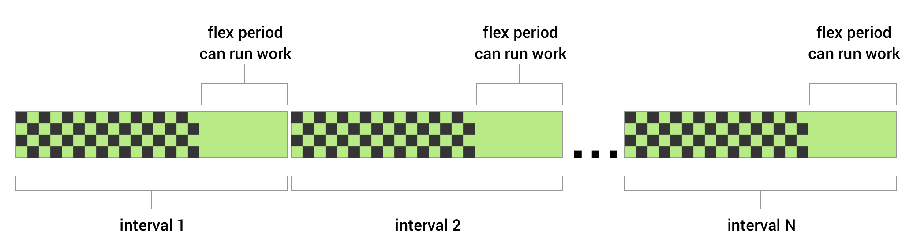

<!-- TOC START min:1 max:3 link:true asterisk:false update:true -->
- [WorkManager 理論編](#workmanager-理論編)
  - [Doze モードとの関係](#doze-モードとの関係)
  - [定期的な処理のスケジュール設定](#定期的な処理のスケジュール設定)
    - [処理が実行されるタイミング](#処理が実行されるタイミング)
    - [処理が実行されるタイミングをあえて遅らせる場合（フレックス期間の設定）](#処理が実行されるタイミングをあえて遅らせる場合フレックス期間の設定)
    - [定期的な処理の繰り返し実行をやめる](#定期的な処理の繰り返し実行をやめる)
  - [優先処理](#優先処理)
    - [概要](#概要)
    - [優先処理が行える時間の割り当て](#優先処理が行える時間の割り当て)
    - [優先処理として登録することが適切なユースケース例](#優先処理として登録することが適切なユースケース例)
    - [優先処理として登録するとフォアグラウンドサービスを実行する可能性がある](#優先処理として登録するとフォアグラウンドサービスを実行する可能性がある)
  - [実行条件を追加する](#実行条件を追加する)
  - [初期遅延を設定する](#初期遅延を設定する)
  - [リトライ（再試行）とバックオフ（後ずさり）](#リトライ再試行とバックオフ後ずさり)
    - [リトライ](#リトライ)
    - [バックオフ](#バックオフ)
  - [「 ID / タグ / 名前」 の共通点と違い](#-id--タグ--名前-の共通点と違い)
  - [WorkRequest にタグを設定する](#workrequest-にタグを設定する)
    - [タグの用途](#タグの用途)
    - [タグは一つの WorkRequest に対して複数設定することが可能です](#タグは一つの-workrequest-に対して複数設定することが可能です)
  - [WorkRequest に名前を設定する（WorkManager のキュー内部で一意となる名前）](#workrequest-に名前を設定するworkmanager-のキュー内部で一意となる名前)
  - [処理のキャンセル](#処理のキャンセル)
    - [処理が途中で停止された場合](#処理が途中で停止された場合)
    - [システムによる処理の強制停止](#システムによる処理の強制停止)
<!-- TOC END -->

# WorkManager 理論編

## Doze モードとの関係

Doze モード中は実行されない

## 定期的な処理のスケジュール設定

### 処理が実行されるタイミング

繰り返し処理の場合、実行間隔を指定します。  
実行間隔は、 **最小実行間隔** であることを認識する必要があります。

設定可能な一番短い「最小実行間隔」は 15 分です。それ未満の値を設定することはできません。

Doze モード中は処理が実行されません。  
また、実行条件 (バッテリー残量等) を指定している場合には、すべての条件が満たされていないと  
処理が実行されません。

Doze モードになっておらず、かつ、実行条件をすべて満たしている場合には、処理はすぐに実行されると思われます。

この **最小実行間隔** のことを、 **インターバル時間** とも呼びます。

**【気になる点】**  
「最小実行間隔」 と言いつつも、以下のフレックス期間の図を見ると疑問に思うことがある。  
1 回目のインターバル内では後ろの方で実行され、 2 回目のインターバル内では前の方で実行された場合には、  
最小実行間隔で指定した時間間隔よりも短い間隔で処理が実行されるのではないか？  
その場合、 「最小実行間隔」 という表現が適切ではないように思う。

### 処理が実行されるタイミングをあえて遅らせる場合（フレックス期間の設定）

最小実行間隔の中にフレックス期間を設定することができます。  
フレックス期間は、最小実行間隔内の後ろ側に設定されるため、処理が実行可能な状態でもすぐに実行されなくなります。

interval は、最小実行間隔を表しています。  
flex period は、フレックス期間を表しています。

黒と緑の碁盤目状の時間帯には、 Work は実行されません。

### 定期的な処理の繰り返し実行をやめる

「処理のキャンセル」 の項目を参照してください。

## 優先処理

### 概要

処理を優先処理として `WorkManager` のキューに登録することで、即座に実行させることができます。  
ただし、以下に記載した 「割り当て」 を満たしていない場合には、優先処理として登録することができません。  
また、システム負荷が高すぎる場合にも、優先処理として登録することができません。  
具体的には、実行中のジョブが多すぎる場合や、メモリに十分な空きがないときを指します。

### 優先処理が行える時間の割り当て

全ての処理を優先処理とすることはできません。  
アプリごとに、処理を優先処理として使用できる時間はシステムによって割り当てられており、  
上限時間に達した場合には、 **「処理を登録しない」** もしくは、 **「通常処理として処理を登録する」**  
という動作を選択することになります。

ただし、アプリがフォアグラウンドにある場合は、システムによる割り当ての実行制限を受けません。  
無制限に優先処理を行うことが可能です。

優先処理を登録できる時間は、アプリのスタンバイバケット (使用頻度) とアプリのプロセスの優先度によって  
システムが決定します。

### 優先処理として登録することが適切なユースケース例

- 決済アプリで支払を実行するユースケース
- チャットアプリでメッセージや添付画像を送信するユースケース

### 優先処理として登録するとフォアグラウンドサービスを実行する可能性がある

優先処理として登録すると、 Android 12 未満のデバイスでは、フォアグラウンドサービスを実行することがあります。  
これは、古いデバイスで優先処理を実行するための下位互換対応です。

フォアグラウンドサービスは、通知を表示する必要があるため、 Android 12 未満のデバイスで  
優先処理が実行される可能性がある場合は、通知を設定する必要があります。

`ListenableWorker` の `getForegroundInfo()` もしくは、 `getForegroundInfoAsync()`  
メソッドを実装することで `WorkManager` が通知を表示できるようになるようです。

## 実行条件を追加する

WorkManager では以下の実行条件を使用できます。  
条件がすべて満たされるまで処理の実行が延期されます。

| 条件             | 詳細                                                                                                                                                                                                      |
|------------------|-----------------------------------------------------------------------------------------------------------------------------------------------------------------------------------------------------------|
| NetworkType      | 処理の実行に必要なネットワークの種類を制約します。（例: Wi-Fi（UNMETERED））。                                                                                                                            |
| BatteryNotLow    | true に設定すると、デバイスが電池残量低下モードになっている場合には処理が実行されません。                                                                                                                 |
| RequiresCharging | true に設定すると、デバイスが充電中の場合にのみ処理が実行されます。                                                                                                                                       |
| DeviceIdle       | true に設定すると、ユーザーのデバイスがアイドル状態になった後にのみ処理が実行されます。これは、ユーザーのデバイスで実行中の他のアプリのパフォーマンス低下を招くような、一括操作を実行する場合に便利です。 |
| StorageNotLow    | true に設定すると、ユーザーのデバイスの保存容量が少なすぎる場合、処理は実行されません。                                                                                                                   |

処理の実行中に実行条件が満たされなくなると、WorkManager がワーカーを停止します。 (処理は中止される？)  
その後、すべての条件が満たされると、処理が再試行されます。

## 初期遅延を設定する

定期的な処理のフレックス期間とは別に、初期遅延を設定する方法があります。  
この方法は、定期的な処理の場合でも、一回限りの処理の場合でも処理の実行を遅延させることができます。

初期遅延とフレックス期間の異なる点は、最初の 1 回目だけ遅延させるのか、それとも  
毎回遅延させるのかという点です。初期遅延では、最初の 1 回目だけ遅延を行いますが、  
フレックス期間は、毎回遅延を行います。

## リトライ（再試行）とバックオフ（後ずさり）

### リトライ

Work の実行に失敗し、リトライしたい場合には、 Work で `Result.retry()` を返すことで、リトライ  
するように指示することができます。

リトライの最短の再試行間隔は 10 秒です。それ以下の値を設定することはできません。

### バックオフ

リトライするように指示した場合には、 (何度も失敗する可能性があるため、) 初めてリトライするまでに  
何秒待機するのかを指示する必要があります。

リトライしても何度も失敗する場合には、リトライするまでの待機時間を  
線形関数的に増加させるのか、指数関数的に増加させるのかを指定できるようになっています。

例えば、初めてリトライするまでの待機時間を 10 秒とした場合は、以下のようになります。

**線形関数的に増加させる場合のイメージ**

|---|------|---------|------------|

**指数関数的に増加させる場合のイメージ**

|---|------|------------|------------------------|

縦棒が処理実行 (リトライ) タイミング  
横棒がリトライまでの待機時間

線形関数的増加の場合は、
最初の待機時間が 10 秒、次の待機時間が 20 秒、その次が 30 秒、その次が 40 秒...  
と、失敗する度に、待機時間が 10 秒ずつ増加していきます。

一方、指数関数的増加の場合は、
最初の待機時間が 10 秒、次の待機時間が 20 秒、その次が 40 秒、その次が 80 秒...  
と、失敗する度に、待機時間が前回の待機時間の 2 倍になります。

## 「 ID / タグ / 名前」 の共通点と違い

**共通点**

すべて Worker ごとに与えられる属性です。

**違い**

- ID
  - WorkManager 内で Worker を識別するためのユニークな値です。
- タグ
  - 複数の Worker に対して同じ属性を与えることでグルーピングを行います。
  - 一括で何らかの操作を行いたい場合に使用します。
- 名前
  - キュー内部で Worker を識別するためのユニークな値です。
  - 同じ Worker が重複してキューに登録されるのを防ぐことができます。
  - 重複して登録しようとした場合の振る舞いを指示するオプションが用意されています。
  - ワークチェーン ( `WorkContinuation` ) を利用する際には、そのワークチェーンやワーカーに  
    名前を設定することはできませんが、ワークチェーンを登録するラッパーワーカーを作成し、そのワーカーに  
    名前を設定することはできます。

## WorkRequest にタグを設定する

### タグの用途

WorkRequest にタグを設定すると、 WorkRequest をグループ化することができ、グループ内の  
WorkRequest すべてに対して、一括して操作を行うことが可能になります。  
例えば、処理リクエストの一括キャンセルを行ったり、現在の処理の状態を確認するために使用できる  
WorkInfo オブジェクトのリストを取得することができます。

### タグは一つの WorkRequest に対して複数設定することが可能です

タグは一つの WorkRequest に対して複数設定することが可能です。

## WorkRequest に名前を設定する（WorkManager のキュー内部で一意となる名前）

WorkManager のキュー内部で WorkRequest が一意になるように名前を付けることができます。  
この名前は、タグや ID とは異なるものです。  
タグは複数の WorkRequest に同じタグを付けることができますが、名前は、  
キュー内部で一意になる名前にしなければいけません。

キュー内部で一意になる名前を設定することで、誤って、同じ WorkRequest が複数登録されるのを  
防ぐことができます。誤って、複数登録された場合に、どのように振る舞うのかを指示するオプションも  
用意されています。

ワークチェーン ( `WorkContinuation` ) には直接名前を付けることはできません。  
ただし、ワークチェーンをキューに登録するラッパーワーカーを作成し、そのラッパーワーカーに  
名前を付けることは可能だと思われます。

## 処理のキャンセル

キューに登録されて、実行されるまで待機している Work や、実行中の Work はキャンセルすることができます。  
Work は、キャンセルされると `CANCELLED` 状態になります。

実行前の Work をキャンセルすると、その Work は実行されなくなります。  
実行中の Work をキャンセルすると、処理を途中で停止します。

チェーンされた Work をキャンセルすると、その後続の Work が全てキャンセルされます。  
後続ではない Work (直前で枝分かれした Work など) はキャンセルされません。

### 処理が途中で停止された場合

処理が途中で停止された場合は、クリーンアップ処理を実行してください。  
クリーンアップ処理とは、開いているファイルを閉じたり、接続しているデータベースを切断するなどの処理です。

### システムによる処理の強制停止

システムによって、実行中の処理が強制停止させられる場合があります。  
強制停止は、処理が実行期限の 10 分を超えた場合に行われることがあります。  
その場合は、処理が後で再試行されるようにスケジュール設定されます。

公式ドキュメントには、 「メモリ不足によって処理が強制停止させられる」 とは記載されていませんでした。  
メモリ不足による強制停止があるのかどうかは不明です。
