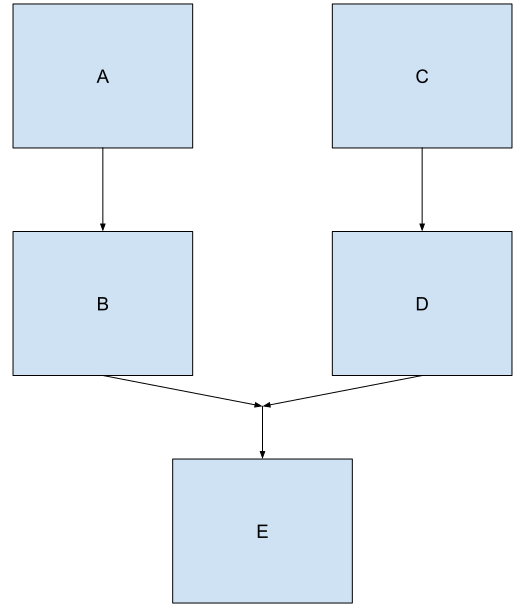

<!-- TOC START min:1 max:3 link:true asterisk:false update:true -->
- [複雑な処理チェーン](#複雑な処理チェーン)
  - [二つのチェーンを結合して三つ目のチェーンを作成する](#二つのチェーンを結合して三つ目のチェーンを作成する)
<!-- TOC END -->


# 複雑な処理チェーン

## 二つのチェーンを結合して三つ目のチェーンを作成する

以下の例では、 `WorkManager` は  
`workA` を実行してから `workB` を実行します。  
`workC` を実行してから `workD` を実行します。  
`workB` と `workD` が両方とも終了した後、 `workE` を実行します。

</p>



</p>

```Java
WorkContinuation chain1 = WorkManager.getInstance(myContext)
    .beginWith(workA)
    .then(workB);
WorkContinuation chain2 = WorkManager.getInstance(myContext)
    .beginWith(workC)
    .then(workD);
WorkContinuation chain3 = WorkContinuation
    .combine(Arrays.asList(chain1, chain2))
    .then(workE);
chain3.enqueue();
```
