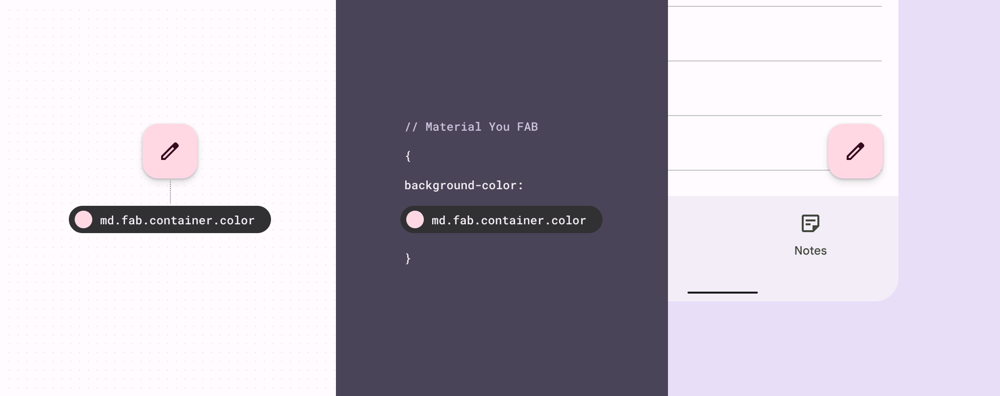
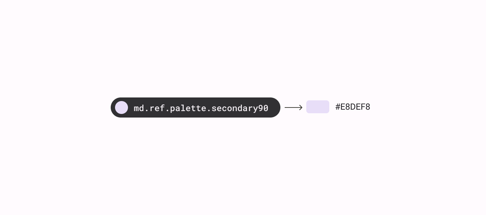
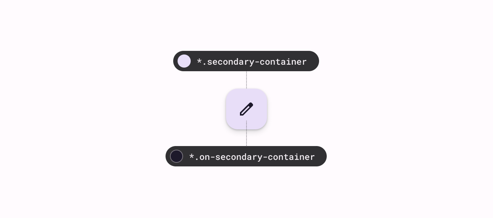
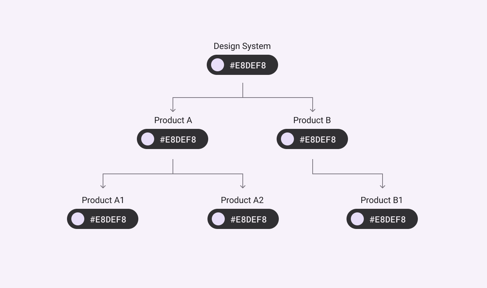
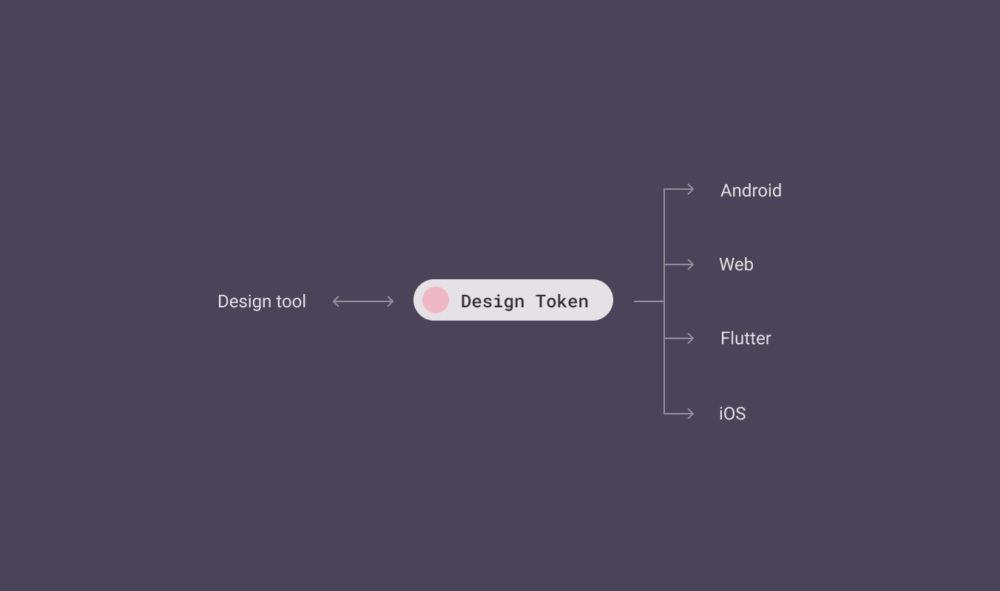

- [概要](#概要)
  - [リソース](#リソース)
  - [デザイントークンとは](#デザイントークンとは)
  - [なぜトークンは重要なのか](#なぜトークンは重要なのか)
  - [トークンとマテリアルデザイン](#トークンとマテリアルデザイン)
  - [トークンが適しているかどうかを判断する](#トークンが適しているかどうかを判断する)
  - [引用元資料](#引用元資料)

# 概要

デザイン トークンは、すべての UI 要素の構成要素です。同じトークンがデザイン、ツール、コードで使用されます。

- デザイン トークンは、色、フォント、測定値などのスタイル値を指します
- ハードコードされた値の代わりにデザイン トークンを使用します
- 各トークンは、使用方法や使用場所に基づいて名前が付けられます (たとえば、md.fab.container.color は FAB のコンテナの色を設定します)
- トークンの終了値 (上記の FAB の例のパッケージ名の最後の名前のこと？) が変更されても、その名前と使用方法は変わりません
- マテリアル デザインには、次の 3 種類のトークンがあります。
  - [参照](https://m3.material.io/m3/pages/design-tokens/how-to-read-tokens#bc81aaf5-fcd8-421b-a5ab-4b1f274c1baf)
  - [システム](https://m3.material.io/m3/pages/design-tokens/how-to-read-tokens#20829697-fd3d-4802-b295-96ba564f2e50)
  - [コンポーネント](https://m3.material.io/m3/pages/design-tokens/how-to-read-tokens#9edb5a47-17f1-4067-96a3-403aee901e2c)

トークンは、デザインファイルとコード全体で同じスタイル値が使用されることを保証します。

ハードコードされた値の代わりにデザイントークンを使用すると、デザインシステムを使用して製品を構築、維持、拡張する作業を効率化できます。

## リソース

[引用元資料](https://m3.material.io/foundations/design-tokens/overview#74f4abd1-45c6-4aeb-b661-a8eb662c6d62) を参照してください。

## デザイントークンとは

デザイン トークンは、デザイン システムのビジュアル スタイルを構成する、繰り返し行われる小さなデザイン決定を表します。 **トークンは、色の 16 進コードなどの静的な値を、わかりやすい名前に置き換えます。**

マテリアル デザイン トークンは、次の 2 つの部分で構成されます。

1. コードのような名前 ( `md.ref.palette.secondary90` など)
2. 関連付けられた値 ( `#E8DEF8` など)

トークンの値は、色、書体、測定値、または別のトークンなど、いくつかの値のいずれかになります。

以下の図は、参照トークンとそれに関連付けられた色値の例です。

**デザイン トークンは、スタイルに意味名を与えます。**

たとえば、デザイナーのモックアップとエンジニアの実装の両方がセカンダリ コンテナ カラーと呼ばれる同じトークンを参照している場合、デザインとエンジニアリングは両方の場所で同じ色が使用されることを確信できます。トークンに割り当てられた色の値が更新されても、この一貫性は維持されます。

以下の図は、 FAB コンテナに secondary-container が割り当てられ、そのアイコンに on-secondary-container が割り当てられた場合の例です。

## なぜトークンは重要なのか

トークンを使用すると、デザイン システムは信頼できる唯一の情報源を持つことができます。トークンは、スタイルの選択と変更を記録して追跡するための一種のリポジトリを提供します。

トークンをデザインと実装に使用すると、スタイルの変更は製品全体、または、製品スイート全体に一貫して伝播します。

トークンは再利用可能で目的主導型であるため、テーマとコンテキストの使用に対するシステム全体の更新を定義できます。たとえば、トークンを使用して、視認性を向上させるために高コントラストの配色を体系的に適用したり、テレビで小さなテキストが読みやすくなるようにタイプ スケールを変更したりできます。

デザイン システムが進化するにつれて、特定の値が変更されます。デザイン トークンは、変更を追跡し、エクスペリエンス全体で継続的な一貫性を確保するのに役立ちます。

## トークンとマテリアルデザイン

これまで、マテリアル デザイン スタイルは、ガイドライン、デザイン ファイル、ツール、プラットフォーム固有のコンポーネント ライブラリを通じて伝えられていました。

デザイン トークンを使用すると、マテリアル デザイン スタイルをダウンロード、カスタマイズ、適用し、デザインおよび開発プロセス全体に統合できます。

トークンを使用すると、プラットフォームに依存しない共有可能な形式でデザインの決定を文書化できます。

デザイントークンは、エンジニアやデザイナーのためのさまざまな統合ポイントを備えた、デザイン選択のための中央リポジトリを提供します。

## トークンが適しているかどうかを判断する

**トークンは、次のような状況で最も役立ち、効率的です:**

- 製品のデザインを更新したり、新しい製品を作成したりすることを計画している
- デザイン システムが複数の製品またはプラットフォームに適用されている
- 将来的にスタイルを簡単に維持または更新したい
- ダイナミック カラーなどの機能を含むマテリアル デザインを最大限に活用したい

**トークンがあまり役に立たない可能性があるのは、次の場合です:**

- 既存のアプリで、今後 1 ～ 2 年は変更されないハードコードされた値を使用している
- 製品にデザイン システムがない

## 引用元資料

- [Design tokens : Overview](https://m3.material.io/foundations/design-tokens/overview)
