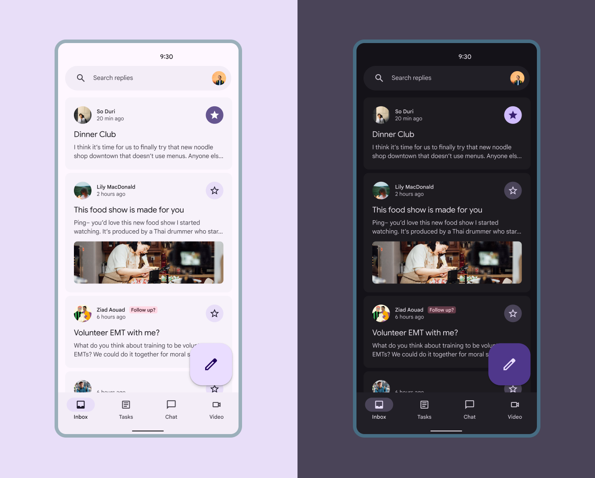
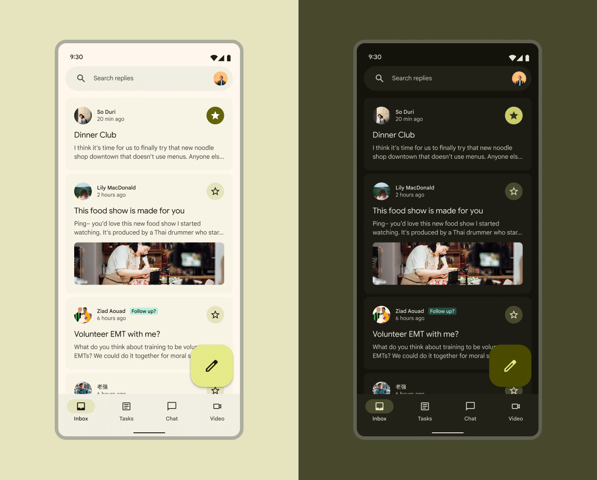

- [スキームを選択する](#スキームを選択する)
  - [静的カラー（ベースラインカラー）](#静的カラーベースラインカラー)
    - [静的 (ベースライン) 色を使用すると良いケース](#静的-ベースライン-色を使用すると良いケース)
  - [ダイナミックカラー](#ダイナミックカラー)
    - [ダイナミックカラーを使用すると良い場合](#ダイナミックカラーを使用すると良い場合)

# スキームを選択する

カラー スキームは、製品のすべての色、色の役割、および明るいテーマと暗いテーマにわたる色の関係を表します。

カラースキームとは、これのことです。

マテリアルには 2 種類のカラー スキームがあります:

1. 静的
2. 動的

このドキュメントでは、さまざまなカラースキーム (静的なベースライン、動的なユーザー生成、動的なコンテンツベースのカラースキームなど) をいつどのように使用するかを学びます。

## 静的カラー（ベースラインカラー）

静的カラーでの作業は、これまで使用したことがある他のカラー ワークフローと最も似ています。静的カラーは、ユーザー入力やアプリ内コンテンツに基づいて変更されることはありません。

Material は、デフォルトのカラー割り当てとマッピングを含む静的なベースライン カラー スキームを提供します。

ベースラインの配色では色は固定されています。

**メリット**

✓ アクセシブルな色を提供できる  
✓ あらかじめ用意されたベースライン カラー スキームを利用できる  
✓ M2 アプリを壊さない色を提供できる  
✓ 将来的にダイナミック カラーに簡単に更新できる  

**デメリット**

✗ パーソナライズされた色が使用できない  
✗ ユーザーの壁紙やアプリ内コンテンツに基づいて変化する色が使用できない  
✗ ユーザーによるコントラストの設定変更ができない  

### 静的 (ベースライン) 色を使用すると良いケース

- ダイナミック カラーを実装する準備ができていない (ただし、準備が整ったら簡単に切り替えることができます)
- 製品が M2 から移行中で、アプリを壊すことなく M3 機能を利用したい
- 製品はパーソナライズされた色やユーザー制御のコントラスト設定のメリットがないエンタープライズ ユーザー向け
- 製品は iOS 用に構築されています

ベースラインを使用してアプリを構築する場合は、 [
性的なカラースキーム](https://m3.material.io/m3/pages/static/baseline) のドキュメントを参照してください。

## ダイナミックカラー

ダイナミックカラーは、特定のソースカラーに基づいて、アクセス可能なカラースキームを自動的に作成します。

UI はさまざまなソースカラーで終わる可能性があるため、 **最初はベースラインカラースキームを使用して設計することをお勧めします。** そうすることで、適切なカラーロールが製品内の適切なコンポーネントにマッピングされることが保証されます。Material Theme Builder を使用して、さまざまなソースカラーで UI モックがどのように見えるかを確認し、必要に応じて調整します。

実際の色は変わるかもしれませんが、色の役割のマッピングは動的なカラースキーム全体で同じままです。

**メリット**

✓ アクセシブルな色を提供可能  
✓ ユーザーの壁紙やアプリ内コンテンツに基づいて変化するパーソナライズされた色を提供可能  
✓ クロマフィデリティなどの高度なカスタマイズを使用して、ダイナミックカラー出力を変更する機能  
✓ ユーザーが自分にあったコントラストの設定を行える (特に視覚障害者にとってメリットが大きい)

**デメリット**

✗ すべてのデバイスでまったく同じ色の UI

### ダイナミックカラーを使用すると良い場合

- 製品でパーソナライズをアピールしたい場合
- ユーザーの壁紙やアプリ内コンテンツに基づいて色を変えたい場合
- 製品でユーザーが制御するコントラスト設定を提供したい場合
- ダイナミックカラーとスタティックカラーを混在させる必要があるかどうかわからない場合 (作業の進行に合わせて、カラースキームをカスタマイズしてスタティックカラーを含めることができます)

ダイナミックカラーを使用してアプリを構築する場合は、 [動的なカラースキーム](https://m3.material.io/m3/pages/dynamic/choosing-a-source) のドキュメントを参照してください。

