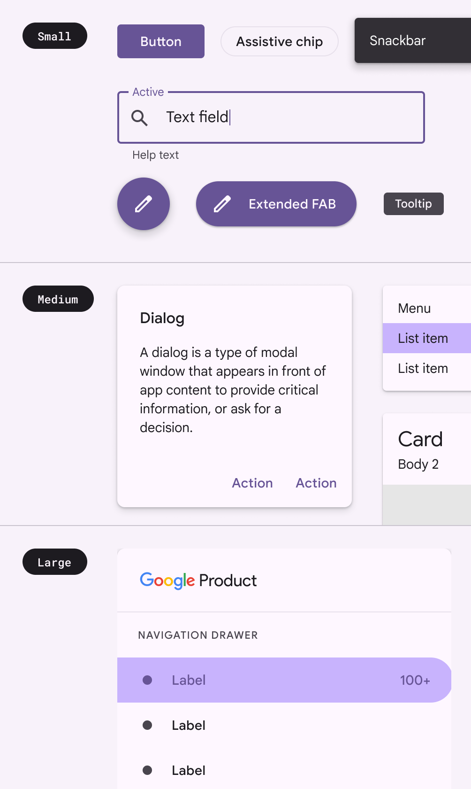
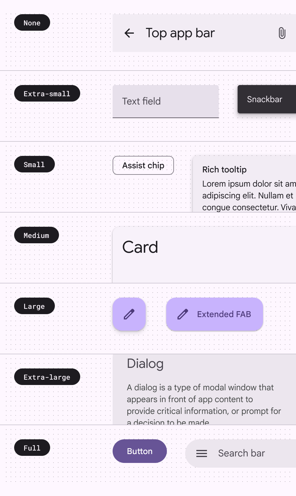

- [概要](#概要)
  - [M2 との違い](#m2-との違い)

形状は注意を向けさせ、状態を伝え、ブランドを表現することができます。

# 概要

- コーナーの形状は、完全に丸いものから四角いものまであります
- コンテナの上部、下部、開始、終了の各コーナーの形状をカスタマイズできます
- 円形と丸い形状は、コンテナの高さ値の 1/2 として定義する必要があります

## M2 との違い

拡張された M3 シェイプ システムでは、 7 つのスタイル ( M2 は 3 つのスタイル) でサイズ ベースのスケールを使用します。スタイルは、希望する丸みの量に基づいてコンポーネントに割り当てられます。

例えば、角が完全に直角なシェイプは「 None 」 、わずかに丸みのあるシェイプは 「 extra-small 」 、完全に円形のシェイプは 「 full 」 です。

スケールのステップは、角に適用される丸みの量によって名前が付けられています。以下は一例です。

**M2** : コンポーネントコンテナのサイズに基づいた 3 段階の形状スケール

**M3** : 形状の角の丸みに基づいた 7 段階の形状スケール

