- [タイプスケールとトークン](#タイプスケールとトークン)
  - [タイプスケール](#タイプスケール)
  - [タイポグラフィートークン](#タイポグラフィートークン)
  - [書体スケールのカスタマイズ](#書体スケールのカスタマイズ)
  - [書体のカスタマイズ](#書体のカスタマイズ)
    - [フォントサイズの単位](#フォントサイズの単位)
    - [Android と Web の文字サイズの対応表](#android-と-web-の文字サイズの対応表)
  - [調整可能な軸](#調整可能な軸)
    - [太さ](#太さ)
      - [設計上の注意点](#設計上の注意点)
    - [グレード](#グレード)
    - [幅](#幅)
    - [光学サイズ](#光学サイズ)

# タイプスケールとトークン

## タイプスケール

タイプ スケールは、アプリ全体で使用できるフォント スタイルの選択であり、さまざまな目的に対応する柔軟で一貫性のあるスタイルを保証します。

Material Design タイプ スケールは、それぞれが意図されたアプリケーションと意味を持つ 15 のスタイルの組み合わせです。これらは、使用方法 ( Display や Headline など) に基づいて割り当てられ、スケール ( Large や Small など) に基づいてより広いカテゴリにグループ化されます。

Material Design のデフォルトのタイプ スケールでは、すべてのタイトル、ラベル、本文に Roboto が使用され、統一されたタイポグラフィ エクスペリエンスが実現されます。 (デフォルトのフォントはデバイスメーカーが変更できるらしく、 Noto になっていたり、それ以外の場合もあるらしいです。)

[Material Theme Builder (Figma)](https://goo.gle/material-theme-builder-figma) で、Material のベースライン タイプ スケールのカスタマイズを実施できます。

スケールは、さまざまな製品のコンテキストとコンテンツのニーズをサポートする、スタイルの一覧です。 1 つの製品で、以下に定義されているすべてのスタイルが使用されることはありません。 代わりに、スケールから、最も適切なスタイルを選択します。

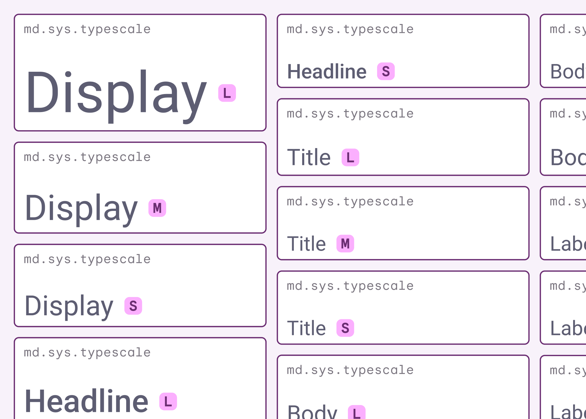

## タイポグラフィートークン

マテリアル デザインの書体スケールは、ブランドとプレーンの 2 種類の参照トークンを区別します。これにより、デザイン内で 2 つの異なる書体を使用できます。

ブランド書体 (トークン md.ref.typeface.brand) は、見出しやディスプレイなどの大きいフォント サイズに推奨され、プレーン書体 (トークン md.ref.typeface.plain) は、本文やラベルなどの小さいフォント サイズに適しています。

## 書体スケールのカスタマイズ

デバイスの違いなど、デフォルトとは異なるサイズが必要な場合は、スタイルを追加または削除したり、Roboto を任意のフォントに置き換えたりして、書体スケールをカスタマイズできます。

マテリアル デザインでは、14 をキー ベース サイズとする **メジャー セカンド書体スケール (※ 1 )** を使用します。 14 というサイズのフォントは、本文のテキストの組版に最も頻繁に使用される最も重要なスタイルに固定されます。

(※ 1 )  
メジャーセカンドスケールとは、 14 ポイントを基準として、 1.125? or 1.2? 倍して、次のフォントサイズを決めるプロセスのことです。この方法により、フォントサイズが適切な比率で変化するため、視覚的に美しく、読みやすいタイポグラフィを実現することができます。

以下の図は、メジャーセカンドスケールでフォント設計を行った例です。

フォントサイズの種類は 15 種類ありますが、この中には、ほとんど同じサイズのフォントも存在します。ほとんど同じサイズのフォントは、ユーザーも認識できない場合が多いため、あまり細かなフォントサイズの設計は必要ありません。以下の図では、左側が実際に使用するフォントで、右側は 15 種類のフォントのうち、実際に使用するフォントのみ、白色になっています。 ( 24 あたりが存在しないが、 HP 作成者のミスだろうから、気にしない...。)

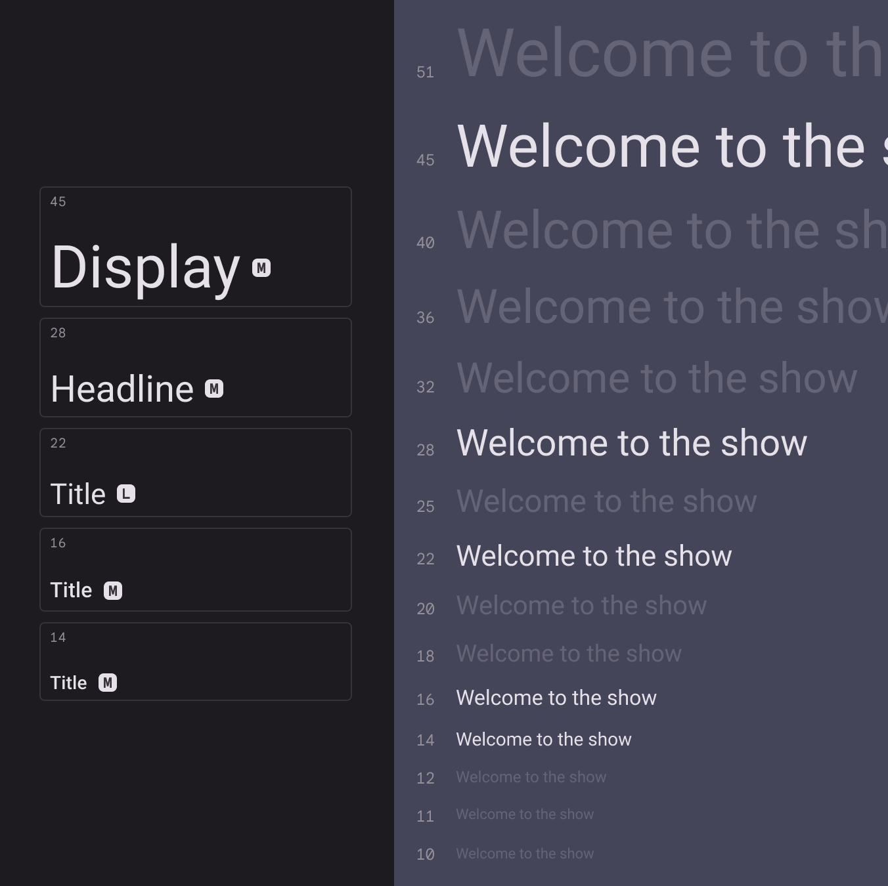

マテリアル デザイン タイプのスケールのデフォルト サイズがニーズを満たさない場合は、代わりに値を代用できます。ここでは、デフォルトの表示メディア サイズが、メジャー セカンド タイプのスケールの別のサイズに調整されています。

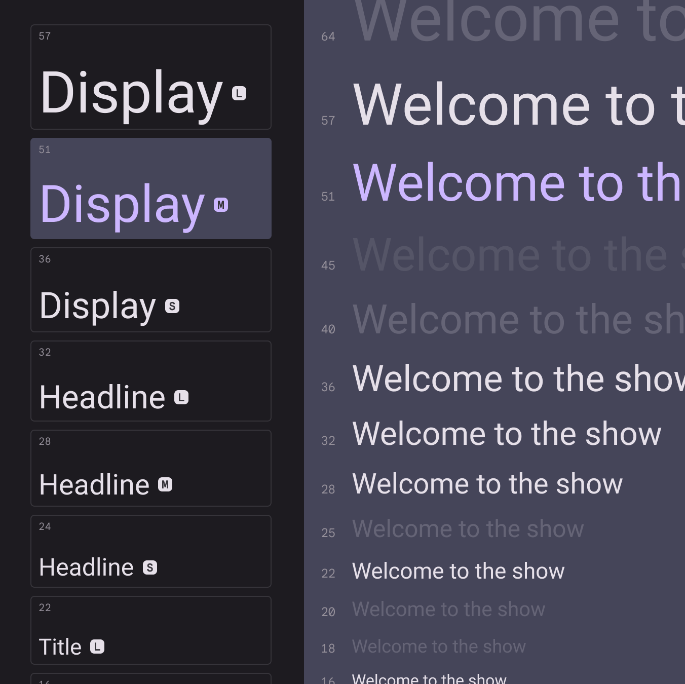

## 書体のカスタマイズ

独自のタイポグラフィでカスタマイズするには、まず、選択した書体を既存のスタイルに適用し、文字のサイズと太さを一致させます。

そこから、カスタム書体の独自の機能に合わせて行の高さと文字間隔の値を調整します。太いフォントでは文字間隔を広くする必要がある場合があり、アセンダ ( b の上に突き出た部分など) とディセンダ ( g の下に突き出た部分など) が長いフォントでは行の高さが異なります。

カスタム書体を使用すると、アプリに表現力豊かでユニークな表現を作成できます。

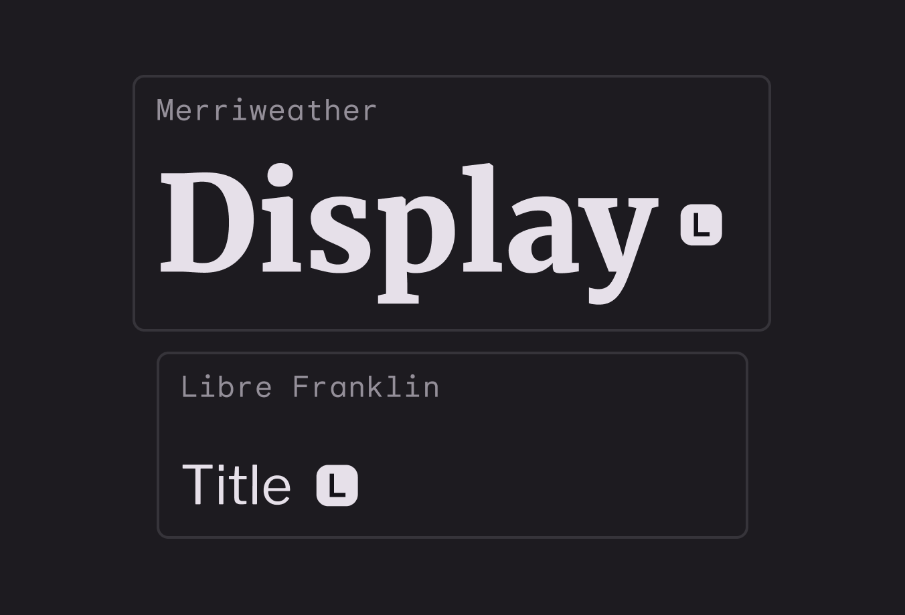

### フォントサイズの単位

Android では、フォント サイズを表すために sp という単位が使用されます。

### Android と Web の文字サイズの対応表

| Android | Web       |
| ------- | --------- |
| 10 sp   | 0.625 rem |
| 12 sp   | 0.75  rem |
| 24 sp   | 1.5  rem  |
| 60 sp   | 3.75 rem  |

## 調整可能な軸

バリアブル フォントには、表現のためのさまざまな可変フォント属性がありますが、製品デザインに最も適したカスタマイズ可能なスタイル属性 (または軸) は、太さ、グレード、幅、および光学サイズの 4 つです。

### 太さ

太さは、特定のフォントの書体のストロークの全体的な太さを定義する主要な属性です。最も一般的な太さは標準と太字ですが、極端に細いものから極端に太いものまで、さまざまな太さがあります。

書体がバリアブルである場合、ストロークの太さは完全かつ連続的な範囲で提供されるため、実質的には太さの数は無制限になります。

Google Fonts の太さについて詳しくは、 [こちら](https://fonts.google.com/knowledge/choosing_type/exploring_typefaces_with_multiple_weights_or_grades) をご覧ください

可変フォント Roboto Flex は、流動的な太さの範囲を提供します

#### 設計上の注意点

本文に極端に細い文字を使用することには注意してください。解像度の低いディスプレイでは、特に小さいサイズでは、より繊細なタイポグラフィのレンダリングが困難になることがあります。代わりに、 Display の文字など、大きいフォント サイズでは細い文字を使用することが可能です。

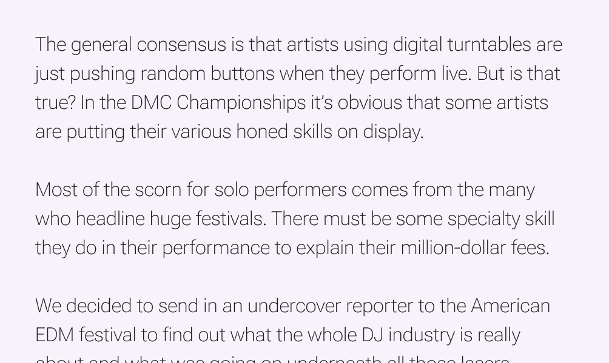

小さいサイズでは太すぎると読みにくくなる場合があります

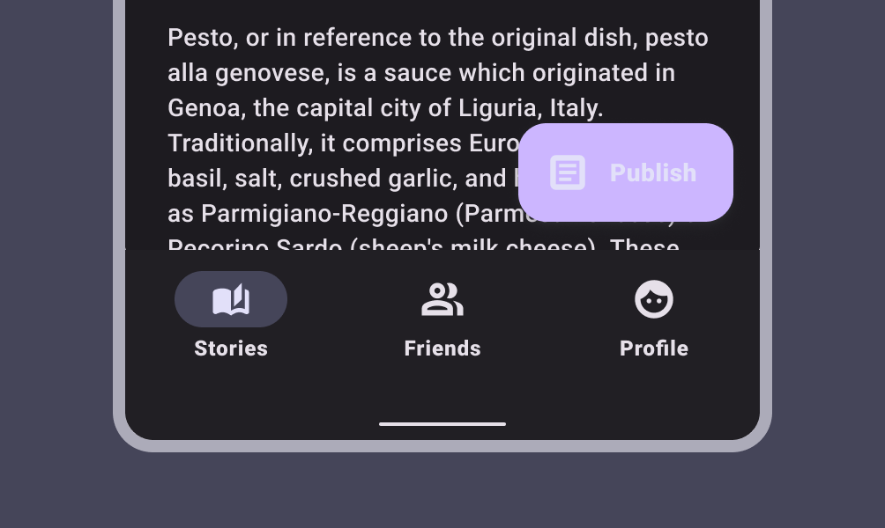

### グレード

グレードは、ウェイト軸とは関係なく、書体の光学的なウェイトを二次的に変更するものです。ウェイト軸とグレード軸はどちらも文字の太さに影響しますが、グレードによる調整はより細かく、文字の幅や改行は変更されません。

Google Fonts のグレードについて詳しくは [こちら](https://fonts.google.com/knowledge/choosing_type/exploring_typefaces_with_multiple_weights_or_grades) を参照してください。

Roboto Flex は、プラスグレード 150 とマイナスグレード 200 を提供します。

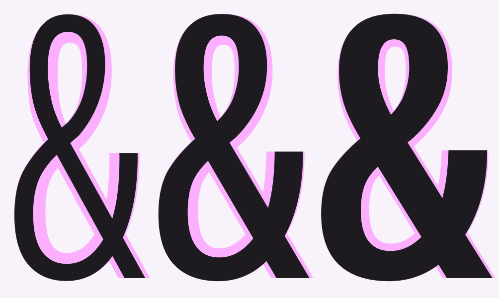

ダークモードとライトモードを切り替えると、同じ設定であっても同じテキストが太く表示されることがあります。これに対処するには、マイナスグレードの使用を検討してください。

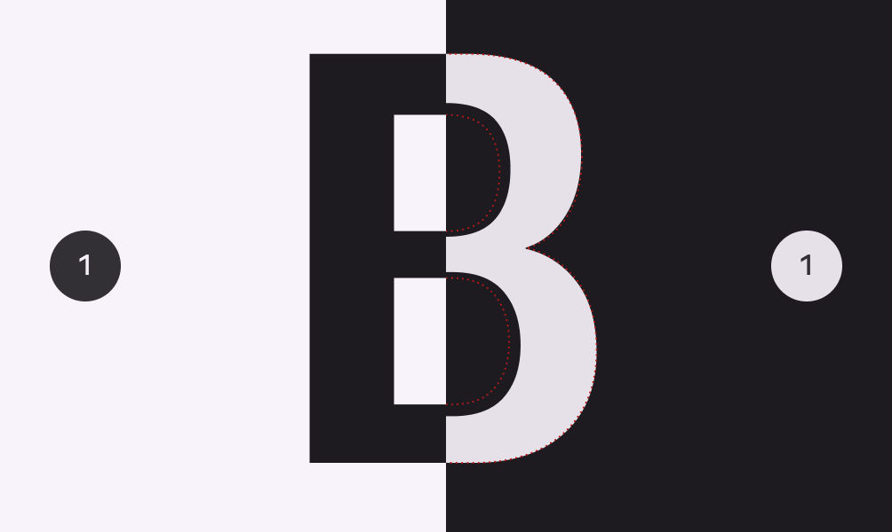

グレードはテキストをリフロー (※ 1 ) せずに強調を変更できます

(※ 1 )  
再レンダリングの際に、要素の位置や大きさを再計算すること。

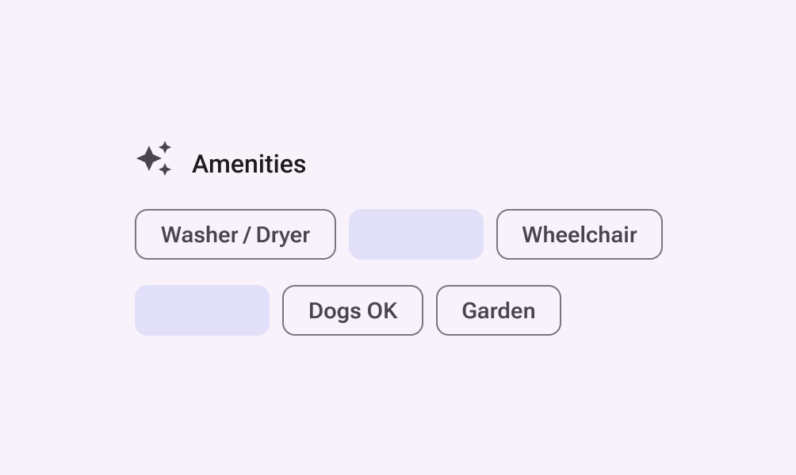

### 幅

幅は、書体の文字が占める水平方向のスペースの大きさです。

幅が狭いと 1 行に収まる文字数が多くなり、幅が広いと個性が増します。

Google Fonts の幅について詳しくは、 [こちら](https://fonts.google.com/knowledge/glossary/width) をご覧ください

Roboto Flex は、 25 から 150 までの流動的な幅の範囲を提供します。

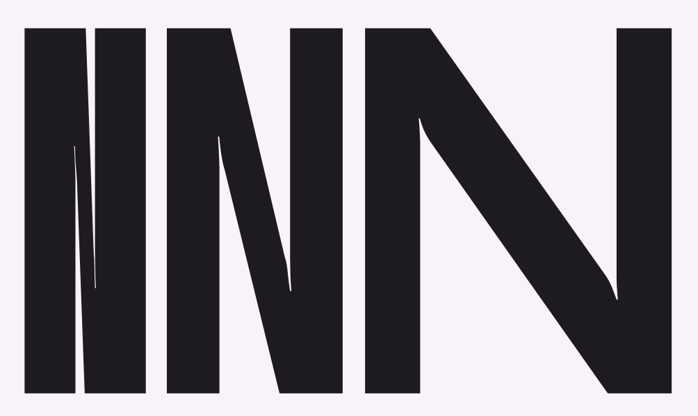

幅が狭いと、ラベルなどの小さなサイズに多くの文字を収めることができます。

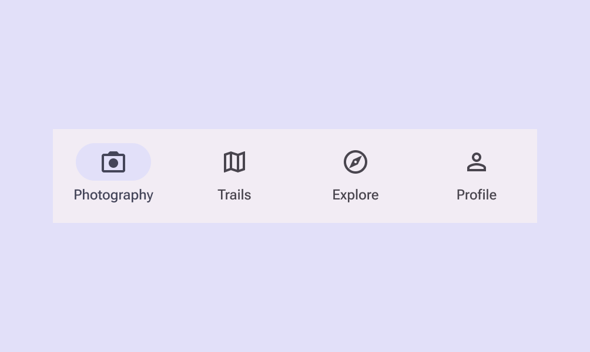

幅の広いスタイルはより多くのスペースを占めるため、トップアプリバーなど、スペースが限られている領域では使用しないでください。

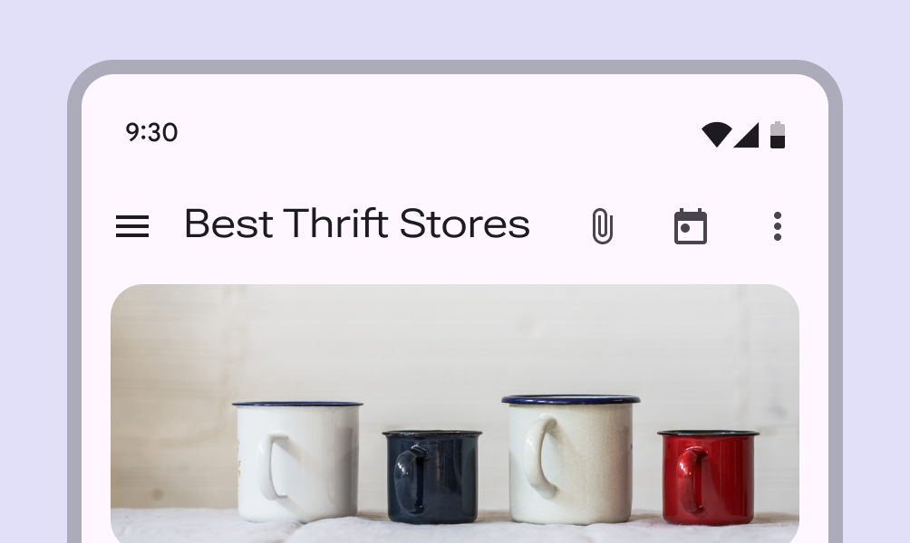

### 光学サイズ

光学サイズは、さまざまなサイズでの使用に最適化された書体のさまざまなバージョンです。

小さいサイズのデザインは読みやすさの向上に重点を置いていますが、大きいサイズのデザインは文字の複雑さを強調し、より多くの太さと幅を提供できます。

光学サイズの書体の選択についての詳細は、 [こちら](https://fonts.google.com/knowledge/choosing_type/choosing_typefaces_that_have_optical_sizes) を参照してください。

[Literata](https://fonts.google.com/specimen/Literata) 書体は 7pt から 72pt までの連続した光学サイズの範囲を持っています。

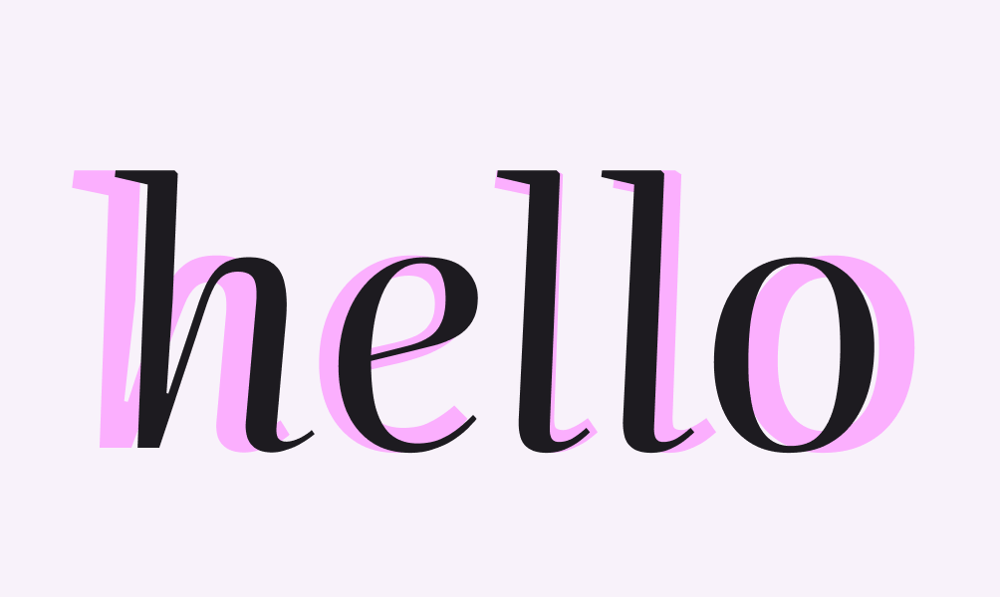

以下は、文字サイズに合った光学サイズを使用している良い例です。

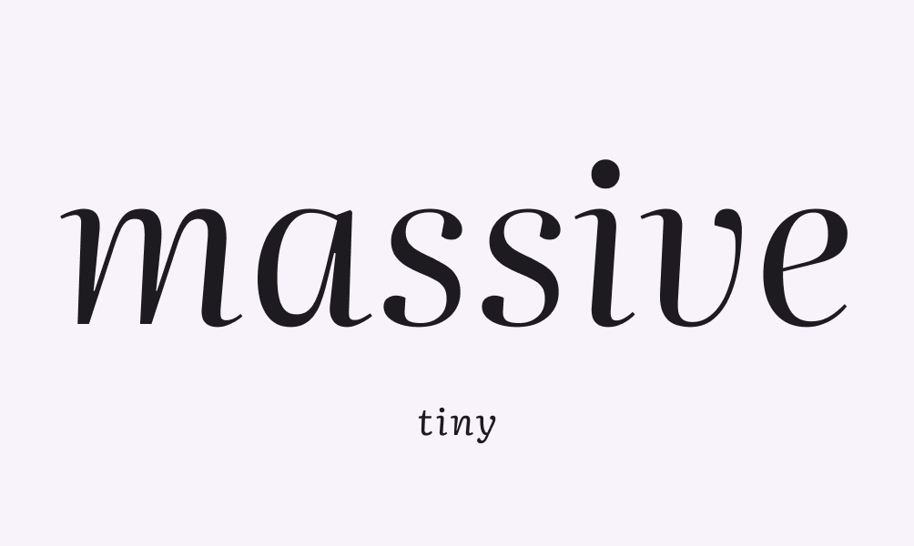

以下は、悪い例です。小さいサイズでは大きな光学文字サイズを使用しないでください。代わりに、使用可能な場合は、より小さな光学サイズを使用してください。

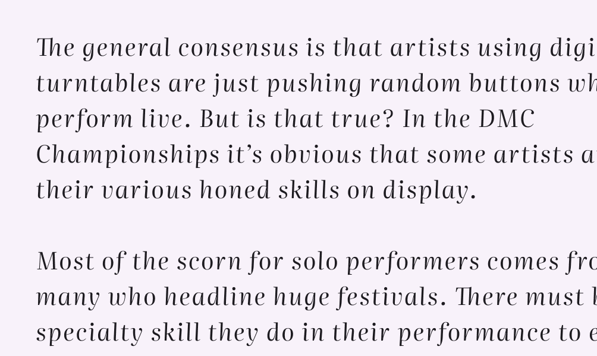

