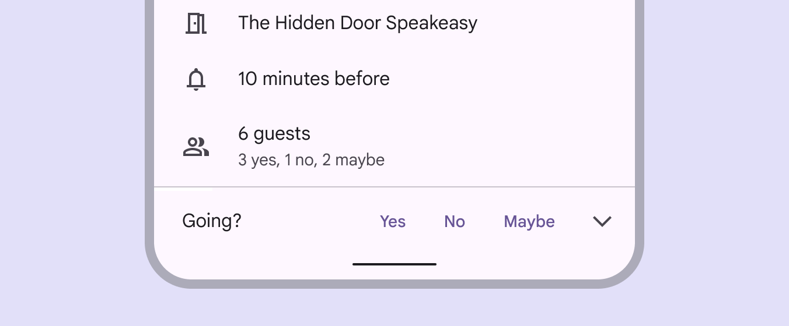

- [ガイドライン](#ガイドライン)
  - [塗りつぶされたボタン](#塗りつぶされたボタン)
  - [塗りつぶしトーンボタン](#塗りつぶしトーンボタン)
  - [アウトラインボタン](#アウトラインボタン)
  - [テキストボタン](#テキストボタン)

# ガイドライン

## 塗りつぶされたボタン

塗りつぶされたボタンは FAB の次に視覚的なインパクトが最も強く、 **保存** 、 **今すぐ参加** 、 **確認** など、フローを完了する重要な最終アクションに使用する必要があります。

塗りつぶされたボタンは、重要なアクションに使用すると視覚的なインパクトが高くなります。

塗りつぶされたボタンは、テキスト ラベルの周囲にコンテナーを表示します。コンテナーのサイズは、さまざまな方法で記述できます。

- コンテナーの幅をテキスト ラベルのサイズに設定し、左右に一定のパディングを設定します。
- コンテナーの相対位置をレスポンシブ レイアウト グリッドに設定します。

**塗りつぶされたボタンには、基本的には、 Primary カラーを使用するものと思われます。**

## 塗りつぶしトーンボタン

**塗りつぶされたトーン ボタンは、塗りつぶされたボタンとアウトライン ボタンの中間的な意味を持ちます。**

オンボーディング フロー (※ 1 ) の「次へ」など、優先度の低いボタンをアウトラインよりも少し強調する必要がある場合に便利です。 **トーン ボタンは、 Secondary Container カラーを使用します。**

(※ 1 )  
はじめて利用するユーザーが、アカウントを作成したり、チュートリアルを確認したりして、利用可能な状態にしたり、サービスへの定着を図るフローのことです。

## アウトラインボタン

アウトライン ボタンは中程度の強調ボタンです。重要なアクションが含まれていますが、アプリの主なアクションではありません。

アウトライン ボタンは塗りつぶされたボタンと組み合わせると、代替の二次的なアクションを示すのに適しています。

アウトラインボタンには、それほど重要でない補助アクションが含まれています

アウトライン ボタンでは、ボタン コンテナーの周囲にストロークが表示され、デフォルトでは塗りつぶしはありません。

アウトラインボタンはさまざまな背景に配置できます。

アウトラインボタンは、背景にグラデーションのある場面で使用できます。

画像の上にアウトライン ボタンを配置する場合は注意してください。ボタンをカスタマイズして、文字色に対して十分なコントラストの塗りつぶしを行うことにより、ラベル テキストが読みやすくなります。または、代わりに塗りつぶされたボタンを使用します。

## テキストボタン

テキスト ボタンは、最も優先度の低いアクションに使用されます。特に、複数のオプションを表示する場合に使用されます。

テキスト ボタンは、さまざまな背景に配置できます。ボタンが操作されるまで、そのコンテナーは表示されません。

テキスト ボタンは、カード、ダイアログ、スナックバーなどのコンポーネントに埋め込まれることがよくあります。テキスト ボタンは、デフォルトの状態では目に見えるコンテナーがないため、近くに存在するコンテンツよりも注目を集めることは、ほとんどありません。

テキストボタンは、ボタンではないテキストとは、視覚的に区別が可能となる色やスタイルである必要があります。

以下は、スナックバーのテキストボタンの例です。

以下は、画像の背景に対するテキストボタンの例です。

カードでテキスト ボタンを使用すると、テキストボタンが控えめであるために、ユーザーは、カードの内容に集中することができます。

ダイアログではテキスト ボタンを使用します。コンテナーがないため、アクションとダイアログ テキストを統一できます。

テキスト ボタンは、ダイアログの終了側の端に揃えます。左から右に記述する言語の場合は右側に、右から左に記述する言語の場合は左側に揃えます。

