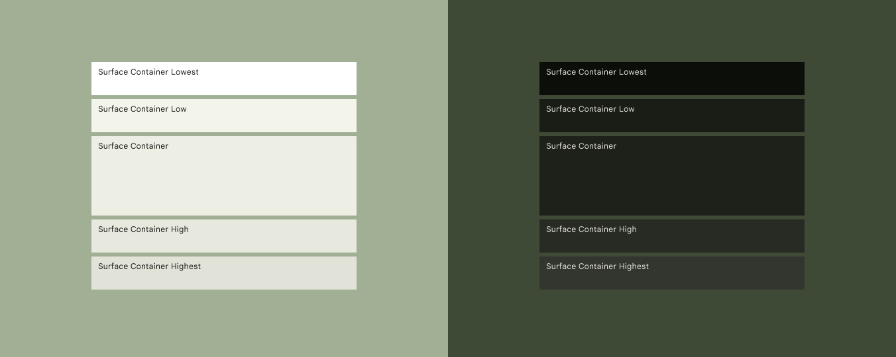
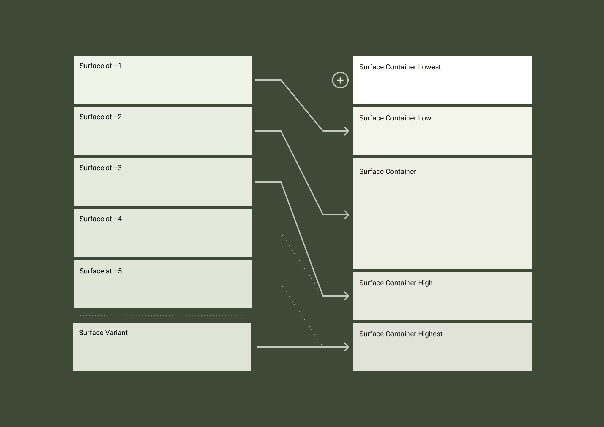
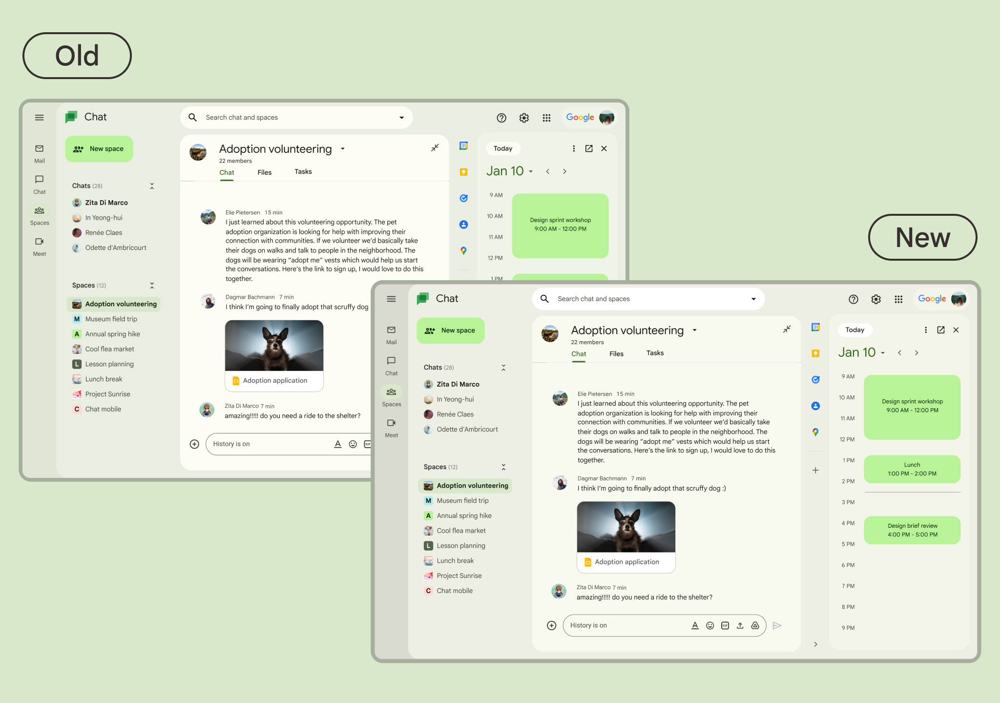

- [マテリアル 3 のトーンベースのサーフェスの導入](#マテリアル-3-のトーンベースのサーフェスの導入)
  - [新しいサーフェス カラー ロールへの移行](#新しいサーフェス-カラー-ロールへの移行)
  - [引用元資料](#引用元資料)

# マテリアル 3 のトーンベースのサーフェスの導入

新しいサーフェス カラー ロールにより、大画面や豊富なカラー機能にさらに柔軟に対応できます。

これまでは、着色された表面を実現するには、コンポーネントに色の役割「 Surface 」を割り当て、その高度を上げて、不透明度レイヤーを介して適用された目的の着色を実現する必要がありました。

https://youtu.be/oCmzo9VqmTo

このアップデートでは、高度に縛られなくなった専用のサーフェス カラー ロールが導入されました。メーカーは、製品の収容ニーズに基づいて適切なサーフェス ロールを選択できるようになり、大画面でのレイアウトの柔軟性が向上しました。

https://youtu.be/96ln4KfT9s0

新しく導入された 「トーンベースのサーフェス」 では、高度に縛られなくなった専用のサーフェス カラー ロールが導入されました。開発者は、サーフェス内のコンテンツの収容量に応じて、適切なサーフェス ロールを選択できるようになり、大画面でのレイアウトの柔軟性が向上しました。

「サーフェス コンテナー」は、「サーフェス」カラー ロールに対して、囲まれた領域に推奨されるデフォルトのカラー ロールです。サーフェスコンテナーには以下の 5 種類が存在します。

| ロール                    | コントラスト |
| ------------------------- | ------------ |
| Surface Container Lowest  | 最も低い     |
| Surface Container Low     | 低い         |
| Surface Container         | 標準         |
| Surface Container High    | 高い         |
| Surface Container Highest | 最も高い     |

これらのサーフェス コンテナー ロールと柔軟に組み合わせることができます。

以下の図は、ライトテーマとダークテーマの新しいカラーロールの例です。

## 新しいサーフェス カラー ロールへの移行

すべてのマテリアル コンポーネントは、新しいサーフェス コンテナ カラー ロールを使用するように自動的に更新されます。カスタム カラー マッピングに、以前の不透明度ベースのサーフェス モデルを使用しているアプリの場合は、これらを新しいロールに再マッピングすることをお勧めします。

- Surface Container Lowest は新しいロールです
- 標高 +1 のサーフェスは Surface Container Low になります
- 標高 +2 のサーフェスは Surface Container になります
- 標高 +3 のサーフェスは Surface Container High になります
- 標高 +4 と +5 のサーフェスは廃止される予定です。
  - 代わりに、 Surface Container Highest を使用することをお勧めします。
  - ユースケースによっては、 Surface Container High または、 Surface Dim も使用できます。
- サーフェス バリアントは Surface Container Highest になります

両方の方法は、移行期間が延長され、アプリが新しいモデルに移行する時間を確保するために共存します。

このアップデートでは、次の点も変更されます:

- デフォルトのライト テーマの Surface ロールがトーン 99 からトーン 98 に変更されます。
- ニュートラル パレットの彩度が 4 から 6 に増加されます。
- ダーク テーマの Surface ロールがわずかに暗くなります。

アプリにカラー ロールを適用する方法の詳細については、 [Color roles](https://m3.material.io/styles/color/the-color-system) をご覧ください。

## 引用元資料

- [Introducing Tone-based Surfaces in Material 3](https://m3.material.io/blog/tone-based-surface-color-m3)

