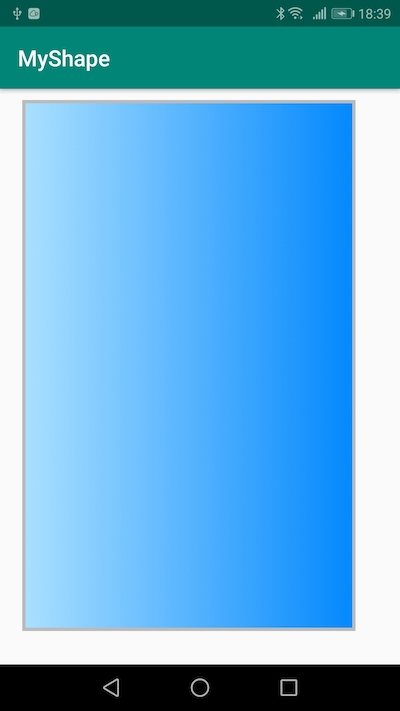

# insetタグ

## 概要

insetタグは、drawbleリソースをViewの`android:background`に指定する際に、Viewの高さ、幅よりもdrawableリソースの高さ、幅を小さい領域で表示させたい場合に使用するタグである。

その効果を逆に利用して、Viewよりもdrawableリソースの方が大きくなるようにすると、リソースの一部だけを画面に表示させることができる。その場合は、insetの値にマイナスをセットしてあげれば良い。

さらに、それを応用して、Viewの端（上下左右のどこか一箇所）に線を引きたい場合には、線を引きたくない場所のinsetをマイナスにすることで実現できる。


## コード

次のコードは、画面領域いっぱいに定義されたTextViewの`android:background`にinsetを定義した例である。

TextViewの上を10dp、左を20dp、下を30dp、右を40dp空けてdrawableを描画している。


**activity_main.xml**

```xml
<?xml version="1.0" encoding="utf-8"?>
<androidx.constraintlayout.widget.ConstraintLayout xmlns:android="http://schemas.android.com/apk/res/android"
    xmlns:app="http://schemas.android.com/apk/res-auto"
    xmlns:tools="http://schemas.android.com/tools"
    android:layout_width="match_parent"
    android:layout_height="match_parent"
    tools:context=".MainActivity">

    <TextView
        style="@style/MyTextView"
        android:layout_width="match_parent"
        android:layout_height="match_parent"
        app:layout_constraintBottom_toBottomOf="parent"
        app:layout_constraintLeft_toLeftOf="parent"
        app:layout_constraintRight_toRightOf="parent"
        app:layout_constraintTop_toTopOf="parent" />

</androidx.constraintlayout.widget.ConstraintLayout>
```


**styles.xml**

```xml
<resources>

    <style name="MyTextView">
        <item name="android:background">@drawable/my_inset</item>
    </style>

</resources>

```


**my_inset.xml**

```xml
<?xml version="1.0" encoding="utf-8"?>
<inset xmlns:android="http://schemas.android.com/apk/res/android"
    android:drawable="@drawable/my_rectangle"
    android:insetLeft="20dp"
    android:insetTop="10dp"
    android:insetRight="40dp"
    android:insetBottom="30dp"/>
```

四隅に同じ値をセットする場合は、`android:inset`属性が使用できる。


**my_rectangle.xml**

```xml
<?xml version="1.0" encoding="utf-8"?>
<shape xmlns:android="http://schemas.android.com/apk/res/android"
    android:shape="rectangle">

    <stroke android:color="@color/colorGrayB" />
    <gradient
        android:endColor="@color/colorDeepBlue"
        android:startColor="@color/colorPaleBlue" />

</shape>
```





