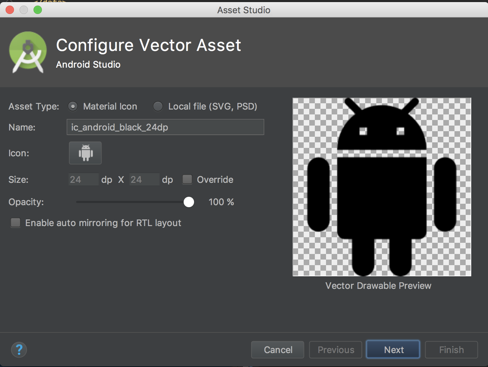

<!-- TOC START min:1 max:3 link:true asterisk:false update:true -->
- [Android Studioでベクター画像を取り込む手順](#android-studioでベクター画像を取り込む手順)
	- [Asset Studioを開き、各パラメータを設定してOKすれば完了](#asset-studioを開き各パラメータを設定してokすれば完了)
		- [Asset Studioのパラメータについて](#asset-studioのパラメータについて)
<!-- TOC END -->

# Android Studioでベクター画像を取り込む手順

## Asset Studioを開き、各パラメータを設定してOKすれば完了

1.「res」フォルダを右クリック
2.「New」
3.「Vector Asset」
4.各パラメータをセットして完了

### Asset Studioのパラメータについて

#### Asset Type

ローカルのSVGファイルからベクター画像を作成して取り込む方法は、「Local file」を選択し、Googleのマテリアルアイコンからベクター画像を取り込む方法「Material Icon」を選択する。

#### Icon

Googleのマテリアルアイコンを利用する場合は、Iconをタップすると一覧からアイコンんを選択できる。

#### Enable auto mirroring for RTL layout

海外では、右から左へ文字を書く国が存在する。
そのような端末で、アイコンの左右を反転して表示する機能。
