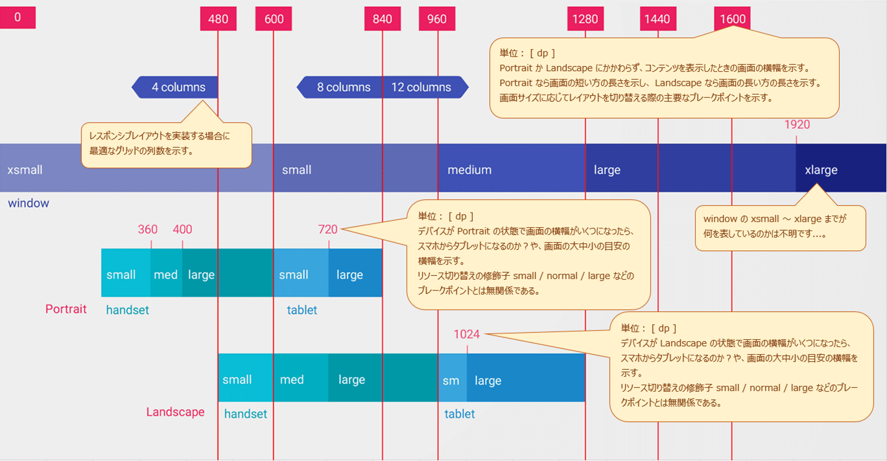

<!-- TOC START min:1 max:3 link:true asterisk:false update:true -->
- [レイアウトの切り替え](#レイアウトの切り替え)
  - [sw999dp 形式の指定](#sw999dp-形式の指定)
    - [「縦横短い方のスクリーンサイズがそれ以上」を意味する](#縦横短い方のスクリーンサイズがそれ以上を意味する)
    - [画面の向きが portrait であろうと landscape であろうとスクリーンの短いほうを参照する](#画面の向きが-portrait-であろうと-landscape-であろうとスクリーンの短いほうを参照する)
    - [なぜ「常に縦横の短いほうの長さ」で判定するのか](#なぜ常に縦横の短いほうの長さで判定するのか)
  - [w999dp 形式の指定](#w999dp-形式の指定)
    - [「アプリコンテンツに対して "横" のスクリーンサイズがそれ以上」を意味する](#アプリコンテンツに対して-横-のスクリーンサイズがそれ以上を意味する)
    - [画面の向きが portrait か landscape かによって、参照するデバイスの辺が変わる](#画面の向きが-portrait-か-landscape-かによって参照するデバイスの辺が変わる)
  - [h999dp 形式の指定](#h999dp-形式の指定)
    - [「アプリコンテンツに対して "縦" のスクリーンサイズがそれ以上」を意味する](#アプリコンテンツに対して-縦-のスクリーンサイズがそれ以上を意味する)
  - [長さによる指定の場合、ステータスバー等のアプリが使用できない領域は含まれない](#長さによる指定の場合ステータスバー等のアプリが使用できない領域は含まれない)
  - [高さではなく幅でレイアウトを決定することの重要性](#高さではなく幅でレイアウトを決定することの重要性)
  - [port / land 形式の指定](#port--land-形式の指定)
    - [【注意】この修飾子は、必ず他のサイズ修飾子の後ろに追加してください。](#注意この修飾子は必ず他のサイズ修飾子の後ろに追加してください)
  - [small / normal / large / xlarge は基本的に使用しない](#small--normal--large--xlarge-は基本的に使用しない)
  - [画面幅、画面高さによって、レイアウトを切り替える際のブレークポイント](#画面幅画面高さによってレイアウトを切り替える際のブレークポイント)
<!-- TOC END -->


# レイアウトの切り替え

## sw999dp 形式の指定

### 「縦横短い方のスクリーンサイズがそれ以上」を意味する

（例）

```
// スクリーンの短い方の長さが 600 dp 未満のデバイスに適用されるリソース
res/layout/main_activity.xml
// スクリーンの短い方の長さが 600 dp 以上のデバイスに適用されるリソース
res/layout-sw600dp/main_activity.xml
```

" sw " は "smallest width" の略です。  

### 画面の向きが portrait であろうと landscape であろうとスクリーンの短いほうを参照する

画面の向きが portrait であろうと landscape であろうと、判定に使用されるスクリーンの長さは、  
スクリーンの縦横のうち、短い方の長さになります。

### なぜ「常に縦横の短いほうの長さ」で判定するのか

おそらく、 landscape 時のスマートフォンなのか、 portrait 時のタブレットなのかを判断するのに  
有効であると思われる。

単にコンテンツを表示している時の横幅を計測するだけでは、上記の 2 通りのケースを判断できないのかな？  
port / land 修飾子を使用すれば判断できるのかな？


## w999dp 形式の指定

### 「アプリコンテンツに対して "横" のスクリーンサイズがそれ以上」を意味する

（例）

```
// スクリーンの横の長さが 600 dp 未満のデバイスに適用されるリソース
res/layout/main_activity.xml
// スクリーンの横の長さが 600 dp 以上のデバイスに適用されるリソース
res/layout-w600dp/main_activity.xml
```


### 画面の向きが portrait か landscape かによって、参照するデバイスの辺が変わる

画面の向きが portrait か landscape かによって、判定に使用されるデバイスの辺が変わります。  
判定に使用されるスクリーンの長さは、アプリコンテンツに対して常にその幅を計測して使用します。


## h999dp 形式の指定

### 「アプリコンテンツに対して "縦" のスクリーンサイズがそれ以上」を意味する

詳細は、 「 w999dp 形式の指定」の項と同じであるため、省略する。


## 長さによる指定の場合、ステータスバー等のアプリが使用できない領域は含まれない

アプリによっては、ステータスバー領域が画面の上端に表示されたり、システムバーが画面の下端に表示されます。  
これらの領域は、判定時の画面の長さには含まれません。


## 高さではなく幅でレイアウトを決定することの重要性

多くの場合、レイアウトの設計では幅が重要な要素になります。  
なぜなら、多くの場合、 UI は垂直にスクロールしますが、水平にはスクロールしません。  
そのため、横幅の大きさによってレイアウトを切り替えることは効果があります。


## port / land 形式の指定

横向き用のレイアウトを作成する場合には、 `land` を使用し、  
縦向き用のレイアウトを作成する場合には、 `port` を使用します。

（例）

```
// スクリーンの短い方の長さが 600 dp 未満のデバイスに適用されるリソース
res/layout/main_activity.xml

// スクリーンの短い方の長さが 600 dp 未満のデバイス、かつ、
// 横向きの状態に適用されるリソース
res/layout-land/main_activity.xml

// スクリーンの短い方の長さが 600 dp 以上のデバイスに適用されるリソース
res/layout-sw600dp/main_activity.xml

// スクリーンの短い方の長さが 600 dp 以上のデバイス、かつ、
// 横向きの状態に適用されるリソース
res/layout-sw600dp-land/main_activity.xml
```


### 【注意】この修飾子は、必ず他のサイズ修飾子の後ろに追加してください。

上記の通りにしてください。


## small / normal / large / xlarge は基本的に使用しない

Android 3.1 ( API レベル 12 ）以下のデバイスに対応する必要がある場合のみ、 `small` 等の修飾子を使用します。  
今の時代に Android 3.1 に対応する必要はない場合がほとんどであるため、実質的に使用することはありません。

現在でも、 Android 3.2 以降のデバイスで `small` 等の修飾子は正しく動作しているような感じがしますが、  
公式ドキュメントには、  
```
Android 3.1 未満には "small" 等 (画面サイズ) を使用し、
Android 3.2 以降には " sw600dp / w600dp / h960dp " 等 (最小幅・最小高) を使用してください。
```
と記載されています。


## 画面幅、画面高さによって、レイアウトを切り替える際のブレークポイント



<p>

上記の図では、列数 8 と 12 のブレークポイントは、画面幅 840 dp となっているが、  
マテリアルデザインのサイトでは、 905 dp となっている。  
サイトによって、多少の違いはあるようだ。
