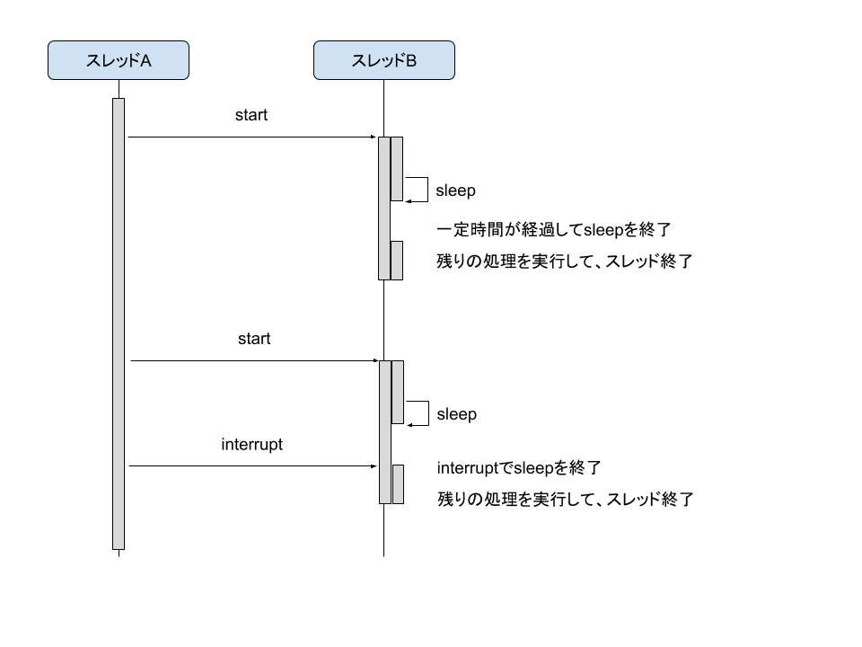
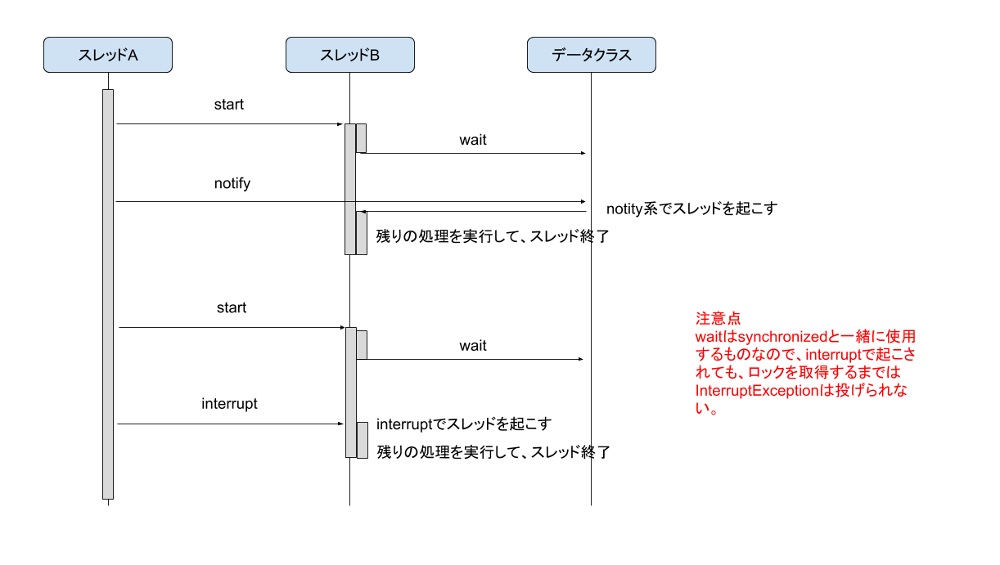

<!-- TOC depthFrom:1 depthTo:6 withLinks:1 updateOnSave:1 orderedList:0 -->

- [スレッドの停止と再開](#スレッドの停止と再開)
	- [Thread クラスのメソッド](#thread-クラスのメソッド)
		- [sleep メソッド](#sleep-メソッド)
		- [join メソッド](#join-メソッド)
		- [interrupt メソッド](#interrupt-メソッド)
			- [インタラプト状態とは](#インタラプト状態とは)
			- [インタラプト状態の取得](#インタラプト状態の取得)
			- [インタラプト状態にする](#インタラプト状態にする)
			- [インタラプト状態のクリア（非インタラプト状態化）](#インタラプト状態のクリア非インタラプト状態化)
		- [stop メソッド](#stop-メソッド)
	- [Object クラスのメソッド](#object-クラスのメソッド)
		- [wait メソッド](#wait-メソッド)
		- [notify/notifyAllメソッド](#notifynotifyallメソッド)
	- [notify/notifyAll メソッドと interrupt メソッドの違い](#notifynotifyall-メソッドと-interrupt-メソッドの違い)
	- [sleep, wait, join の違い](#sleep-wait-join-の違い)

<!-- /TOC -->

# スレッドの停止と再開

## Thread クラスのメソッド

### sleep メソッド

sleep メソッドは、自分自身のスレッドを指定した時間だけ停止させます。

sleep メソッドは、 Thread クラスのクラスメソッドです。

### join メソッド

join メソッドは、指定したスレッドの処理が終了するまで自分自身のスレッドを停止します。

join メソッドは、 Thread クラスのインスタンスメソッドです。

### interrupt メソッド

interrupt メソッドは、非インタラプト状態のスレッドをインタラプト状態にします。

インタラプト状態のスレッドは、 sleep, wait, join で停止状態になったスレッドを強制的に再開します。

スレッドが上記の停止中ではない場合は、次回、停止中になった時に、すぐに再開します。

再開するとインタラプト状態は、非インタラプト状態に戻ります。

#### インタラプト状態とは

Thread はインタラプト状態を保持しています。

インタラプト状態には、`インタラプト状態`と`非インタラプト状態`が存在しています。

#### インタラプト状態の取得

`Thread.isInterrupted`メソッド（インスタンスメソッド）で状態を取得することができます。インスタンスメソッドであるため、あるスレッドから別のスレッドの状態を取得します。

#### インタラプト状態にする

interruptメソッドは、以下の役割を果たします。

- sleepメソッドで停止しているスレッドを強制的に再開します。
  - すぐにInterruptExceptionを投げます。
- waitメソッドで停止しているスレッドを強制的に再開します。
  - インスタンスのロックを取得してからInterruptExceptionを投げます。
  - waitをtryブロックで囲み、catchでInterruptExceptionをキャッチします。
  - waitの後続処理から再開します。
  - interruptメソッド呼び出し直後にインタラプト状態になるが、自動的にすぐに非インタラプト状態に戻る。（おそらく例外を投げたら状態が戻る。）
- joinメソッドで停止しているスレッドを強制的に再開します。
	- すぐにInterruptExceptionを投げます。

interruptメソッドは、Threadクラスのインスタンスメソッドです。

#### インタラプト状態のクリア（非インタラプト状態化）

**wait, sleep, join メソッドでクリア**

スレッドがインタラプト状態である時に、 wait , sleep , join メソッドが呼ばれると、  
インタラプト状態をクリアして、 InterruptException を投げます。

**Thread.interrupted メソッドでクリア**

このメソッドは通常使用されません。

インタラプト状態は、 `Thread.interrupted` メソッド（クラスメソッド）でクリアすることができます。  
クラスメソッドであるため、自分自身のスレッドの状態をクリアします。

このメソッドは、インタラプト状態の場合には `true` を、非インタラプト状態の場合には `false` を返します。

このメソッドは通常使用されませんが、使用する場面としては、 wait , sleep , join が呼ばれていないのに  
interrupt メソッドで、スレッドをインタラプト状態にしてしまった場合などは、  
このメソッドを使用して、自分で自分のスレッドを非インタラプト状態にすることができます。

### stop メソッド

stop メソッドは使用禁止です。

なぜなら、クリティカルセクション (Single Threaded Execution) を実行している途中でも、  
強制的にスレッドを止めてしまうため、データの整合性が保てなくなる可能性があるためです。

## Object クラスのメソッド

### wait メソッド

wait メソッドは、インスタンスのロックと併用して使用します。自分自身のスレッドを停止し、インスタンスのロックを解除します。

インスタンスのロックを取得していなければ、呼び出すことができません。

wait メソッドは、 Object クラスのメソッドです。

### notify/notifyAllメソッド

notify/notifyAll メソッドは、 wait で停止されたスレッドを再開するメソッドです。

当然、停止中のスレッドから呼び出すことはできないため、他のスレッドから呼び出します。

インスタンスのロックを取得していなければ、呼び出すことができません。

notify/notifyAll メソッドは、 Object クラスのメソッドです。

## notify/notifyAll メソッドと interrupt メソッドの違い

| -                      | notify/notifyAll | interrupt |
| ---------------------- | ---------------- | --------- |
| 呼び出し時のロック取得 | 必要             | 不要      |
| 対象のスレッドの指定   | 不可             | 必要      |

## sleep, wait, join の違い

- sleep
	- 用途
		- 他の処理は無関係で、自分自身を指定した時間だけ停止する。
	- ガード条件
		- 指定した時間を経過したかどうか
- wait
	- 用途
		- Single Threaded Execution を作るための仕組みであり、ロック（synchronized）と一緒に使用する。
	- ガード条件
		- ロックされているかどうか
- join
	- 用途
		- 他のスレッドの終了を待つ。
	- ガード条件
		- 対象のスレッドが終了したかどうか

上記のようにまとめてみると、 wait 以外はロック関連の内容は出てこないため、気にしなくて良いことがわかる。

