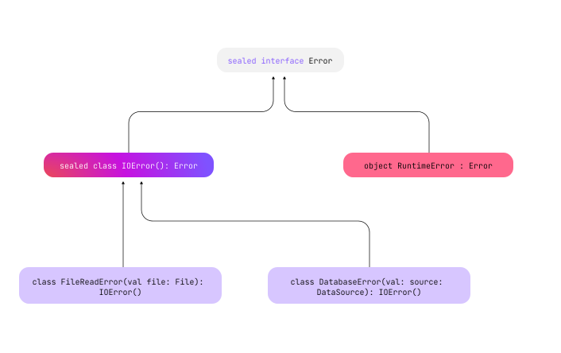

- [sealed クラスと sealed インターフェース](#sealed-クラスと-sealed-インターフェース)
  - [シールされたクラスまたはインターフェースを宣言する](#シールされたクラスまたはインターフェースを宣言する)
  - [コンストラクター](#コンストラクター)
  - [継承](#継承)
    - [マルチプラットフォームプロジェクトにおける継承](#マルチプラットフォームプロジェクトにおける継承)
  - [when 式でシールされたクラスを使用する](#when-式でシールされたクラスを使用する)
  - [ユースケースのシナリオ](#ユースケースのシナリオ)
    - [UI アプリケーションにおける状態管理](#ui-アプリケーションにおける状態管理)
    - [支払い方法の処理](#支払い方法の処理)
    - [API 要求応答処理](#api-要求応答処理)


# sealed クラスと sealed インターフェース

シールされたクラスとインターフェースは、クラス階層の継承をシール (閉じ込める機能) を提供します。シールされたクラスのすべての直接のサブクラスは、コンパイル時に認識されます。シールされたクラスが定義されているモジュールとパッケージの外部に他のサブクラスが出現することはありません。同じロジックがシールされたインターフェースとその実装に適用されます。シールされたインターフェースを持つモジュールがコンパイルされると、新しい実装は作成できなくなります。

シールされたクラスとインターフェースを when 式と組み合わせると、考えられるすべてのサブクラスの動作をカバーし、コードに悪影響を与える新しいサブクラスが作成されないようにすることができます。

シールクラスは、次のようなシナリオに最適です。

- 限定されたクラス継承が望ましい
  - クラスを拡張するサブクラスの定義済み有限セットがあり、それらはすべてコンパイル時に認識されます。
- 型安全な設計が必要な場合
  - 安全性とパターンマッチングはプロジェクトで非常に重要です。特に、状態管理や複雑な条件付きロジックの処理では重要です。
  - 例については、 「 when 式でシールされたクラスを使用する」セクションを参照してください。
- クローズド API の使用
  - サードパーティのクライアントが API を意図したとおりに使用できるようにするために、ライブラリには堅牢で保守可能なパブリック API が必要です。

より詳細な実際のアプリケーションについては、 「ユースケースのシナリオ」 セクションを参照してください。

Java 15 では同様の概念が導入され、シールされたクラスを定義するには、 sealed キーワードと permits 句を一緒に使用します。これで、制限された階層を定義します。


## シールされたクラスまたはインターフェースを宣言する

シールされたクラスまたはインターフェースを宣言するには、 sealed 修飾子を使用します。

```kotlin
// sealed インターフェース定義
sealed interface Error

// sealed インターフェース Error を実装した sealed クラスを定義
sealed class IOError(): Error

// sealed クラス IOError を継承したサブクラスを定義
class FileReadError(val file: File): IOError()
class DatabaseError(val source: DataSource): IOError()

// sealed インターフェース Error を実装したシングルトンオブジェクトを定義
object RuntimeError : Error
```

sealed クラスを継承したクラスの宣言は、 sealed クラスの宣言と同じファイル内でなら可能です。 sealed クラスの中カッコで囲まなくても、同じファイル内なら、 sealed クラスを継承したクラスを宣言できます。

この例は、エラークラスを含むライブラリの API を表し、ライブラリユーザーがエラーを処理できるようにします。このようなエラークラスの階層に、パブリック API で表示されるインターフェイスまたは抽象クラスが含まれている場合、他の開発者がクライアントコードでそれらを実装または拡張することを妨げるものは何もありません。ライブラリは外部で宣言されたエラーを認識しないため、独自のクラスと一貫して処理することはできません。ただし、エラークラスのシールされた階層を使用すると、ライブラリの作成者は、考えられるすべてのエラーの種類を把握し、後で他のエラーの種類が出現しないようにすることができます。

例の階層は次のようになります。




## コンストラクター

Sealed クラス自体は常に抽象クラスであるため、直接インスタンス化することはできません。ただし、コンストラクターを含めたり継承したりすることはできます。これらのコンストラクターは、 Sealed クラス自体のインスタンスを作成するためのものではなく、そのサブクラスのためのものです。以下の例では、 Error という Sealed クラスがあり、そのサブクラスをインスタンス化します。

```kotlin
sealed class Error(val message: String) {
    class NetworkError : Error("Network failure")
    class DatabaseError : Error("Database cannot be reached")
    class UnknownError : Error("An unknown error has occurred")
}

fun main() {
    // サブクラスのインスタンスの生成方法は通常のネストされたクラスと同じです。
    val errors = listOf(Error.NetworkError(), Error.DatabaseError(), Error.UnknownError())
    errors.forEach { println(it.message) }
}
```

```
実行結果

Network failure 
Database cannot be reached 
An unknown error has occurred
```

シールクラス内で enum クラスを使用すると、 enum 定数を使用して状態を表し、追加の詳細を提供できます。各 enum 定数は単一のインスタンスとしてのみ存在しますが、シールクラスのサブクラスは複数のインスタンスを持つことができます。例では、シールクラス Error とそのいくつかのサブクラスは、 enum を使用してエラーの重大度を示します。各サブクラスのコンストラクターは重大度を初期化し、その状態を変更できます。

```kotlin
// Severity は、シビアリティーと読み、「重要度」のこと
enum class ErrorSeverity { MINOR, MAJOR, CRITICAL }

sealed class Error(val severity: ErrorSeverity) {
    class FileReadError(val file: File): Error(ErrorSeverity.MAJOR)
    // CRITICAL は、複数のサブクラスで使用されていますが、問題ありません。
    class DatabaseError(val source: DataSource): Error(ErrorSeverity.CRITICAL)
    object RuntimeError : Error(ErrorSeverity.CRITICAL)
    // ここにエラーの種類を追加することが可能です。
}
```

シールされたクラスのコンストラクターには、 protected (デフォルト) または private の 2 つの可視性のいずれかを設定できます。

```kotlin
sealed class IOError {
    // sealed クラスのコンストラクタは、デフォルトでは protected の可視性になっています。
    // そのため、このクラス内とサブクラスのコンストラクタ内でのみ参照可能です。
    constructor() { /*...*/ }

    // private なコンストラクタは、このクラス内でのみ参照可能です。
    // シールされたクラスでプライベート コンストラクターを使用すると、インスタンス化をさらに厳密に制御できるようになり、クラス内で特定の初期化手順が可能になります。
    private constructor(description: String): this() { /*...*/ }

    // パブリックおよび内部コンストラクタはシールされたクラスでは許可されていないため、エラーが発生します。
    // public constructor(code: Int): this() {}
}
```


## 継承

シールされたクラスとインターフェースの直接のサブクラスは、同じパッケージ内で宣言する必要があります。これらはトップレベルにすることも、任意の数の他の名前付きクラス、名前付きインターフェース、または名前付きオブジェクト内にネストすることもできます。サブクラスは、 Kotlin の通常の継承ルールと互換性がある限り、任意の可視性を持つことができます。

シールされたクラスのサブクラスには、適切に修飾された名前が必要です。ローカルオブジェクトまたは匿名オブジェクトにすることはできません。

enum クラスはシールされたクラスや他のクラスを拡張できません。ただし、シールされたインターフェースを実装することはできます。

```kotlin
sealed interface Error

// sealed インターフェース Error を継承した enum クラス
enum class ErrorType : Error {
    FILE_ERROR, DATABASE_ERROR
}
```

これらの制限は間接サブクラス (子ではなく孫など) には適用されません。シールされたクラスの直接サブクラスがシール済みとしてマークされていない場合は、その修飾子が許可するあらゆる方法で拡張できます。

```kotlin
// sealed インターフェース Error は、同じパッケージとモジュール内にのみ、それを実装したオブジェクトが存在します。
sealed interface Error

// Error を継承している sealed クラス IOError は、同じパッケージ内でのみ継承されることが可能です。
sealed class IOError(): Error

// Error を実装した CustomError クラスは、 open であるため、
// それが参照可能なところからなら、どこからでも継承されることが可能です。
open class CustomError(): Error
```


### マルチプラットフォームプロジェクトにおける継承

マルチプラットフォームプロジェクトには、継承に関するもう 1 つの制限があります。シールクラスの直接のサブクラスは、同じソースセットに存在する必要があります。これは、 expected および actual 修飾子のないシールクラスに適用されます。

シールされたクラスが共通ソースセットで expect として宣言され、プラットフォームソースセットに実際の実装がある場合、 expect バージョンと actual バージョンの両方でソースセットにサブクラスを含めることができます。さらに、階層構造を使用する場合は、 expect 宣言と actual 宣言の間の任意のソースセットにサブクラスを作成できます。

マルチプラットフォームプロジェクトの階層構造について詳しくは、 [こちら](https://kotlinlang.org/docs/multiplatform-hierarchy.html) をご覧ください。

## when 式でシールされたクラスを使用する

シールされたクラスを使用する主な利点は、 when 式でシールされたクラスを使用する場合に発揮されます。シールされたクラスで使用される when 式により、 Kotlin コンパイラーは、考えられるすべてのケースが網羅されていることを徹底的にチェックできます。このような場合、 else 句を追加する必要はありません。

```kotlin
// sealed クラスとそのサブクラス
sealed class Error {
    class FileReadError(val file: String): Error()
    class DatabaseError(val source: String): Error()
    object RuntimeError : Error()
}

// エラーのログ出力を行う関数
fun log(e: Error) = when(e) {
    is Error.FileReadError -> println("Error while reading file ${e.file}")
    is Error.DatabaseError -> println("Error while reading from database ${e.source}")
    Error.RuntimeError -> println("Runtime error")
    // 全てのケースが網羅されているため、 else 句を指定する必要がありません。
}

fun main() {
    val errors = listOf(
        Error.FileReadError("example.txt"),
        Error.DatabaseError("usersDatabase"),
        Error.RuntimeError
    )

    errors.forEach { log(it) }
}
```

```
実行結果

Error while reading file example.txt
Error while reading from database usersDatabase
Runtime error
```

マルチプラットフォームプロジェクトでは、共通コード内に when 式を含むシールクラスが想定される宣言として存在する場合でも、 else ブランチが必要です。これは、実際のプラットフォーム実装のサブクラスが、共通コードでは認識されないシールクラスを拡張する可能性があるためです。


## ユースケースのシナリオ

シールされたクラスとインターフェースが特に役立つ実用的なシナリオをいくつか見てみましょう。


### UI アプリケーションにおける状態管理

シールされたクラスを使用して、アプリケーション内のさまざまな UI 状態を表すことができます。このアプローチにより、 UI の変更を構造化して安全に処理できます。この例では、さまざまな UI 状態を管理する方法を示します。

```kotlin
sealed class UIState {
    // Loading はステートレスなのでシングルトンにしていると思われる。
    data object Loading : UIState()
    data class Success(val data: String) : UIState()
    data class Error(val exception: Exception) : UIState()
}

fun updateUI(state: UIState) {
    when (state) {
        is UIState.Loading -> showLoadingIndicator()
        is UIState.Success -> showData(state.data)
        is UIState.Error -> showError(state.exception)
    }
}
```


### 支払い方法の処理

実際のビジネスアプリケーションでは、さまざまな支払い方法を効率的に処理することが一般的な要件です。このようなビジネスロジックを実装するには、 when 式を含むシールクラスを使用できます。さまざまな支払い方法をシールクラスのサブクラスとして表すことで、トランザクションを処理するための明確で管理しやすい構造が確立されます。

```kotlin
sealed class Payment {
    data class CreditCard(val number: String, val expiryDate: String) : Payment()
    data class PayPal(val email: String) : Payment()
    data object Cash : Payment()
}

fun processPayment(payment: Payment) {
    when (payment) {
        is Payment.CreditCard -> processCreditCardPayment(payment.number, payment.expiryDate)
        is Payment.PayPal -> processPayPalPayment(payment.email)
        is Payment.Cash -> processCashPayment()
    }
}
```

Payment は、電子商取引システムにおけるさまざまな支払い方法 ( CreditCard , PayPal , Cash ) を表すシールクラスです。各サブクラスには、 CreditCard の番号と有効期限、 PayPal のメールなど、固有のプロパティを設定できます。

processPayment() 関数は、さまざまな支払い方法の処理方法を示します。このアプローチにより、考えられるすべての支払いタイプが考慮され、将来的に新しい支払い方法が追加されてもシステムが柔軟に保たれます。


### API 要求応答処理

シールクラスとシールインターフェイスを使用して、 API 要求と応答を処理するユーザー認証システムを実装できます。ユーザー認証システムには、ログイン機能とログアウト機能があります。

- シールされた ApiRequest インターフェイス
  - ログイン用の LoginRequest 、ログアウト操作用の LogoutRequest という特定の要求タイプを定義します。
- シールされたクラス ApiResponse
  - ユーザーデータを含む UserSuccess 、存在しないユーザー用の UserNotFound 、失敗時の Error など、さまざまな応答シナリオをカプセル化します。
- handleRequest 関数
  - when 式を使用してこれらの要求を型安全に処理します。
- getUserById 関数
  - ユーザー取得をシミュレートします。

```kotlin
import io.ktor.server.application.*
import io.ktor.server.resources.*

import kotlinx.serialization.*

// API リクエストのために sealed インターフェースを定義
// @Resource アノテーションは、 Ktor フレームワークのものと思われる。
@Resource("api")
sealed interface ApiRequest

@Serializable
@Resource("login")
data class LoginRequest(val username: String, val password: String) : ApiRequest


@Serializable
@Resource("logout")
object LogoutRequest : ApiRequest

// レスポンスの詳細を含む sealed クラス ApiResponse を定義
sealed class ApiResponse {
    data class UserSuccess(val user: UserData) : ApiResponse()
    data object UserNotFound : ApiResponse()
    data class Error(val message: String) : ApiResponse()
}

// success レスポンスで使用する UserData クラスを定義
data class UserData(val userId: String, val name: String, val email: String)

// ユーザー資格を検証する関数 (疑似)
fun isValidUser(username: String, password: String): Boolean {
    // ユーザー資格検証ロジック (疑似)
    return username == "validUser" && password == "validPass"
}

// API リクエストを処理し、レスポンスを返す関数
fun handleRequest(request: ApiRequest): ApiResponse {
    return when (request) {
        is LoginRequest -> {
            if (isValidUser(request.username, request.password)) {
                ApiResponse.UserSuccess(UserData("userId", "userName", "userEmail"))
            } else {
                ApiResponse.Error("Invalid username or password")
            }
        }
        is LogoutRequest -> {
            // この例では、ログアウトは常に成功するものとします。
            ApiResponse.UserSuccess(UserData("userId", "userName", "userEmail"))
        }
    }
}

// ユーザー ID を元にユーザーを返す関数 (疑似)
fun getUserById(userId: String): ApiResponse {
    return if (userId == "validUserId") {
        ApiResponse.UserSuccess(UserData("validUserId", "John Doe", "john@example.com"))
    } else {
        ApiResponse.UserNotFound
    }
    // エラーの場合は、 ApiResponse.Error オブジェクトを返します。
}

fun main() {
    val loginResponse = handleRequest(LoginRequest("user", "pass"))
    println(loginResponse)

    val logoutResponse = handleRequest(LogoutRequest)
    println(logoutResponse)

    val userResponse = getUserById("validUserId")
    println(userResponse)

    val userNotFoundResponse = getUserById("invalidId")
    println(userNotFoundResponse)
}
```

```
実行結果

Invalid username or password
UserSuccess(userId=userId, name=userName, email=userEmail)
UserSuccess(userId=userId, name=John Doe, email=john@example.com)
UserNotFound
```


