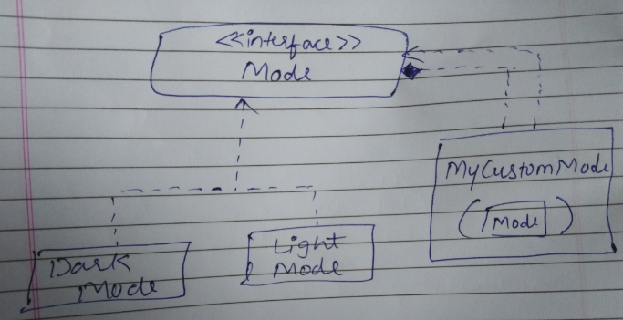

- [デリゲートクラス（クラスの委譲）](#デリゲートクラスクラスの委譲)
  - [概要](#概要)
  - [基本](#基本)
  - [メリット](#メリット)
    - [例１（ボイラープレートの削減）](#例１ボイラープレートの削減)
    - [例２　複数のデリゲートと具象クラスの継承](#例２複数のデリゲートと具象クラスの継承)
  - [オーバーライド](#オーバーライド)
  - [参考資料](#参考資料)


# デリゲートクラス（クラスの委譲）

## 概要

デリゲートクラスは、ボイラープレートコードを減らすのに役立ちます。

デリゲートクラスを使用すると、委譲によって、インターフェースの実装を行います。つまり、インターフェースの 「実装 + 委譲」 が、デリゲートクラスで実現できることです。


## 基本

`Derived` クラスは、  `Base` インターフェースのすべての `public` メンバーを実装します。

```kotlin
interface Base {
    fun print()
}

class BaseImpl(val x: Int) : Base {
    override fun print() { print(x) }
}

class Derived(b: Base) : Base by b

fun main() {
    val b = BaseImpl(10)
    Derived(b).print() // 10
}
```

コンパイラは、 `Derived` クラスに `Base` インターフェースを実装したメンバーを自動生成し、そのメンバーは、 `by` 修飾子で指定された `b` インスタンスのメンバーに委譲されます。

`Base` は、 **インターフェース** である必要があります。デリゲートクラスの `by` の直前には、抽象クラスや具象クラスは使えません。


## メリット

デリゲートクラスを使用すると、以下のメリットを得ることができます。

- ボイラープレートコードが削減されます。
- デリゲーションは継承とは異なる。
  - クラスの継承枠を消費しないため、別途、クラスを継承することができます。
  - 複数のクラスをデリゲーションすることができます。


### 例１（ボイラープレートの削減）

以下の関係のクラスがあったとします。 `MyCustomMode` には、 `LightMode` や `DarkMode` も設定できるものとします。



すると、以下のようなコードができあがります。

```kotlin
interface Mode {
    val color: String
    fun display()
}

class DarkMode(override val color: String): Mode {    
    override fun display(){
        println("Dark Mode...$color")
    }
}

class LightMode(override val color: String): Mode {
    override fun display() { 
        println("Light Mode...$color") 
    }
}

class MyCustomMode(val mode: Mode): Mode {
    // デリゲートクラスを利用すると、
    // この部分がコンパイラによって、自動生成されます。
    override val color:String = mode.color
    override fun display() { 
        mode.display()
    }
}
```

これを利用するには、以下のようにします。 ( `display` 関数を使用する例です。)

```kotlin
fun main() {
    MyCustomMode(DarkMode("CUSTOM_DARK_GRAY")).display()
    MyCustomMode(LightMode("CUSTOM_LIGHT_GRAY")).display()
}
```

`MyCustomMode` 内に定義された `display()` 関数は、スーパークラスの `display()` 関数を呼んでいるだけなので、以下のように書き換えることができます。これにより、 `display()` 関数の実装、および、 `color` プロパティの代入は、コンパイラが自動的に生成してくれるようになります。

```kotlin
class MyCustomMode(val mode: Mode): Mode by mode
```

利用方法は先ほどと同じです。 ( `main` 関数の部分)


### 例２　複数のデリゲートと具象クラスの継承

プライマリコンストラクタの直後のコロンの後ろに `インターフェース名 by プロパティ名` で定義したものはデリゲートとみなされます。コロンでインターフェース名が接続されているため、実装 (継承) のように見えますが、これは、 「実装 + 委譲」 です。

単なる継承 (委譲ではない) の場合は、コロンの直後、もしくは、カンマの直後に、クラス名とそのプライマリコンストラクタが続くだけで、 `by` 修飾子は続きません。

```kotlin
class Student(marks: Marks, totals: Totals) :
    Marks by marks, Totals by totals, KotlinClass() {
    
}
```

- `Marks by marks` と `Totals by totals` は、インターフェースのデリゲーションです。
- `Marks` と `Totals` は、インターフェースである必要があります。
- `KotlinClass()` は、クラスの継承です。
  - `KotlinClass()` は、 `()` でプライマリコンストラクタが呼ばれていることから、具象クラスであることがわかります。


## オーバーライド

オーバーライドすることにより、委譲先の関数を呼び出すのではなく、委譲元で動作を変更することが可能です。 (実際には、継承ではなく委譲なので、 「オーバーライド」 という呼び方が適切なのか少し気になるところではありますが、公式ドキュメントでもオーバーライドと書かれています。)

```kotlin
interface Base {
    fun printMessage()
    fun printMessageLine()
}

class BaseImpl(val x: Int) : Base {
    override fun printMessage() { print(x) }
    override fun printMessageLine() { println(x) }
}

class Derived(private val b: Base) : Base by b {
    override fun printMessage() {
        print("abc")

        // オーバーライドしていなければ、こんな感じで委譲先の関数が呼び出される仕組みになっています。
        b.printMessage()
    }
}

fun main() {
    val b = BaseImpl(10)
    Derived(b).printMessage() // abc
    Derived(b).printMessageLine() // 10
}
```

委譲先の関数からプロパティにアクセスした場合、委譲先のプロパティにアクセスします。委譲元の関数からプロパティにアクセスした場合、委譲元のプロパティにアクセスします。

```kotlin
interface Base {
    val message: String
    fun print()
}

class BaseImpl(val x: Int) : Base {
    // 委譲先のプロパティ
    override val message = "BaseImpl: x = $x"
    override fun print() {
        // 委譲先の関数でプロパティを参照すると、委譲先のプロパティが参照されます。
        println(message)
    }
}

class Derived(b: Base) : Base by b {
    // 委譲元のプロパティ
    override val message = "Message of Derived"
}

fun main() {
    val b = BaseImpl(10)
    val derived = Derived(b)
    derived.print() // BaseImpl: x = 10
    println(derived.message) // Message of Derived
}
```


## 参考資料

- [Delegation - Kotlin 公式ドキュメント](https://kotlinlang.org/docs/delegation.html#overriding-a-member-of-an-interface-implemented-by-delegation)


