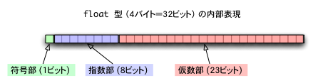
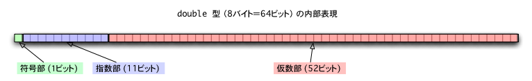

- [浮動小数点の仕組み](#浮動小数点の仕組み)
  - [概要](#概要)
  - [double や float の表現方法](#double-や-float-の表現方法)
  - [指数部の最大値と最小値](#指数部の最大値と最小値)
  - [指数部にはオフセットが設定されているらしい](#指数部にはオフセットが設定されているらしい)
  - [仮数部の最大値と最小値](#仮数部の最大値と最小値)
    - [仮数部の小数点位置](#仮数部の小数点位置)
    - [では、仮数部の最大値と最小値はいくつになるのか](#では仮数部の最大値と最小値はいくつになるのか)
  - [つまり、 float 型で扱えるの最小値と最大値は](#つまり-float-型で扱えるの最小値と最大値は)
  - [浮動小数点で気をつけたい点](#浮動小数点で気をつけたい点)
    - [すごく大きい値とすごく小さい値を計算することはできない](#すごく大きい値とすごく小さい値を計算することはできない)


# 浮動小数点の仕組み

## 概要

浮動小数点型の double や float が表せる値の範囲を調べていたら、  
サイトによって記載されている内容がバラバラだったため、  
いろいろ調査していたら、浮動小数点のややこしさに気が付いたため、  
ここにまとめておきます。


## double や float の表現方法





仮数部や指数部については、以下の部分を示します。


上記の画像では十進数で表現されていますが、  
実際には、仮数部も指数部も二進数で扱われます。  
そのため、基数には、 10 ではなく、 2 が入ります。
(基数が 2 だと、指数が 1 増えるごとに、小数点位置が一つずれるため)


## 指数部の最大値と最小値

指数部は、マイナスも扱えるようになっているため、  
8 ビットのうち、先頭ビットは符号ビットと考え、  
残り 7 ビットが有効な数字とみなすことができます。

すると、扱える数値は -127 ～ 128  ということになります。

基数が 2 であることから、基数の指数乗の最小値と最大値は  
最小値 : 2 の -127 乗は、約 `5.8 × ( 10 の -39 乗 )`  
最大値 : 2 の 128 乗は、約 `3.4 × ( 10 の 38 乗 )`  
となります。


## 指数部にはオフセットが設定されているらしい

指数部にはオフセット (下駄) が設定されているらしく、  
実際の値に 127 を足した値を保持しているらしい。

つまり、 -127 は 0 となり、 128 は 255 となります。  
オフセット適用後の扱える値の範囲は 0 ～ 255 となります。

マイナス符号を意識せずに値が小さいほど小さい値であることが  
見分けわすくなっていることが、オフセットを適用するメリットでしょうか。


## 仮数部の最大値と最小値

### 仮数部の小数点位置

仮数部の最大値と最小値を考える前に、仮数部の小数点位置についてまずは考えます。

仮数部の小数点位置は、常に整数部が一桁になるように設定されるようです。  
そして、その整数部は、必ず 1 になります。  
(ただし、実際の値が 0 の場合を除きます。)  
つまり、それがどういうことを意味するかというと、  
仮数部には、実際の仮数の小数点以下のデータだけが格納されるということです。


### では、仮数部の最大値と最小値はいくつになるのか

```
例なので、桁数が少なくて済む float について考えます。
```

float の仮数部は 23 ビットなので、  
見やすいように 8 - 8 - 7 桁で区切ってみます。

```
12345678 12345678 1234567 - 桁数がわかりやすいようにメモ
00000000 00000000 0000000 - データ
```

最小値は

```
12345678 12345678 1234567 - 桁数がわかりやすいようにメモ
00000000 00000000 0000001 - データ
```

となり、十進数だと、約 `1.2 × ( 10 の -7 乗)` となります。

最大値は

```
12345678 12345678 1234567 - 桁数がわかりやすいようにメモ
11111111 11111111 1111111 - データ
```

となり、十進数だと、約 `8.4 × ( 10 の 6 乗)` となります。


## つまり、 float 型で扱えるの最小値と最大値は

最小値は、仮数部が約 `10 の -7 乗` 、指数部が約 `10 の -39 乗` なので、  
あわせて、約 `1 × 10 の -46 乗` くらいまで小さい値が扱えることになります。

最大値は、仮数部が約 `10 の 6 乗` 、指数部が約 `10 の 38 乗` なので、  
あわせて、約 `1 × 10 の 44 乗` くらいまで小さい値が扱えることになります。

これは、正の数についてしか考えていませんが、実際には符号ビットが存在するため、  
負の数についても、これくらいの範囲の値が扱えることになります。

さて、ここまで読むと、  
一般的に言われている float の最小値というのは、負の数の最小値ではなく、  
正の数で一番ゼロに近くて扱い可能な数値のことを示していることがわかります。


## 浮動小数点で気をつけたい点

### すごく大きい値とすごく小さい値を計算することはできない

ここまでで、 float で扱える最小値と最大値がなんとなくわかりましたが、  
ここで注意すべき点があります。

小数点位置が移動する 「浮動小数点」 という仕組みを使うことにより、  
とてつもなく小さい値やとてつもなく大きい値を扱えるようになりましたが、  
これは、値を単体で表現できる範囲にすぎません。

実際に値を使用する場面では、もしかしたら、  
とてつもなく大きい数字と、とてつもなく小さい数字を足し算することがあるかもしれません。

大きい数字と小さい数字は、単体では表現できたかもしれませんが、  
足し算した結果、有効桁数をあふれた場合には、その値を保持することができず、  
エラーを起こしてしまうでしょう。

そのため、浮動小数点を扱う場合には、ひょっとしたら、最大値や最小値よりも、  
有効桁数に注意する必要があるのではないかと考えてるようになりました。

これは、数値計算において一般的な問題であり、「桁落ち」や「情報落ち」と呼ばれる現象だそうです。


