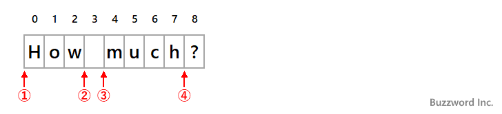

- [正規表現の一覧](#正規表現の一覧)
  - [文字](#文字)
    - [Android で使用可能な正規表現の文字](#android-で使用可能な正規表現の文字)
    - [Android で使用できない正規表現の文字](#android-で使用できない正規表現の文字)
    - [エスケープの必要性](#エスケープの必要性)
  - [文字クラス](#文字クラス)
    - [概要](#概要)
    - [文法](#文法)
    - [演算の優先順位](#演算の優先順位)
    - [優先順位を変更する](#優先順位を変更する)
  - [定義済み文字クラス](#定義済み文字クラス)
    - [一覧](#一覧)
    - [エスケープの必要性](#エスケープの必要性-1)
  - [境界マッチャー](#境界マッチャー)
    - [行頭（^）と行末（$）における MULTILINE オプション](#行頭と行末における-multiline-オプション)
    - [行頭（^）と入力の開始地点（\\A）の違い](#行頭と入力の開始地点aの違い)
    - [\\z と \\Z の意味](#z-と-z-の意味)
    - [前方参照](#前方参照)
    - [前方参照の否定](#前方参照の否定)
    - [後方参照](#後方参照)
    - [後方参照の否定](#後方参照の否定)
    - [単語境界（\\b）](#単語境界b)
    - [非単語境界（\\B）](#非単語境界b)
  - [繰り返し（量指定子 / 数量子）](#繰り返し量指定子--数量子)
    - [概要](#概要-1)
    - [数量子が適用される範囲](#数量子が適用される範囲)
    - [数量子の省略](#数量子の省略)
    - [三種類の修飾子](#三種類の修飾子)
    - [Greedy quantifiers（貪欲な量指定子）](#greedy-quantifiers貪欲な量指定子)
    - [Reluctant Qualifiers（消極的な量指定子）](#reluctant-qualifiers消極的な量指定子)
    - [Possessive Qualifiers（さらに貪欲な量指定子）](#possessive-qualifiersさらに貪欲な量指定子)
  - [論理演算子](#論理演算子)


# 正規表現の一覧

## 文字

### Android で使用可能な正規表現の文字

以下の表は文字を表す正規表現です。

| 正規表現 | 説明                                               |
| -------- | -------------------------------------------------- |
| `\\`     | バックスラッシュ                                   |
| `\"`     | ダブルクオーテーション                             |
| `\uhhhh` | h で指定した文字コード ( h には 16 進数の値が入る) |
| `\t`     | タブ文字 ( `\u0009` )                              |
| `\n`     | 改行文字 ( line feed ) ( `\u000A` )                |
| `\r`     | キャリッジリターン文字 ( `\u000D` )                |


### Android で使用できない正規表現の文字

以下の表は、 Java の [公式ドキュメント](https://docs.oracle.com/javase/8/docs/api/java/util/regex/Pattern.html) では正規表現として定義されていますが、実際に Android の文字列リテラルで使用できないものです。

| 正規表現    | 説明                                                             |
| ----------- | ---------------------------------------------------------------- |
| `\0n`       | n で指定した文字 ( n には 8 進数の値が入る)                      |
| `\0nn`      | n で指定した文字 ( n には 8 進数の値が入る)                      |
| `\0mnn`     | m と n で指定した文字 ( m には 4 進数、 n には 8 進数の値が入る) |
| `\xhh`      | h で指定した文字 ( h には 16 進数の値が入る)                     |
| `\x{h...h}` | h で指定した文字 ( h には 16 進数の値が入る)                     |
| `\f`        | フォームフィード文字 ( `\u000C` )                                |
| `\a`        | アラート (ベル) 文字 ( `\u0007` )                                |
| `\e`        | エスケープ文字 ( `\u001B` )                                      |
| `\cx`       | x に一致する制御文字                                             |


### エスケープの必要性

上記に記載した文字としての正規表現は、基本的にはエスケープを行わずにそのまま使用する方が良いです。

エスケープを行った場合は、使用方法を誤ると想定外の結果を招く恐れがあります。

```kotlin
// OK
val target = "\t"
// NG : これを画面に表示するとタブとして認識されず '\t' という文字として表示されます。
val target = "\\t"

// 正規表現の文字クラスとしてはどちらでもタブ文字として認識されます。
// OK
val regex = Regex("\t")
// OK
val regex = Regex("\\t")
```


## 文字クラス

### 概要

文字クラスとは、 **文字の範囲** を表現するものです。例えば、 `[a-z]` は、アルファベットの a ～ z までのいずれかの一文字を意味します。

文字クラスを表現するには、対象を大カッコ ( `[]` ) で囲む必要があります。ただし、文字クラスで表現される範囲が一文字だけの場合は大カッコを省略することが可能です。

**正規表現を扱う際は、 「文字」 と 「文字クラス」 は別物だということを意識しておくことが重要です。**


### 文法

文字クラスの記述方法は以下の通りです。

| 概要                                    | 記述例       | 例の意味                                         |
| --------------------------------------- | ------------ | ------------------------------------------------ |
| 記述したいずれか                        | [abc]        | a または b または c                              |
| 記述したいずれでもない (否定) (※ 1 )          | [^ab]        | a でも b でもない                                |
| 範囲内のいずれか (論理和) (※ 2 )              | [a-cX-Z0-9]  | a〜c または X〜Z または 0〜9                     |
| 複数条件を同時に満たす (論理積) (※ 3 )        | [a-z&&[def]] | d または e または f                              |
| 複数条件を同時に満たす (論理積で引き算) | [a-z&&[^bc]] | a〜z かつ bc 以外 (つまり、 a〜z の中で bc 以外) |

(※ 1 )  
チルダ ( `^` ) は、文字クラスの先頭に記述してください。それ以外の場所に記述されたチルダは、単なる文字と見なされます。

(※ 2 )  
ハイフン ( `-` ) は、文字クラスの先頭 or 末尾以外の場所に記述してください。先頭 or 末尾に記述された場合は単なる文字と見なされます。

(※ 3 )  
`&&` は、文字クラスの先頭 or 末尾以外の場所に記述してください。先頭 or 末尾に記述された場合は実行時エラーとなります。


### 演算の優先順位

文字クラス内で使用される演算子には 4 種類が存在しており、優先順位は、基本的には、以下の通りです。ただし、後述するように、大カッコ `[]` を使用した場合は、優先順位が変わるため、注意してください。

| 優先順位 | 演算子            | 意味   |
| -------- | ----------------- | ------ |
| 1 (※ 1 ) | `-`               | 範囲   |
| 1 (※ 1 ) | 演算子なし (※ 2 ) | 連接   |
| 2        | `&&`              | 論理積 |
| 3        | `^`               | 否定   |

(※ 1 )  
範囲と連接については、どちらの方が優先度が高いのかがわかりませんでした。ただし、どちらが優先されたとしても同じ結果になると思われるため、同じ優先順位にしています。

(※ 2 )  
`XY` のように、演算子なしで連結する場合を示します。 ( `X` と `Y` は単なる文字や文字範囲や文字クラスを表します。)


### 優先順位を変更する

文字クラス内では、丸カッコ ( `()` ) が使用できませんが、代わりに大カッコ ( `[]` ) を使用することで、演算の優先順位を変更することが可能です。以下の二つの例を比較してください。

```kotlin
// [d] かつ [d-f] を意味する
val regex = "[d&&def]"
// ( [d] かつ [d] ) または [ed] を意味する
val regex = "[[d&&d]ef]"
```

ネストされた大カッコ内の処理が優先的に実行されます。


## 定義済み文字クラス

### 一覧

以下の表は、定義済みの文字クラスの一覧です。「定義済み文字クラス」 とは、言い換えれば、特定の文字クラスの省略記法のことです。大文字で表される定義済み文字クラスは小文字で表される定義済み文字クラスの否定です。

| 定義済み文字クラス | 意味                     | 通常の文字クラスを使用した同等の表現                                                                                   |
| ------------------ | ------------------------ | ---------------------------------------------------------------------------------------------------------------------- |
| `.`                | 任意の一文字             | 表現方法なし                                                                                                           |
| `\d`               | 数字                     | `[0-9]`                                                                                                                |
| `\D`               | 数字以外                 | `[^0-9]`                                                                                                               |
| `\h`               | 水平空白文字             | `[ 　\t\xA0\u1680\u180e\u2000-\u200a\u202f\u205f\u3000]`                                                               |
| `\H`               | 水平空白文字以外         | `[^\h]`                                                                                                                |
| `\s`               | 空白文字                 | `[ 　\t\n\x0B\f\r]` 半角空白( ), 全角空白(　), タブ(t), 改行(n), 垂直タブ(xOB), 用紙送り文字(f), キャリッジリターン(r) |
| `\S`               | 空白文字以外             | `[^\s]`                                                                                                                |
| `\v`               | 垂直空白文字             | `[\n\x0B\f\r\x85\u2028\u2029]`                                                                                         |
| `\V`               | 垂直空白文字以外         | `[^\v]`                                                                                                                |
| `\w`               | 英数字かアンダースコア   | `[a-zA-Z_0-9]`                                                                                                         |
| `\W`               | 英数字アンダースコア以外 | `[^\w]`                                                                                                                |

### エスケープの必要性

定義済み文字クラスは、そのままでは文字列リテラルの中で Illegal escape エラーになります。そのため、先頭にバックスラッシュを追加して、エスケープする必要があります。例えば、 `\d` は `\\d` とします。

基本的には必ずエスケープする必要があります。たとえ、正規表現の大カッコの中であれ、エスケープは必要です。

ただし、例外として、 raw string (ダブルクォーテーション三つで囲む文字列リテラル) 内で使用する場合のみ、エスケープせずに使用する必要があります。


## 境界マッチャー

| 正規表現    | 意味                                                |
| ----------- | --------------------------------------------------- |
| `^`         | 行頭                                                |
| `$`         | 行末                                                |
| `\A`        | 入力の開始地点                                      |
| `\Z`        | 最後のターミネータを除く入力の終わり (存在する場合) |
| `\z`        | 入力の終わり                                        |
| `AA(?=BB)`  | 前方参照                                            |
| `AA(?!BB)`  | 前方参照の否定                                      |
| `(?<=AA)BB` | 後方参照                                            |
| `(?<!AA)BB` | 後方参照の否定                                      |
| `\b`        | 単語境界                                            |
| `\B`        | 非単語境界                                          |
| `\G`        | 直前のマッチの終了地点                              |

### 行頭（^）と行末（$）における MULTILINE オプション

通常、対象文字列が複数行の場合は、二行目以降の行頭はチルダ ( `^` ) ではマッチしません。しかし、 `MULTILINE` オプションを指定することで、二行目以降の行頭もチルダでマッチさせることが可能です。

```kotlin
// いずれの記述方法でも同じです。
Regex("abc", RegexOption.MULTILINE)
"abc".toRegex(RegexOption.MULTILINE)
Regex("(?m)abc")
```

MULTILINE オプションの振る舞いについては、行末 ( `$` ) についても同様です。つまり、オプションが有効になっていれば、全ての行の行末で `$` がマッチします。無効になっていれば、最終行の行末でのみ `$` がマッチします。


### 行頭（^）と入力の開始地点（\A）の違い

入力の開始地点 ( `\A` ) は、 MULTILINE オプションが無効になっている行頭 ( `^` ) と同じ振る舞いをします。たとえ MULTILINE オプションが有効になっていても、その振る舞いは変わりません。


### \z と \Z の意味

`\z` と `\Z` は、 `\A` の行末版です。つまり、 MULTILINE オプションが無効になっている行末 ( `$` ) と同じ振る舞いをします。

\z と \Z の違いは、文字列の末尾が行末文字だった場合に行末文字を取り除くかどうかです。 \z は行末文字を取り除きません。 \Z は行末文字を取り除いてからマッチングを行います。

例えば対象の文字列が `ABC\n` のように文字列の末尾に行末文字の一つである `\n` がある場合、パターン `ABC\z` はマッチしませんが、パターン `ABC\Z` はマッチします。


### 前方参照

前方参照 ( `AA(?=BB)` ) は、文字列 AA を検索します。ただし、直後に文字列 BB があるもののみにマッチします。

例えば、以下のような単語のリストがあるとします。

```
大谷大学
大谷高校
大谷中学
```

正規表現 ( `大谷(?=大学)` ) は、直後に 「大学」 という文字列がある 「大谷大学」 にのみマッチします。

```kotlin
private fun check(p: Pattern, target: String) {
    val m = p.matcher(target)
    if (m.find()) {
        println("○ $target")
    } else {
        println("× $target")
    }
}

val s1 = "大谷大学"
val s2 = "大谷高校"
val s3 = "大谷中学"

val regex = "大谷(?=大学)"
val p = Pattern.compile(regex)

check(p, s1) // ○ 大谷大学
check(p, s2) // × 大谷高校
check(p, s3) // × 大谷中学
```


### 前方参照の否定

前方参照の否定 ( `AA(?!BB)` ) は、文字列 AA を検索します。ただし、直後に文字列 BB がないもののみにマッチします。

例えば、以下のような単語 のリストがあるとします。

```
大谷大学
大谷高校
大谷中学
```

正規表現 ( `大谷(?!大学)` ) は、直後に 「大学」 という文字列がない 「大谷高校」 と 「大谷中学」 にマッチします。


### 後方参照

前方参照の否定 ( `(?<=AA)BB` ) は、文字列 BB を検索します。ただし、直前に文字列 AA があるもののみにマッチします。

例は、前方参照の項を参照してください。


### 後方参照の否定

前方参照の否定 ( `(?<!AA)BB` ) は、文字列 BB を検索します。ただし、直前に文字列 AA がないもののみにマッチします。

例は、前方参照の否定の項を参照してください。


### 単語境界（\b）

単語境界というのは、単語を構成する文字 ( a-z 、 A-Z 、 0-9 、 _ 、 Unicode 文字) とそうでない文字との境目のことです。次の図を見て下さい。



対象の文字列が "How much?" の場合、単語境界は上記の 4 箇所になります。


### 非単語境界（\B）

非単語境界というのは、単語境界以外の境目のことです。次の図を見て下さい。


対象の文字列が "How much?" の場合、単語境界は上記の 6 箇所になります。


## 繰り返し（量指定子 / 数量子）

### 概要

文字や文字クラスの後ろに繰り返しを意味する修飾子を付与することで、繰り返しを表現することが可能です。繰り返しを意味する修飾子は、 **量指定子** や **数量子** などと呼ばれます。


### 数量子が適用される範囲

文字や文字クラスの直後に数量子を付与した場合は、 **直前の一文字に対しての繰り返し** を意味します。数量子の前にある **複数の文字に対して繰り返しを指定したい場合** は、繰り返したい文字列を丸カッコ `()` で囲んで、繰り返したい部分を定義します。

```kotlin
val target = "abcabc"
// 丸カッコがあるため、 'abc' の繰り返しを意味する。
val regex = Regex("""(abc){2}""", RegexOption.MULTILINE)
val isMatched = regex.containsMatchIn(target)
println("$isMatched") // true

val target = "abcc"
// 丸カッコがないため、直前の 'c' のみの繰り返しを意味する。
val regex = Regex("""abc{2}""", RegexOption.MULTILINE)
val isMatched = regex.containsMatchIn(target)
println("$isMatched") // true
```


### 数量子の省略

数量子の指定がない場合 (省略されている) 場合は、数量子 `{1}` が指定されているものと見なされます。

以下の二つは同じ意味になります。

```kotlin
val a = "a{1}"
val a = "a"
```


### 三種類の修飾子

繰り返しを示す修飾子には三種類の修飾子が存在しています。ここでは、その三種類の表現方法と共通の意味について記述しています。三種類の修飾子の違いについては別紙 「 Greedy vs Reluctant vs Possessive Qualifiers.md 」 を参照してください。


### Greedy quantifiers（貪欲な量指定子）

`X` は任意の文字 or 文字列とします。 X は大カッコで囲んでも良いですが、その場合は、文字クラスの規約に従い、 「大カッコ内のいずれか一文字」 という意味になる点に注意してください。

| フォーマット | 意味                     |
| ------------ | ------------------------ |
| `X?`         | X が 0 個または 1 個     |
| `X*`         | X が 0 個以上            |
| `X+`         | X が 1 個以上            |
| `X{n}`       | X が n 個                |
| `X{n,}`      | X が n 個以上            |
| `X{n,m}`     | X が n 個以上、 m 個以下 |


### Reluctant Qualifiers（消極的な量指定子）

| フォーマット | 意味                      |
| ------------ | ------------------------- |
| `X??`        | Greedy quantifiers に同じ |
| `X*?`        | Greedy quantifiers に同じ |
| `X+?`        | Greedy quantifiers に同じ |
| `X{n}?`      | Greedy quantifiers に同じ |
| `X{n,}?`     | Greedy quantifiers に同じ |
| `X{n,m}?`    | Greedy quantifiers に同じ |


### Possessive Qualifiers（さらに貪欲な量指定子）

| フォーマット | 意味                      |
| ------------ | ------------------------- |
| `X?+`        | Greedy quantifiers に同じ |
| `X*+`        | Greedy quantifiers に同じ |
| `X++`        | Greedy quantifiers に同じ |
| `X{n}+`      | Greedy quantifiers に同じ |
| `X{n,}+`     | Greedy quantifiers に同じ |
| `X{n,m}+`    | Greedy quantifiers に同じ |


## 論理演算子

`X` と `Y` は任意の文字 or 文字列 or 文字クラスとします。 

| 論理演算子 | 使用例 | 意味                 |
| ------ | ------ | ---------------------------- |
| なし   | `XY`   | X の後に Y が続きます (連接) |
| `\|`   | `X\|Y` | X または Y (選択)            |
| `()`   | `(X)`  | グループ化                   |

**連接** と **選択** は正規表現の専門用語です。

**「選択」 と 「グループ化」 の演算子は、文字クラス内 (大カッコ内) では使用しないでください。** 文字クラス内では、メタ文字であるとは見なされず、単なる文字であると見なされます。


