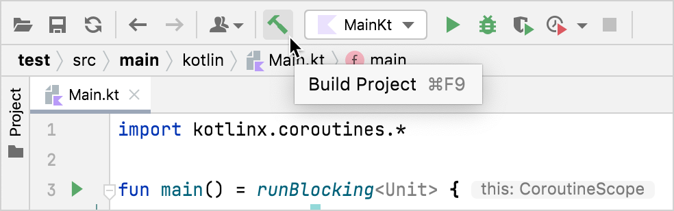
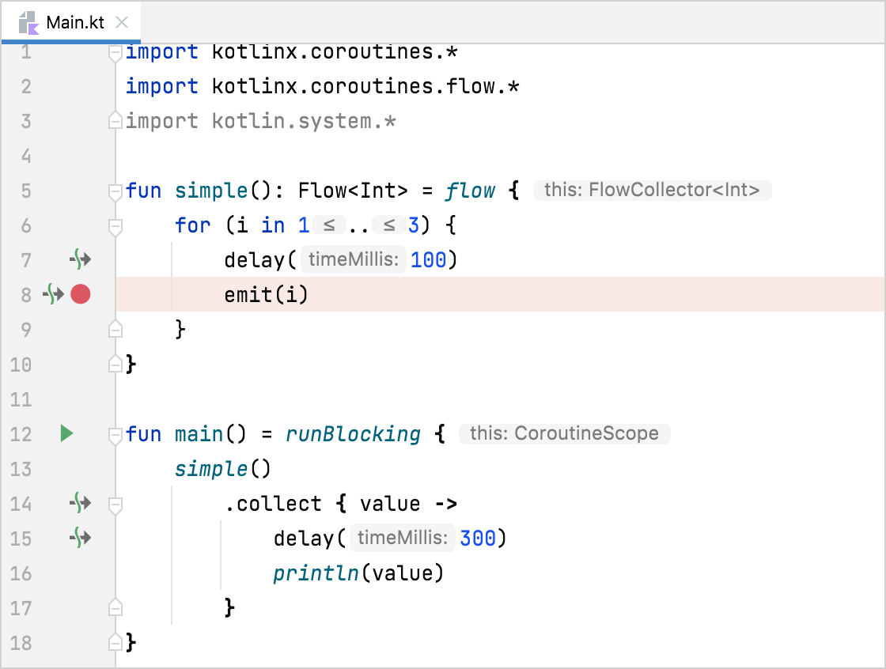
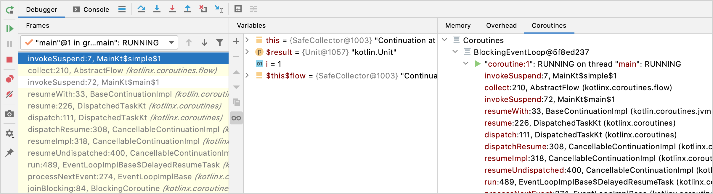
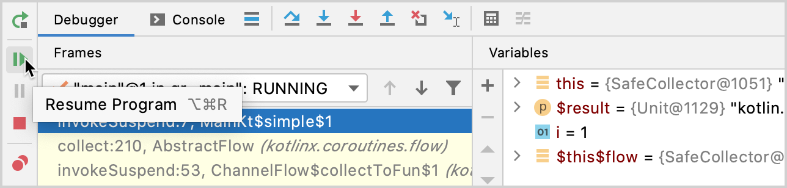
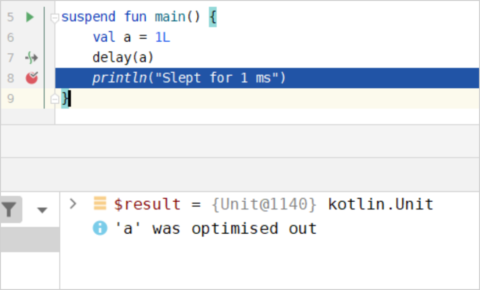
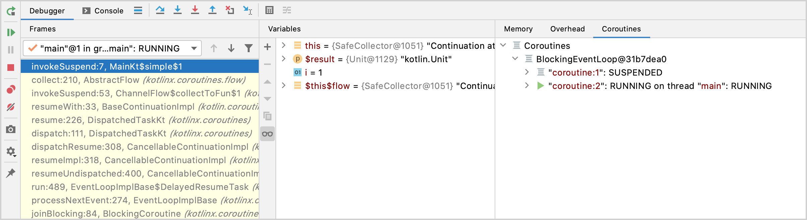
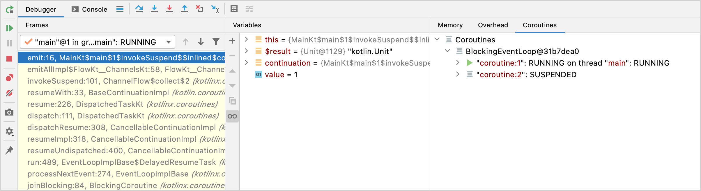

- [IntelliJ IDEA を使用して Kotlin の Flow をデバッグするチュートリアル](#intellij-idea-を使用して-kotlin-の-flow-をデバッグするチュートリアル)
  - [Kotlin Flow を作成する](#kotlin-flow-を作成する)
  - [コルーチンをデバッグする](#コルーチンをデバッグする)
    - [最適化された変数](#最適化された変数)
  - [同時実行するコルーチンを追加します。](#同時実行するコルーチンを追加します)
  - [2つのコルーチンで Kotlin Flow をデバッグする](#2つのコルーチンで-kotlin-flow-をデバッグする)


# IntelliJ IDEA を使用して Kotlin の Flow をデバッグするチュートリアル

このチュートリアルでは、 Kotlin Flow を作成し、 IntelliJ IDEA を使用してデバッグする方法を説明します。

このチュートリアルでは、コルーチンと Kotlin Flow の概念に関する事前知識があることを前提としています。


## Kotlin Flow を作成する

低速エミッターと低速コレクターを使用して Kotlin Flow を作成します。

1. IntelliJ IDEA で Kotlin プロジェクトを開きます。プロジェクトがない場合は作成します。

2. Gradle プロジェクトで kotlinx.coroutines ライブラリを使用するには、 build.gradle(.kts) に次の依存関係を追加します。

```kotlin
dependencies {
    implementation("org.jetbrains.kotlinx:kotlinx-coroutines-android:1.9.0-RC")
}
```

**結果の APK にデバッグインフラストラクチャを含めないようにする**

kotlinx-coroutines-core アーティファクトには、デバッガーによってのみ使用されるリソースファイルが含まれています。これは、コルーチンが正常に動作するために必要ではないものです。機能を損なうことなくこれを除外するには、アプリケーションサブプロジェクトの Gradle ファイルの android ブロックに次のスニペットを追加します。

```kotlin
packagingOptions {
    resources.excludes += "DebugProbesKt.bin"
}
```

3. src/main/kotlin の Main.kt ファイルを開きます。

src ディレクトリには、 Kotlin のソースファイルとリソースが含まれています。 Main.kt ファイルには、 Hello World! を出力するサンプルコードが含まれています。

4. 3 つの数値のフローを返す simple() 関数を作成します。

- delay() 関数を使用して、 CPU を消費するブロッキングコードを模倣します。スレッドをブロックせずに、コルーチンを 100 ミリ秒間停止します。
- emit() 関数を使用して、 for ループで値を生成します。

```kotlin
import kotlinx.coroutines.*
import kotlinx.coroutines.flow.*
import kotlin.system.*

fun simple(): Flow<Int> = flow {
    for (i in 1..3) {
        delay(100)
        emit(i)
    }
}
```

5. main() 関数のコードを変更します:

- runBlocking() ブロックを使用してコルーチンをラップします。
- collect() 関数を使用して、出力された値を収集します。
- delay() 関数を使用して、 CPU を消費するコードを模倣します。スレッドをブロックせずに、コルーチンを 300 ミリ秒間停止します。
- println() 関数を使用して、フローから収集された値を出力します。

```kotlin
fun main() = runBlocking {
    simple()
        .collect { value ->
            delay(300)
            println(value)
        }
}
```

6. 「プロジェクトのビルド」 をクリックしてコードをビルドします。




## コルーチンをデバッグする

1. emit() 関数が呼び出される行にブレークポイントを設定します。



2. 画面上部の実行構成の横にある 「デバッグ」 をクリックして、コードをデバッグモードで実行します。


デバッグツールウィンドウが表示されます。

- Frames タブにはコールスタックが含まれています。
- Variables タブには現在のコンテキストの変数が含まれています。フローが最初の値を出力していることがわかります。
- Coroutines タブには実行中または中断中のコルーチンに関する情報が含まれています。



3. デバッグツールウィンドウで [プログラムの再開] をクリックして、デバッガーセッションを再開します。プログラムは同じブレークポイントで停止します。



これでフローは 2 番目の値を発行します。 Variables セクションの i = 2 となっていることが確認できます。


### 最適化された変数

suspend 関数を使用する場合、デバッガーで変数名の横に 「最適化されました」 というメッセージが表示されることがあります。



このメッセージは、変数の有効期間が短縮され、変数が存在しなくなったことを意味します。最適化された変数は値が表示されないため、コードをデバッグするのは困難です。この動作は、 `-Xdebug` コンパイラオプションで無効にできます。

**このフラグは本番環境では使用しないでください。 -Xdebug はメモリ リークを引き起こす可能性があります。**


## 同時実行するコルーチンを追加します。

1. src/main/kotlin の Main.kt ファイルを開きます。

2. コードを拡張して、エミッターとコレクターを同時に実行します。

- buffer() 関数への呼び出しを追加して、エミッターとコレクターを同時に実行します。 buffer() は、エミッターから出力された値を保存し、別のコルーチンでコレクターを実行します。そのため、エミッターがコレクターを待つ必要がなくなります。

```kotlin
fun main() = runBlocking<Unit> {
    simple()
        .buffer()
        .collect { value ->
            delay(300)
            println(value)
        }
}
```

3. 「プロジェクトのビルド」 をクリックしてコードをビルドします。


## 2つのコルーチンで Kotlin Flow をデバッグする

1. println(value) に新しいブレークポイントを設定します。

2. 画面上部の実行構成の横にある [デバッグ] をクリックして、コードをデバッグモードで実行します。



デバッグツールウィンドウが表示されます。

[コルーチン] タブでは、 2 つのコルーチンが同時に実行されていることがわかります。フローコレクターとエミッターは、 buffer() 関数のため、別々のコルーチンで実行されます。 buffer() 関数は、フローから送信された値をバッファリングします。エミッターコルーチンのステータスは RUNNING で、コレクターコルーチンのステータスは SUSPENDED です。

3. デバッグツールウィンドウで [プログラムの再開] をクリックして、デバッガーセッションを再開します。



これで、コレクターコルーチンのステータスは RUNNING になり、エミッターコルーチンのステータスは SUSPENDED になります。

各コルーチンを詳しく調べて、コードをデバッグできます。


